## Overview

The Azure cloud infrastructure has become a commonplace for users to deploy virtual machines on the cloud due to its’ flexibility, ease of deployment, and cost benefits.  In addition, Microsoft has expanded Azure to include a marketplace with thousands of certified, open source, and community software applications, developer services, and data—pre-configured for Microsoft Azure.  This tutorial covers deploying the HDP Sandbox offering from the Azure Marketplace.  

## Prerequisites
[A Microsoft Azure account – you can sign up for an evaluation account if you do not already have one.](https://azure.microsoft.com/en-us/pricing/free-trial/)

## Concepts/FAQs

The offering is a single Virtual Machine which has similar functionality as the on-premise HDP Sandbox. The operating system used is CentOS Linux.
  
## Procedure 

1\. Go to [https://azure.microsoft.com/en-us/marketplace/](https://azure.microsoft.com/en-us/marketplace/) and type in “Hortonworks Sandbox” in the search bar and hit enter. The following page displays.

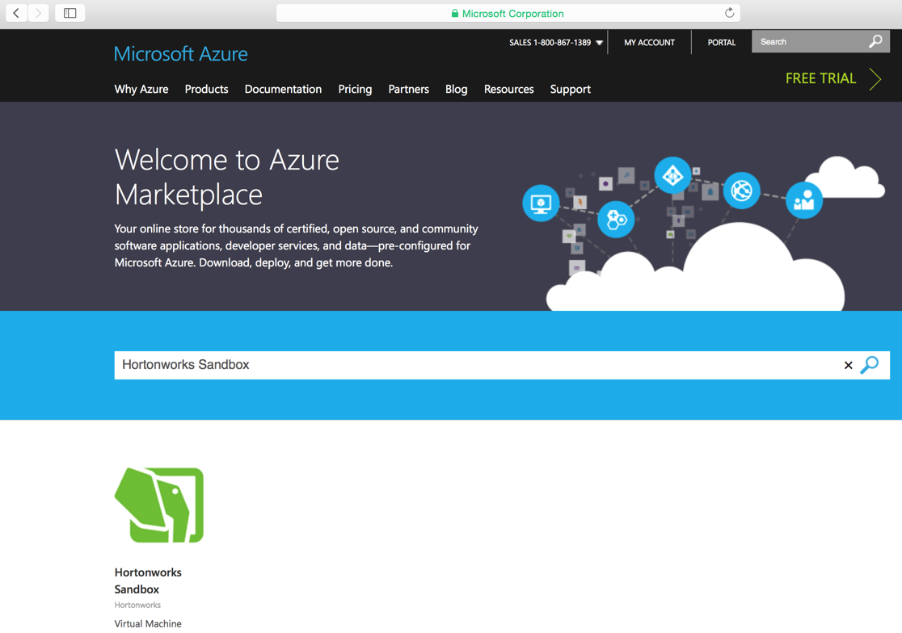

2\. Click on the “Hortonworks Sandbox” offering. The next page displayed will be the landing page with some information.  On this page click on the “Create Virtual Machine” button. 

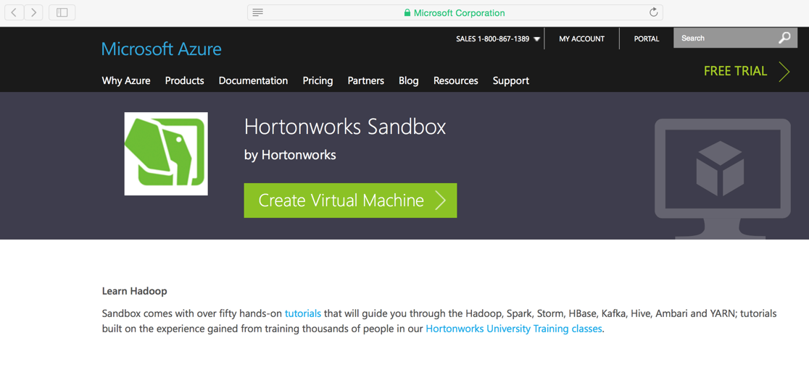

3\. If not yet logged in, the following page will be displayed. Enter your credentials.

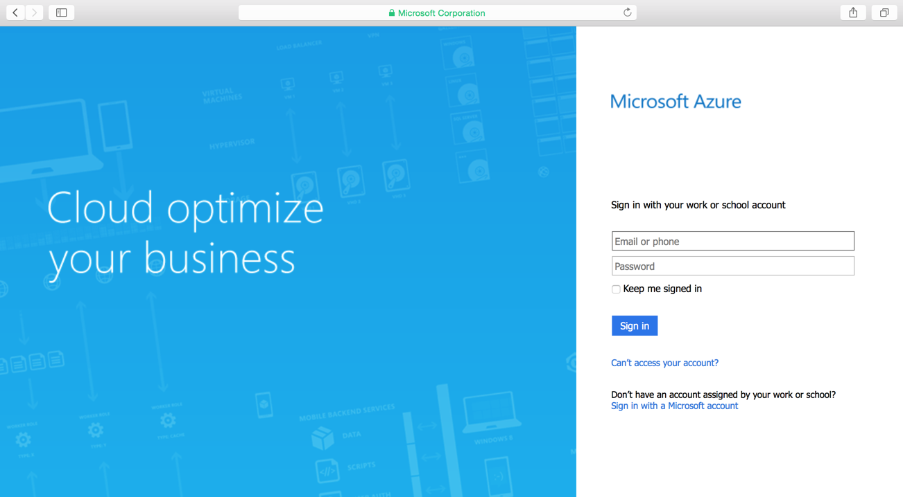

4\. After logging in, the following page is presented.  Select “Resource Manager” from the drop down field “Select a deployment model” field.  Microsoft suggests to always use the Resource Manager deployment model.  More information on the Resource Manager can be found [here](https://azure.microsoft.com/en-us/documentation/articles/resource-group-overview/) .  After making the selection, click “Create”. 

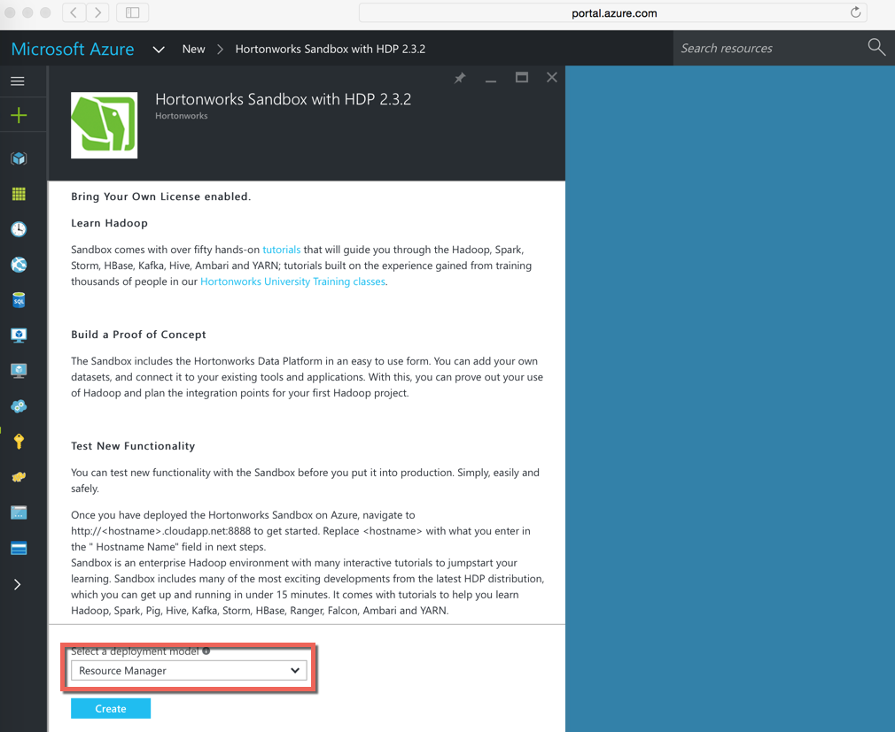

5\. After clicking create, you see a two new sections that will walk you through in entering information about the virtual machine being provisioned.  Below shows a screenshot of the fields filled out. 

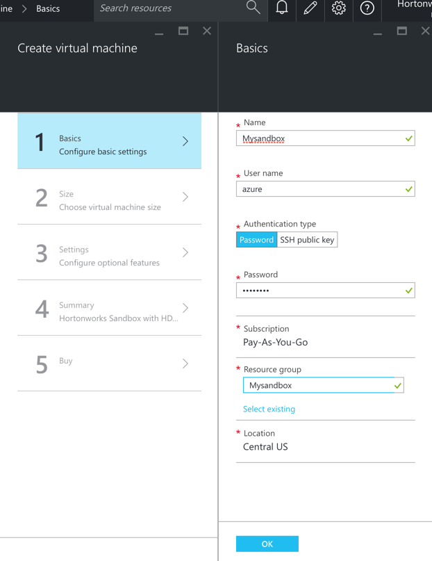

6\. Enter a value for each of the fields.  Below is an explanation of the fields. 

- **Name**: This is the name you want to reference the machine.  You can choose any name to your liking.  In the example above, “Mysandbox” was the name given to the machine. 
- **User name**:  This is the name of the user account used to log into the machine.  In this example, “azure” is the user name chosen.  
- **Authentication type**: This field allows a choice to either use a password or an SSH public key.  This is needed when using an ssh client to access the virtual machine for any specific reason.  If you are not familiar using SSH, simply select password and enter a password that satisfies 3 of the following:       
 - 1 lower case character
 - 1 upper case character 
 - 1 digit 
 - 1 special character
 - If you are familiar with using SSH, proceed in selecting “SSH public key” and enter in your public SSH key. 

- **Subscription**:  This depends on your account.  The example used above is set to “Pay-As-You-Go” which is the typical subscription.  
- **Resource group**: This is the name of the resource group you want to create.  You can also select an existing group if you like.  Suggestion is to create a new resource group.  In the example, we create a resource group name that is the same name as the machine “Mysandbox”. 
- **Location**: This field allows selection of the region where the machine is deployed.  Region selection may be important if you have certain limits on your account or if a specific region is having service issues.  You can typically keep this as default.  In the example above, the default is “Central US”.  If you are having issues with deploying an offering, Azure support may ask you to switch to a different region location as a troubleshooting measure. 

**NOTE**:  Make sure to write down your username and password.  If using ssh public key, ensure you have the corresponding private key.  Without it, you won’t be able to access the terminal of the machine. 

7\. After entering values for the fields click OK.  The following sections are then presented:

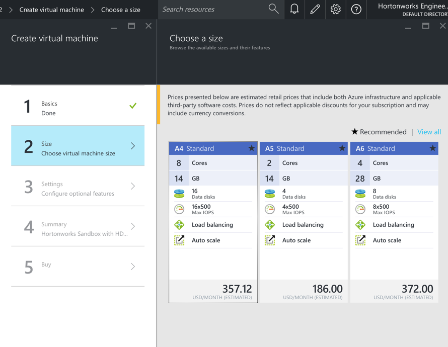

8\. Here you can select the machine to run the Sandbox.  The suggestion is to use a machine equivalent or higher than an A4 spec’d machine.  After selecting the machine, click on the select button.   

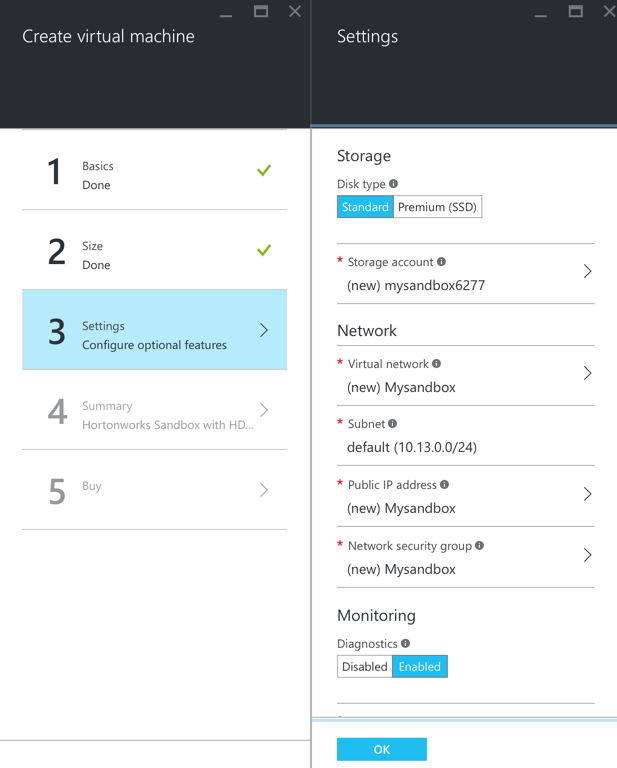

9\. The next prompt is a list of settings.  You can simply leave these as defaults and click “OK”.  The next screen is the summary. 

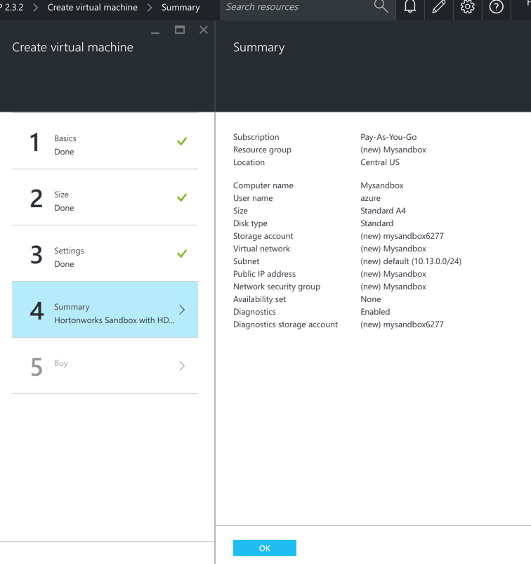

10\. Ensure the information looks correct for the specific items you have entered and selected.  If all looks well,  click the “OK” button.  

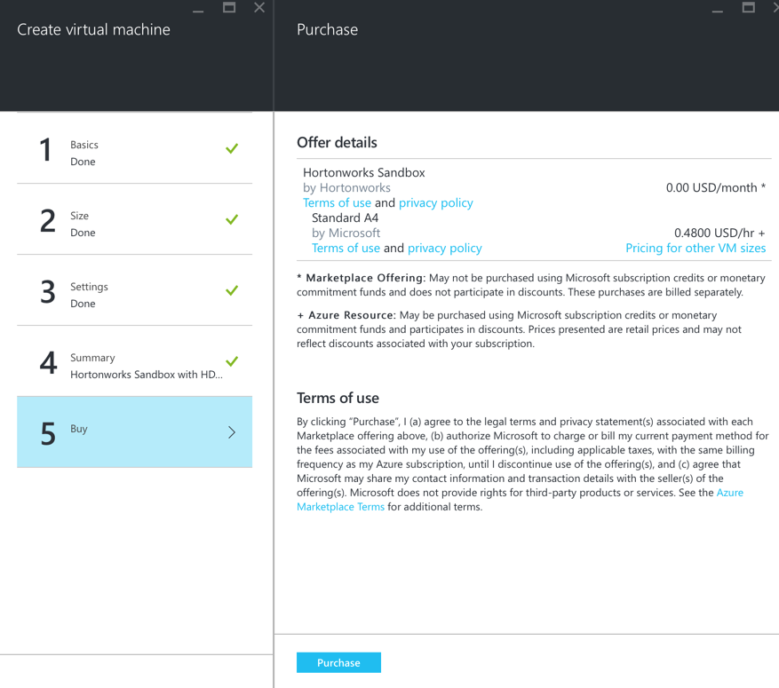

11\. The last step in this section is to click purchase.  You will be brought back to the dashboard.  An animation for the deployment of the Sandbox will be rendering.  It should resemble the screenshot below. 

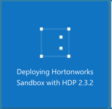

Once the virtual machine is deployed the following screen is displayed in the portal. 

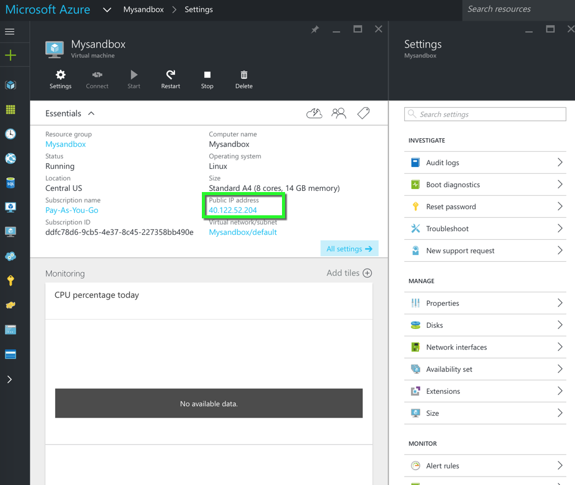

12\. Take note of the IP address.  In this example, it is 40.122.52.204 and highlighted in a green box.  Your machine will have a different IP.  Open up a new browser tab and enter in your IP address followed by the port 8888.  You should have something similar as the screen below, but with your ip address. 

13\. Hit enter and you should be welcomed with the following registration page.

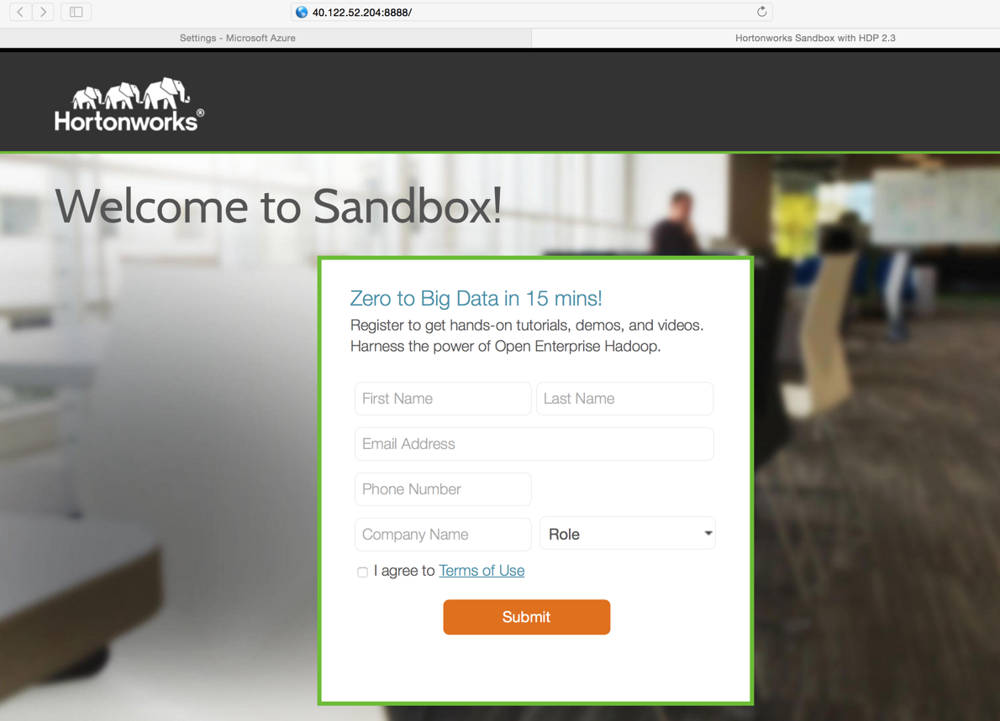
14\. Fill out the form, agree to the terms of use and click the submit button.  The next page displayed is the splash page.  

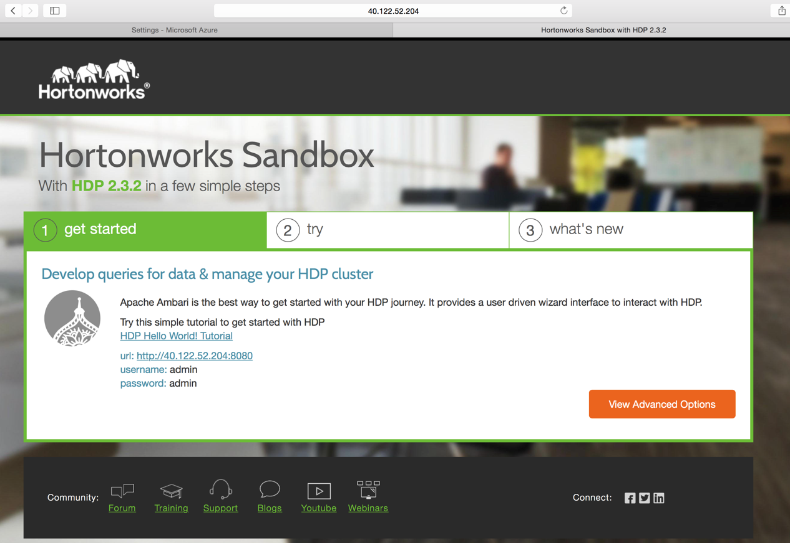

15\. If you are new to HDP, start your journey by clicking on the link to the HDP Hello World Tutorial.  

## Next Steps...
Now that you have the Sandbox up and running, feel free to try our list of tutorials.  By clicking on the try tab on the splash page.  The page below will be displayed allowing you to explore our tutorials. 

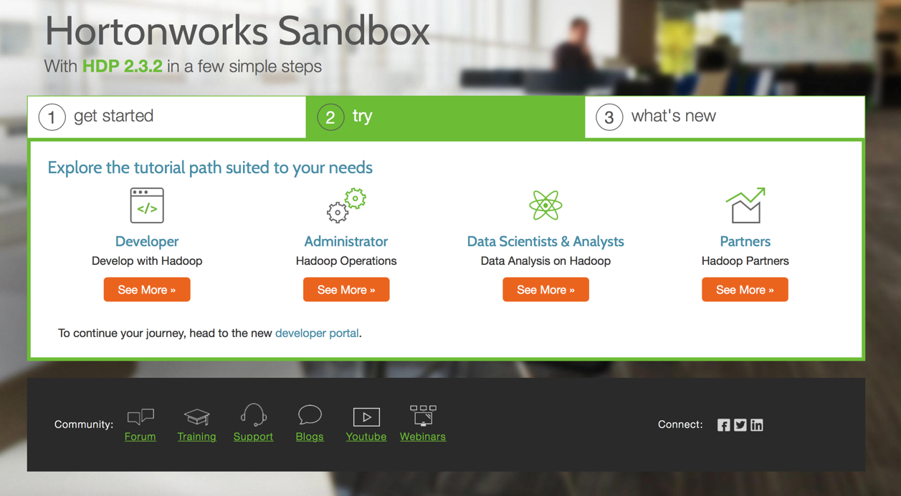

Please leave feedback and comments in our Sandbox Forums at [http://hortonworks.com/community/forums/forum/hortonworks-sandbox/](http://hortonworks.com/community/forums/forum/hortonworks-sandbox/).
 
