# Real-Time Event Processing In NiFi, SAM, Schema Registry and Superset

## Introduction

In this tutorial, you will learn how to deploy a modern real-time streaming application. This application serves as a reference framework for developing a big data pipeline, complete with a broad range of use cases and powerful reusable core components. You will explore the NiFi Dataflow application, Kafka topics, Schemas, SAM topology and visualize slices from Superset.

### Prerequisites

- [Installed Hortonworks DataFlow (HDF) Sandbox](https://hortonworks.com/downloads/#sandbox)
- [Getting Started with HDF](https://hortonworks.com/tutorial/getting-started-with-hdf-sandbox/)
- Enabled Connected Data Architecture:
  - [Enable CDA for VirtualBox](https://hortonworks.com/tutorial/sandbox-deployment-and-install-guide/section/1/#enable-connected-data-architecture-cda---advanced-topic)
  - [Enable CDA for VMware](https://hortonworks.com/tutorial/sandbox-deployment-and-install-guide/section/2/#enable-connected-data-architecture-cda---advanced-topic)
  - [Enable CDA for Docker](https://hortonworks.com/tutorial/sandbox-deployment-and-install-guide/section/3/#enable-connected-data-architecture-cda---advanced-topic)

## Outline

- [Concepts](#concepts)
- [Overview of Trucking IoT Ref App](#overview-of-trucking-iot-ref-app)
- [Step 1: Configure SAM for CDA](#step-1-configure-sam-for-cda)
- [Step 2: Configure HDFS for CDA](#step-2-configure-hdfs-for-cda)
- [Step 3: Deploy SAM Topology CDA Version](#step-3-deploy-sam-topology-cda-version)
- [Step 4: Visualize Trucking Data Via Superset](#step-4-visualize-trucking-data-via-superset)
- [Summary](#summary)
- [Further Reading](#further-reading)
- [Appendix A: Trucking IoT GitHub Repo](https://github.com/orendain/trucking-iot/tree/master)

## Concepts

### SuperSet

SuperSet is a visual, intuitive and interactive data exploration platform. This platform offers a fast way to create and share dashboards with friends and business clients of your visualized datasets. Various visualization options are available to analyze the data and interpret it. The Semantic Layer allows users to control how the data stores are displayed in the UI. The model is secure and allows users to intricate rules in which only certain features are accessible by select individuals. SuperSet can be integrated with Druid or other data stores (SQLAlchemy, Python ORM, etc) of the user's choice offering flexibility to be compatible with multiple systems.

### Druid

Druid is an open source analytics database developed for business intelligence queries on data. Druid provides low-latency live data ingestion, flexible data exploration and aggregation. Deployments often reach out to trillions of event in relation to numerous petabytes of data.

### Overview of Trucking IoT Ref App

The Trucking IoT Reference Application is built using Hortonworks DataFlow Platform.

The Trucking IoT data comes from a truck events simulator that is ingested by Apache NiFi, NiFi sends the data to Kafka topics which are then ingested by Stream Analytics Manager (SAM) to be stored into Druid. Superset is used to create a visual representation of the Druid data sources. A more in depth explanation of the pipeline will be explained as you explore the NiFi Dataflow application, Schema Registry, SAM, Druid and Superset.

### Step 1: Configure SAM for CDA

1\. Open Stream Analytics Manager (SAM) at [http://sandbox-hdf.hortonworks.com:7777/](http://sandbox-hdf.hortonworks.com:7777/)

### Add a Service Pool for HDP

SAM needs to be told where to find the HDP node to allow data transmission between the HDF and HDP nodes.

1\. Hover over the wrench to open the Configuration dropdown, select **Service Pool**, so we can add a new service pool for HDP.

In the field to the left of AUTO ADD, include the following:

~~~bash
http://sandbox-hdp.hortonworks.com:8080/api/v1/clusters/Sandbox
~~~

and then click AUTO ADD.

2\. There will be a popup screen asking for username/password as seen below:

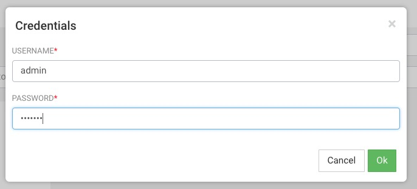

Use your HDP **admin** credentials to sign in.

**Table 1**: Ambari Login credentials

| Username | Password |
|:---:|:---:|
| admin | **setup process |

> [Setup Ambari Admin Password Manually](https://hortonworks.com/tutorial/learning-the-ropes-of-the-hortonworks-sandbox/#admin-password-reset)

You should now see services from the HDP Sandbox on the  SAM Service Pool Dashboard to the right of the HDF Sandbox Service Pool. We have now shared the web address of where SAM can find the services for the HDP Ambari Stack as seen on the image below:

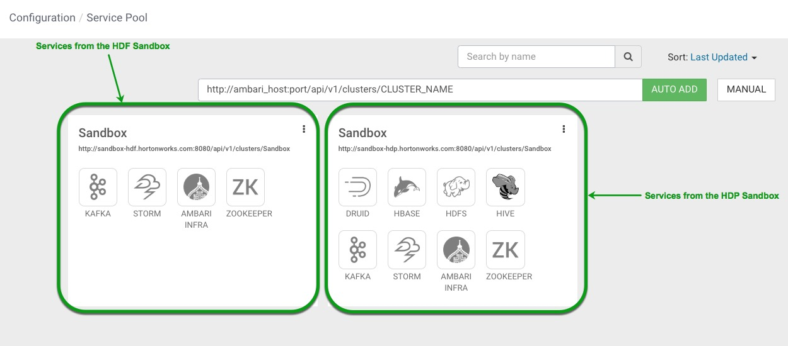

### Create a multi-node Environment

With SAM environments, we can select the services that we want our SAM application to have access to. So, we will add the necessary services from HDF and HDP Service Pools and create a multi-node environment from those services.

1\. Head to the Configuration dropdown, select **Environments**.

Click on the green plus symbol to create a new environment, add the following:

~~~bash
NAME: SandboxCDAEnvironment

DESCRIPTION: HDF and HDP Services Selected for CDA

SELECT SERVICES:

HDF:

KAFKA, STORM, ZOOKEEPER

HDP:

DRUID, HBASE, HDFS, HIVE
~~~

The configurations should look like this:

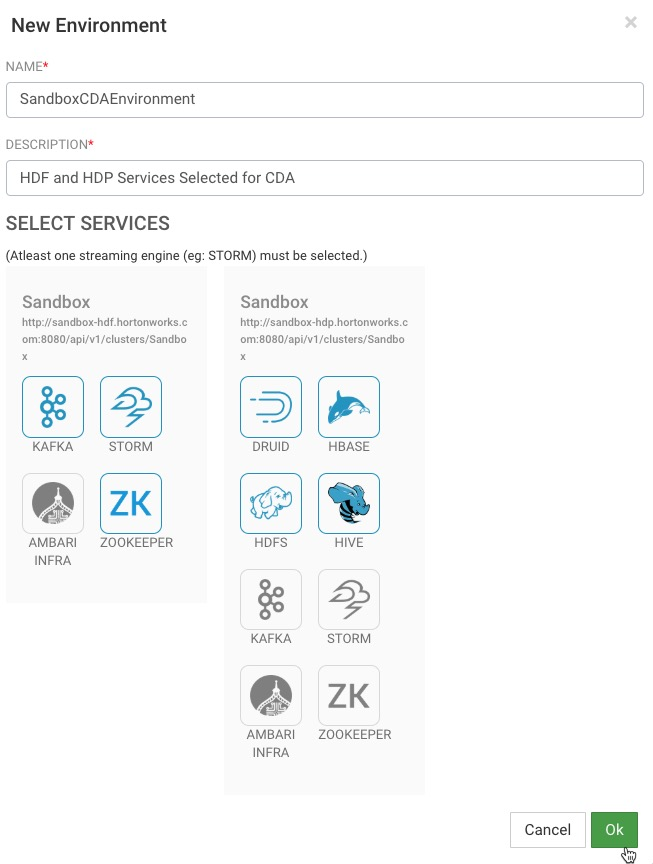

Now that these configurations are complete, we are ready to import and run our SAM topology for CDA.

### Step 2: Configure HDFS for CDA

1\. Open the HDP [**Shell-in-a-Box**](http://sandbox-hdp.hortonworks.com:4200)

2\. Login as **user/password: root/hadoop**

>Note: If this is not your first time login into Shell-in-a-Box then use the previous password you set up for root.

3\. Enter the following commands:

~~~~bash
su hdfs

hdfs dfs -chmod 777 /apps
~~~~

The commands above will allow the service Storm in HDF to write to HDFS which resides in HDP.

### Step 3: Deploy SAM Topology CDA Version

1\. Open Stream Analytics Manager (SAM) at [http://sandbox-hdf.hortonworks.com:7777/](http://sandbox-hdf.hortonworks.com:7777/)

2\. [Download the SAM topology for CDA](assets/templates/sam_topology/Trucking-IoT-CDA-V2.json) and save it somewhere on your computer as "Trucking-IoT-CDA-V2.json".

3\. Now on the SAM UI click the green plus sign and select **Import Application**

~~~bash
SELECT JSON FILE*
Choose File: Trucking-IoT-CDA-V2.json

APPLICATION NAME
Trucking-IoT-CDA

ENVIRONMENT
SandboxCDAEnvironment
~~~

4\. Click on the **Run** button to deploy the topology:

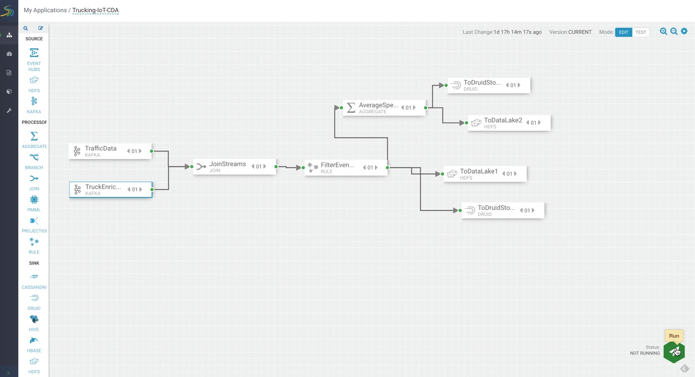

A window will appear asking if you want to continue deployment, click **Ok**.

5\. You will receive a notification that the SAM topology application deployed successfully and your topology will show Active Status in the bottom right corner.

**Overview of the SAM Canvas:**

- My Applications: Different Topology Projects
- 1st Left Sidebar: My Applications, Dashboard, Schema Registry, Model Registry, Configuration
- 2nd Left Sidebar: Different stream components (source, processor, sink)
- Gear Icon: configure topology settings
- Status Icon: Start or Stop Topology

**Overview of SAM topology:**

- **TrafficData** source data of "trucking_data_traffic" Kafka topic

- **TruckEnrichedData** source data of "trucking_data_truck_enriched" Kafka topic

- **JoinStreams** stream TruckEnrichData and TrafficData by "routeId"

- **FilterEvents** checks if not "Normal" eventType, then will emit them

- **AverageSpeed** computes average speed for driverId along routeId

- **ToDruidStore1** stores violation events from FilterEvents processor into Druid

- **ToDataLake1** store violation events from FilterEvents processor into HDFS

- **ToDruidStore2** stores average speed events into Druid

- **ToDataLake2** store average speed events into HDFS

### Step 4: Visualize Trucking Data Via Superset

1\. Open Ambari at `http://sandbox-hdp.hortonworks.com:8080/`. User credentials are `username/password = raj_ops/raj_ops`

2\. Ensure that the services HDFS, YARN, Druid and Superset are on and to turn off maintenance mode.

For example, to turn on **HDFS**, click on the service name in Ambari, click on the **Service Actions** dropdown and click **Start**. In the window, you will be asked if you want to start, confirm and also click on the checkbox to turn off maintenance mode.

3\. Open Superset at [http://sandbox-hdp.hortonworks.com:9089/](http://sandbox-hdp.hortonworks.com:9089/)

>Note: The username and password for Superset is `admin/admin`

4\. Wait about 25 - 30 minutes for Kafka data to be consumed, then periodically, select the **Sources** dropdown and click on **Refresh Druid Metadata**. Eventually, the two Druid data sources will appear.

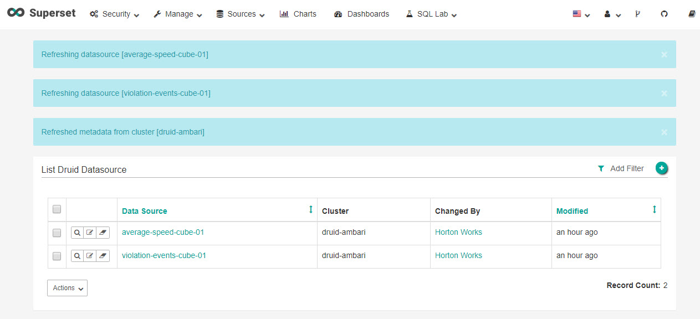

5\. Select **average-speed-cube-01** druid data source.

6\. You will be taken to the Superset visualization slice where you can visualize that druid data source.

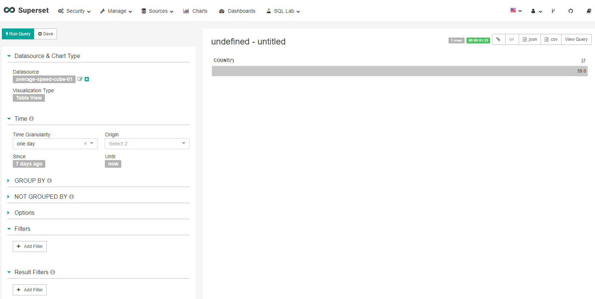

7\. Under **Datasource & Chart Type**, select Visualization Type: **Sunburst**.

8\. Under Hierarchy, add **driverId**, **speed_AVG**.

9\. Press on **Query** to visualize the data into a Sunburst representation.

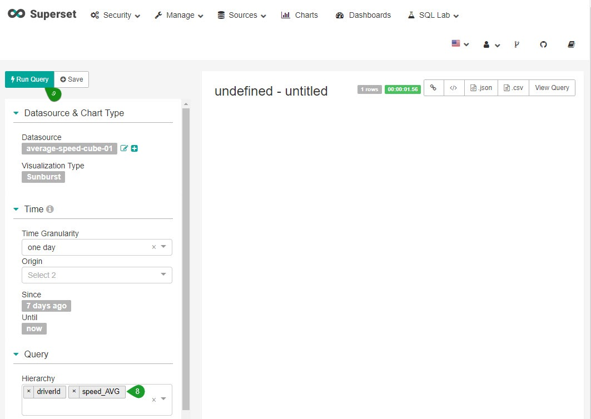

10\. Select **Save** and name the slice: `AvgSpeedSunburst`. Create a new dashboard and call it: `Trucking-IoT-Demo`. Click **Save**.

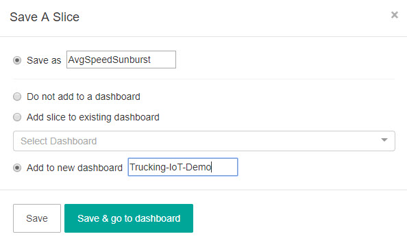

The following visualization slice is a "Sunburst" of **average-speed-cube-01** data source.

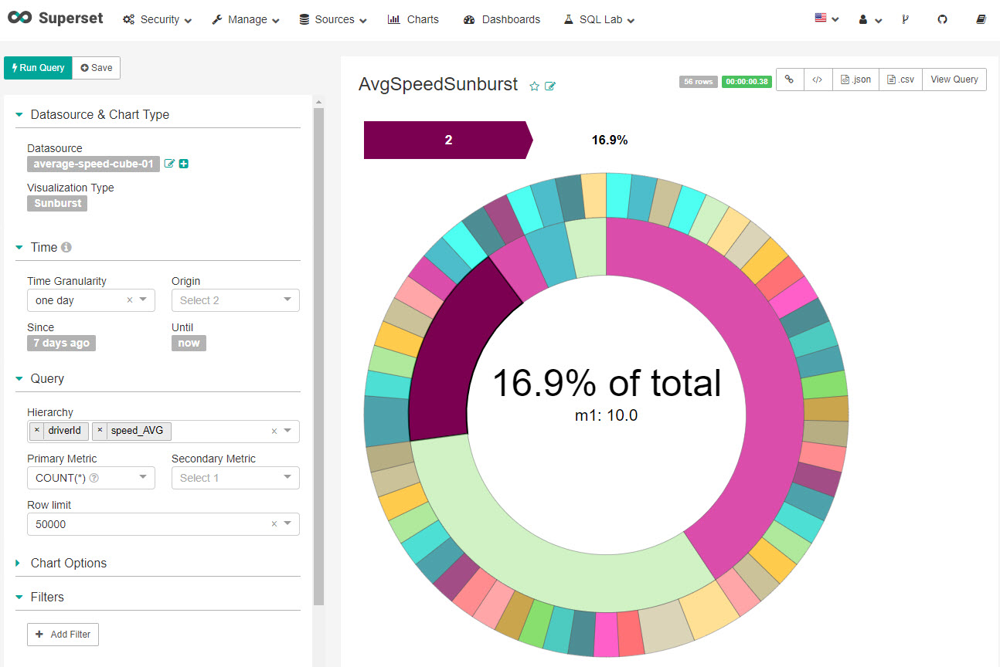

The following visualization slice is a "Sunburst" of **violation-events-cube-01** data source:

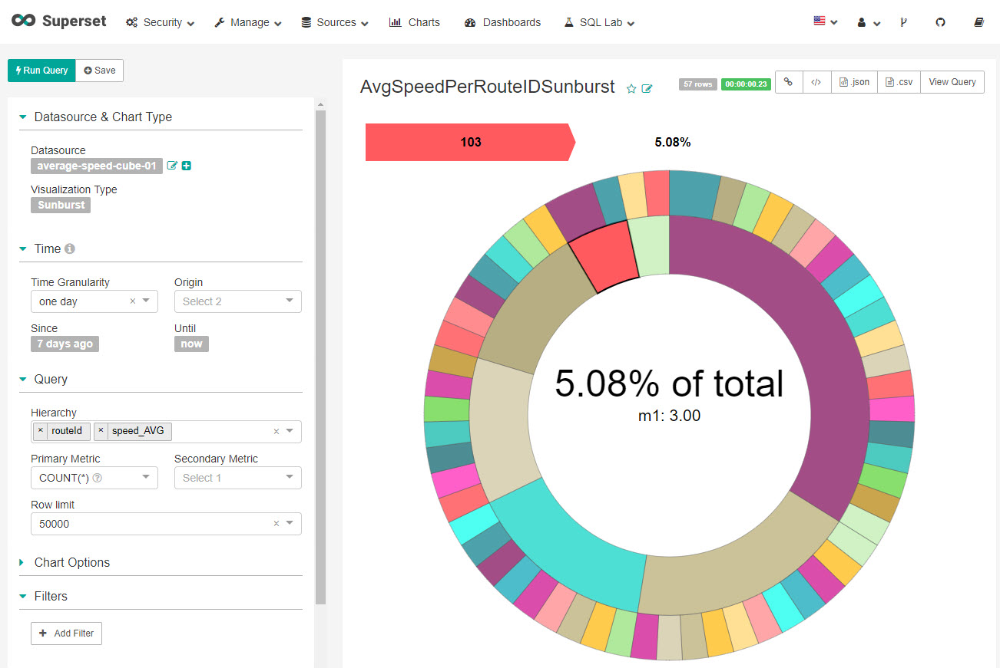

All created visualization slices will be sent to the dashboard you assign them to, in the two above examples, both slices are apart of the `Trucking-IoT-Demo` dashboard.

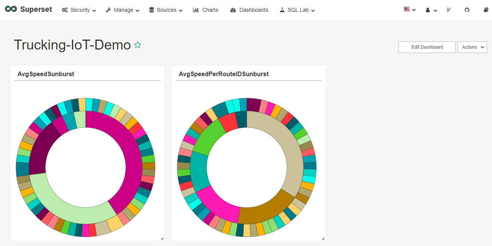

## Summary

Congratulations! You deployed the  CDA Trucking IoT demo that processes truck event data by using the NiFi, Kafka, SAM, Schema Registry and SuperSet.

## Further Reading

- [Superset](https://superset.incubator.apache.org/)
- [Druid](http://druid.io/)

### Appendix A: Trucking IoT GitHub Repo

~~~URL
https://github.com/orendain/trucking-iot/tree/master
~~~
