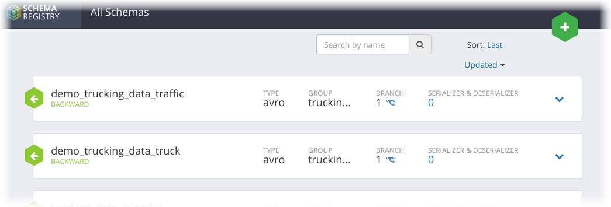

# Schema Registry in Trucking IoT on HDF

## Using the Java API with Scala

## Introduction

This is an **optional** section of the Schema Registry tutorial meant for developers interested in leveraging Schema Registry's API.  The API will allow you to programmatically create new schemas, register new schema versions, access a schema's registered serializer/deserializer, and more.

In this tutorial, we'll go over how to programmatically register new schemas using the Schema Registry Java API in the Scala programming language.  We'll also list the necessary dependencies and common endpoint configurations to take note of.

## Prerequisites

- Your favorite IDE set up and ready to go

## Outline

- [Environment Setup](#environment-setup)
- [Dependencies](#dependencies)
- [Schema Text and Configuration](#schema-text-and-configuration)
- [Adding New Schema Metadata](#adding-new-schema-metadata)
- [Registering a New Schema Version](#registering-a-new-schema-version)
- [Running the Application](#running-the-application)
- [Summary](#summary)

## Environment Setup

Download the `schema-registry-with-scala` github project by running the command below.  Then open it with your favorite text editor or IDE.

***UPDATE**
```bash
git clone https://github.com/orendain/schema-registry-with-scala
```

***UPDATE**
~~~text
Alternatively, if you would prefer not to download the code, and simply follow along, you may view this project directly on [GitHub](https://github.com/orendain/schema-registry-with-scala).
~~~

### Dependencies

Open the file `build.sbt`, located in the root of the project.

To use Schema Registry's API, we need to bring in a couple of dependencies, and specify the repository in which they are found.

```scala
// Specify the repository in which we can find the Schema Registry libraries
resolvers += "Hortonworks Nexus" at "http://repo.hortonworks.com/content/repositories/releases"
```

```scala
// Dependencies required for using the Schema Registry API
"com.hortonworks.registries" % "schema-registry-serdes" % "0.3.0.3.0.1.1-5",
"javax.xml.bind" % "jaxb-api" % "2.3.0",
```

## Schema Text and Configuration

Let's take a look at where we save the schema texts for two schemas we will be registering.

`src/main/resources/schema/truck-data.avsc` and `src/main/resources/schema/traffic-data.avsc`

The text for `truck-data.avsc` is pasted below for your convenience.  Recognize this from the previous section on using the interface to register new schemas.  This text defines the fields that make up data of a certain schema.

```scala
{
   "type" : "record",
   "namespace" : "com.orendainx.trucking",
   "name" : "TruckData",
   "fields" : [
      { "name" : "eventTime" , "type" : "long" },
      { "name" : "truckId" , "type" : "int" },
      { "name" : "driverId" , "type" : "int" },
      { "name" : "driverName" , "type" : "string" },
      { "name" : "routeId" , "type" : "int" },
      { "name" : "routeName" , "type" : "string" },
      { "name" : "latitude" , "type" : "double" },
      { "name" : "longitude" , "type" : "double" },
      { "name" : "speed" , "type" : "int" },
      { "name" : "eventType" , "type" : "string" }
   ]
}
```

Open up `src/main/resources/application.conf` and take a look at the properties we specify.

One of the most important tasks is to point to Schema Registry's correct API endpoint, which by default on the HDF sandbox is `http://sandbox-hdf.hortonworks.com:7788/api/v1`.

Notice some of the properties for the two schemas `demo_trucking_data_truck` and `demo_trucking_data_traffic` and recognize some of the fields from the previous exercise.

## Adding New Schema Metadata

Now let's take a look at the code actually doing work with schemas.

Check out `src/main/scala/com/orendainx/trucking/schemaregistry/SchemaRegistrar.scala`.

One of the very first things we do is to instantiate a SchemaRegistryClient, an object that allows us to interact with a remote schema registry.

```scala
private val schemaRegistryClient = new SchemaRegistryClient(clientConfig.asJava)
```

Remember the graphic from an earlier section where each **schema version** was part of a larger **schema metadata**.

Before we can specify what fields a given schema has, we need to create metadata for it.

```scala
// Build a new metadata for a schema using the properties extracted above
val schemaMetadata = new SchemaMetadata.Builder(schemaName)
  .`type`(schemaType).schemaGroup(schemaGroupName)
  .description(schemaDescription)
  .compatibility(schemaTypeCompatibility)
  .build()
```

We continue by registering this metadata with Schema Registry by way of using the client.

```scala
// Register the new schema metadata using an instance of a Schema Registry Client
val metadataRegistrationResult = schemaRegistryClient.registerSchemaMetadata(schemaMetadata)
log.info(s"Schema metadata was registered with ID: $metadataRegistrationResult")
```

## Registering a New Schema Version

Now that we have a metadata created, we can use schema text to create a schema version.

The following block of code will read all of the content from a filepath.

```scala
// Get the filepath where we will find the schema text and read the entire file containing the Avro schema text
val filepath = config.getString("avro.filepath")
val scanner = new Scanner(getClass.getResourceAsStream(filepath)).useDelimiter("\\A")
val avroSchemaContent = if (scanner.hasNext) scanner.next() else ""
```

With this text in hand, we create a `SchemaVersion` object and register it under the schema metadata we created above.

```scala
// Create a SchemaVersion object out of the Avro schema text we read in, then register it to Schema Registry using the client
val schemaVersion = new SchemaVersion(avroSchemaContent, "Initial schema")
val schemaVersionId = schemaRegistryClient.addSchemaVersion(schemaName, schemaVersion)

log.info(s"Schema content: $avroSchemaContent")
log.info(s"Schema version was registered with ID: $schemaVersionId")
```

## Running The Application

Run this SBT application using your preferred method.  If you download this project onto the CDF Sandbox or if your host machine is using a distribution with the Yum package manager, there is a helper script included to run the application for you.

``` scala
./run.sh
```

Once the application runs, you should be able to navigate to the Schema Registry Web UI and see our two new schemas.



## Summary

We've just successfully built an application leveraging Schema Registry's Java API for creating new schemas!

Efforts for developing Schema Registry are open source.  For more information, check out the GitHub project at: `https://github.com/hortonworks/registry`
