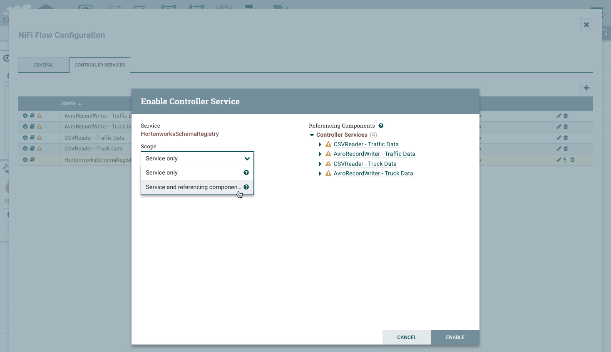
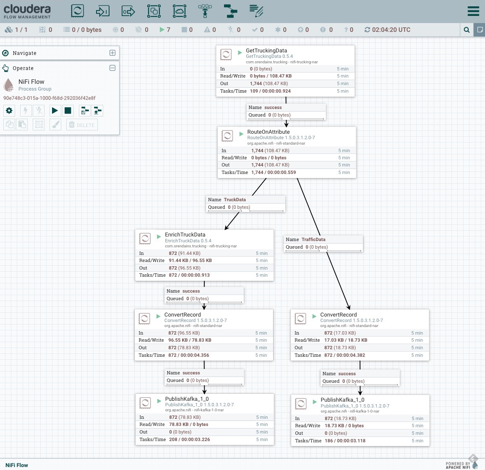
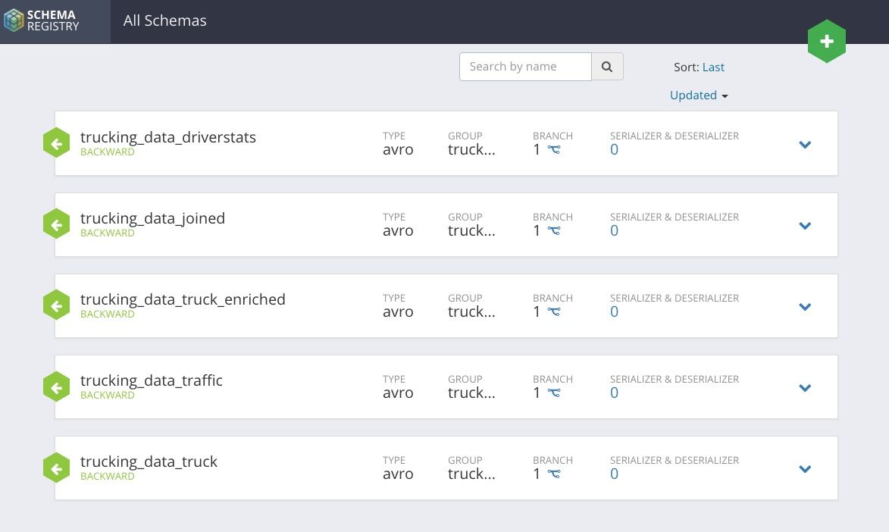
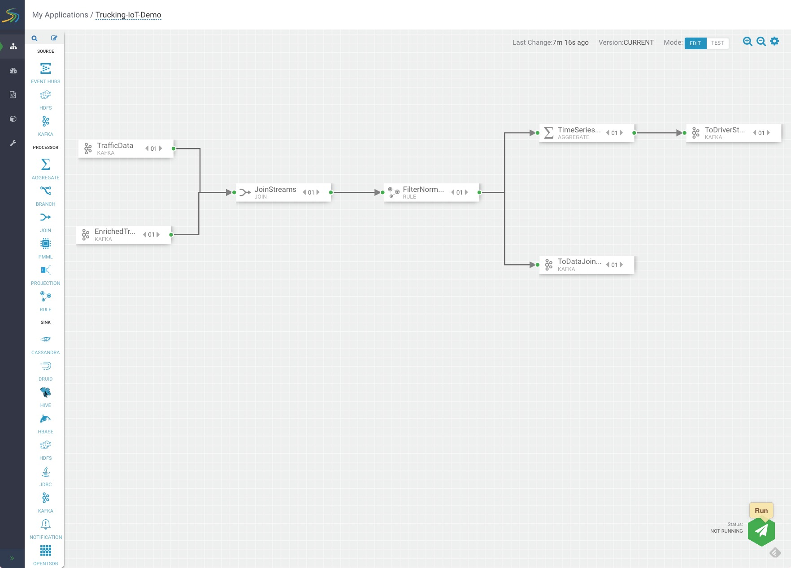
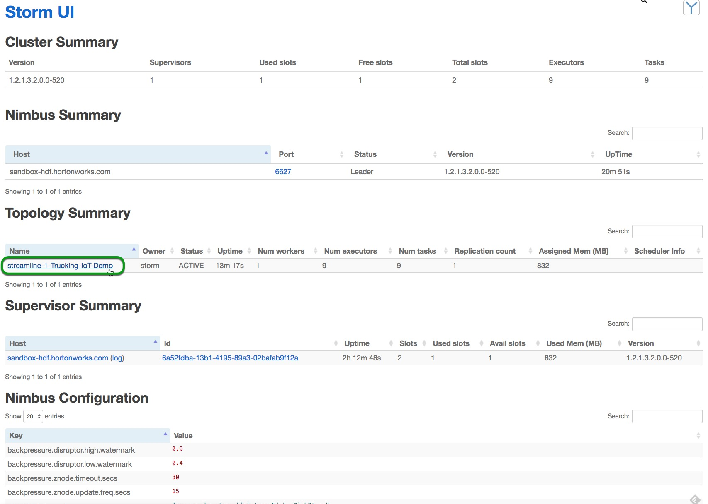
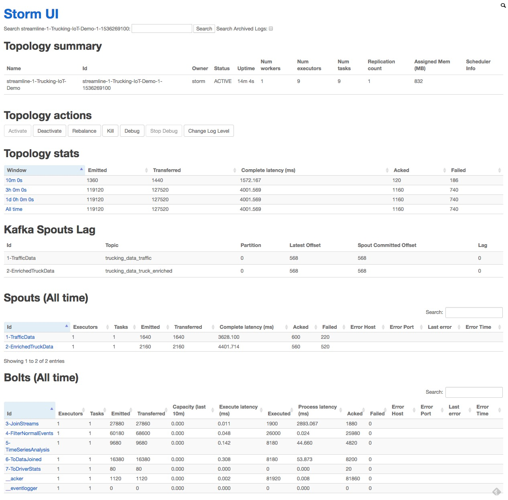

# Getting Started with the HDF Sandbox

## Introduction

In this tutorial, you will learn how to deploy a modern real-time streaming application. This application serves as a reference framework for developing a big data pipeline, complete with a broad range of use cases and powerful reusable core components. You will explore the NiFi Dataflow application, Kafka topics, Schemas and SAM topology.

## Prerequisites

- Downloaded and deployed the [Hortonworks DataFlow (HDF)](https://www.cloudera.com/downloads/hortonworks-sandbox/hdf.html?utm_source=mktg-tutorial) Sandbox

## Outline

- [Concepts](#concepts)
- [Overview of Trucking IoT Ref App](#overview-of-trucking-iot-ref-app)
- [Step 1: Explore Dataflow Application](#step-1-explore-dataflow-application)
- [Step 2: View Schema Registry](#step-2-view-schema-registry)
- [Step 3: Analyze Stream Analytics Application](#step-3-analyze-stream-analytics-application)
- [Step 4: View the Storm Engine that Powers SAM](#step-4-view-the-storm-engine-that-powers-sam)
- [Summary](#summary)
- [Further Reading](#further-reading)
- [Appendix A: Trucking IoT GitHub Repo](https://github.com/orendain/trucking-iot/tree/master)

## Concepts

### Stream Analytics Manager (SAM)

Stream Analytics Manager is a drag and drop program that enables stream processing developers to build data topologies within minutes compared to traditional practice of writing several lines of code. A topology is a **directed acyclic graph (DAG)** of processors. Now users can configure and optimize how they want each component or processor to perform computations on the data. They can perform windowing, joining multiple streams together and other data manipulation. SAM currently supports the stream processing engine known as Apache Storm, but it will later support other engines such as Spark and Flink. At that time, it will be the users choice on which stream processing engine they want to choose.

### Apache Storm

Apache Storm is the current backend computational processing engine for Stream Analytics Manager. After the user builds their SAM topology, all the actual processing of data happens in a Storm topology, which is also a **DAG**, but is comprised of spouts and bolts with streams of tuples representing the edges.

A **spout** ingests the data usually from a Kafka Topic into the topology while **bolts** do all the processing. Thus, all the same components from the SAM topology are represented in the Storm topology, but as appropriate spouts and bolts.

Storm is the Open Source distributed, reliable, fault-tolerant system that handles real time analytics, scoring machine learning models, continuous static computations and enforcing Extract, Transform and Load (ETL) paradigms.

### Schema Registry

Schema Registry (SR) stores and retrieves Avro Schemas via RESTful interface. SR stores a version history containing all schemas. Serializers are provided to plug into Kafka clients that are responsible for schema storage and retrieve Kafka messages sent in Avro format.

### Kafka

Apache Kafka is an open source publish-subscribe based messaging system responsible for transferring data from one application to another.

### Overview of Trucking IoT Ref App

The Trucking IoT Reference Application is built using Hortonworks DataFlow Platform.

The Trucking IoT data comes from a truck events simulator that is ingested by Apache NiFi, NiFi sends the data to Kafka topics which are then ingested by Stream Analytics Manager (SAM). A more in depth explanation of the pipeline will be explained as you explore the NiFi Dataflow application, Schema Registry and SAM.

### Step 1: Explore Dataflow Application

1\. Open the NiFi UI [http://sandbox-hdf.hortonworks.com:9090/nifi/](http://sandbox-hdf.hortonworks.com:9090/nifi/)

2\. The NiFi Dataflow application template: `Trucking IoT Demo` will appear on the canvas.

4\. Select NiFi configuration icon . Click on the Controller Services tab.

5\. The **HortonworksSchemaRegistry** should be enabled. If it's not enabled then select the lightning bolt symbol next to **HortonworksSchemaRegistry**.

6\. In the "Enable Controller Service" window, under "Scope", select "Service and referencing components". Then click ENABLE.

All controller services referencing **HortonworksSchemaRegistry** will also be enabled. Head back to the NiFi Dataflow.

Overview of the **7 processors** in the NiFi Flow:

- **GetTruckingData** - Simulator generates TruckData and TrafficData in bar-delimited CSV

- **RouteOnAttribute** - filters the _TrafficData_ and _TruckData_ into separate data feeds

| Data Name | Data Fields    |
| :------------- | :------------- |
| TruckData       | eventTime, truckId, driverId, driverName, routeId, routeName, latitude, longitude, speed, eventType       |
| TrafficData       | eventTime, routeId, congestionLevel       |

_TruckData side of Flow_

- **EnrichTruckData** - tags on three fields to the end of _TruckData_: "foggy","rainy", "windy"

- **ConvertRecord** - reads incoming data with "CSVReader" and writes out Avro data with "AvroRecordSetWriter" embedding a "trucking_data_truck_enriched" schema onto each flowfile.

- **PublishKafka_1_0** - stores Avro data into Kafka Topic "trucking_data_truck_enriched" _TrafficData side of Flow_

- **ConvertRecord** - converts CSV data into Avro data embedding a "trucking_data_traffic" schema onto each flowfile

- **PublishKafka_1_0** - stores Avro data into Kafka Topic "trucking_data_traffic"

Overview of **5 controller services** used in the NiFi Flow:

- **AvroRecordSetWriter - Enriched Truck Data** - writes contents of RecordSet in Binary Avro Format (trucking_data_truck_enriched schema)

- **AvroRecordSetWriter - Traffic Data** - writes contents of RecordSet in Binary Avro Format (trucking_data_traffic schema)

- **CSVReader - Enriched Truck Data** - returns each row in CSV file as a separate record (trucking_data_truck_enriched schema)

- **CSVReader - Traffic Data** - returns each row in CSV file as a separate record (trucking_data_traffic schema)

- **HortonworksSchemaRegistry** - provides schema registry service for interaction with Hortonworks Schema Registry

7\. Press `command+A` or `control+A` to select all the processors in the NiFi Dataflow and click on the start button .

8\. To reduce resource consumption and footprint, when the **PublishKafka_1_0** processors reach about 500 input records, click on the stop button . This will take approximately 1 - 2 minutes.

9\. Stop **NiFi** service: **Ambari** -> **NiFi** -> **Service Actions** -> **Stop**

### Step 2: View Schema Registry

1\. Open the Schema Registry UI at [http://sandbox-hdf.hortonworks.com:7788/](http://sandbox-hdf.hortonworks.com:7788/)

Overview of the essential **schemas** in the Schema Registry:

- **trucking_data_joined** - model for truck event originating from a truck's onboard computer (EnrichedTruckAndTrafficData)

- **trucking_data_truck_enriched** - model for truck event originating from a truck's onboard computer (EnrichedTruckData)

- **trucking_data_traffic** model for eventTime, routeId, congestionLevel (TrafficData)

### Step 3: Analyze Stream Analytics Application

1\. Open Stream Analytics Manager (SAM) at [http://sandbox-hdf.hortonworks.com:7777/](http://sandbox-hdf.hortonworks.com:7777/)

2\. Click on the Trucking-IoT_Demo, then the green pencil on the right top corner. This should show an image similar to the one below, click on the **Run** button to deploy the topology:

A window will appear asking if you want to continue deployment, click **Ok**.

3\. You will receive a notification that the SAM topology application deployed successfully and your topology will show Active Status in the bottom right corner.

**Overview of the SAM Canvas:**

- My Applications: Different Topology Projects
- 1st Left Sidebar: My Applications, Dashboard, Schema Registry, Model Registry, Configuration
- 2nd Left Sidebar: Different stream components (source, processor, sink)
- Gear Icon: Configure topology settings
- Status Icon: Start or Stop Topology

**Overview of SAM topology:**

- **TrafficData** is the source component name, which pulls in data from the Kafka topic "trucking_data_traffic".

- **EnrichedTruckData** is the source component name, which pull is data from the Kafka topic "trucking_data_truck_enriched"

- **JoinStreams** joins streams "TrafficData" and "EnrichedTruckData" by "routeId".

- **FilterNormalEvents** checks if non "Normal" eventType's occur, then it  will emit them.

- **TimeSeriesAnalysis** computes the average of 10 samples of speed across a 10 second window period, calculates the sum across the same window period as before for foggy, rainy, windy and eventTime individually.

- **ToDriverStats** stores the input from "TimeSeriesAnalysis": driveId, routeId, averageSpeed, totalFog, totalRain, totalWind, and totalViolations into Kafka topic "trucking_data_driverstats".

- **ToDataJoined** stores the input from "FilterNormalEvents": eventTime, congestionLevel, truckId, driverId, driverName, routeId, routeName, latitude, longitude, speed, eventType, foggy, rainy, and windy into Kafka topic "trucking_data_joined".

### Step 4: View the Storm Engine that Powers SAM

1\. From Ambari, click on **Storm** > **Storm UI**

2\. Click on Topology Name: **streamline-1-Trucking-IoT-Demo** under **Topology Summary**

3\.  **Overview of the Storm Topology**

You can see the total number of **Emitted** `(1360)` and **Transferred** `(1440)` tuples after `10m 0s` under **TOPOLOGY STATS** for the entire topology. You can also see individual emitted and transferred tuples for each individual Spout and Bolt in the topology increase. If we hover over one of the spouts or bolts on the graph, we can see how much data they process and their latency.

- Topology Summary
- Topology Stats
- Topology Static Visualization
- Spout
- Bolts
- Topology Configuration

## Summary

Congratulations! You deployed the Trucking IoT demo that processes truck event data by using the NiFi data flow application to separate the data into two flows: _TruckData_ and _TrafficData_. These two flows are then transmitted into two Kafka robust queues tagged with Schema Registry schemas: _trucking_data_traffic_ and _trucking_data_truck_enriched. Stream Analytics Manager's (SAM) topology pulls in this data to join the two streams (or flows) by _routId_, and filter's non-normal events which then get split into two streams. One stream is sent to a Kafka sink directly the other stream is then further filtered with an aggregate processor then sent to a different Kafka sink.

## Further Reading

- [Apache NiFi User Guide](https://nifi.apache.org/docs.html)
- [Kafka Documentation](https://kafka.apache.org/documentation/)
- [Schema Registry](https://docs.confluent.io/current/schema-registry/docs/index.html)
- [Stream Analytics Manager User Guide](https://docs.hortonworks.com/HDPDocuments/HDF3/HDF-3.0.2/bk_streaming-analytics-manager-user-guide/content/ch_sam-manage.html)
