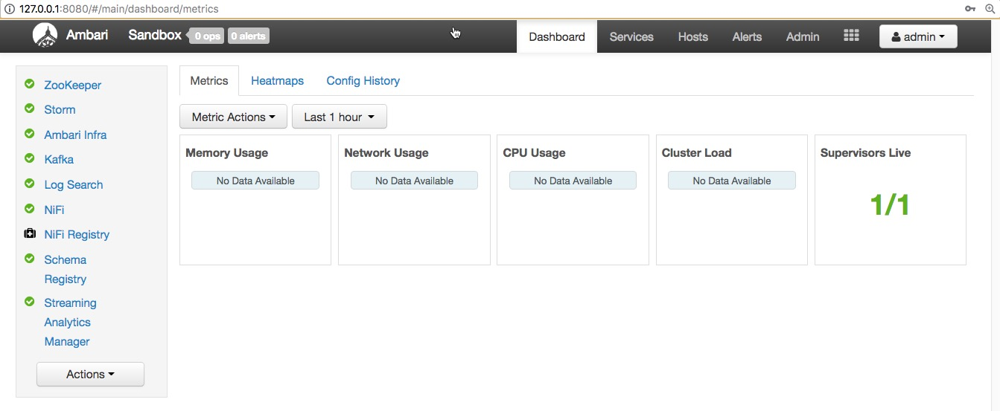
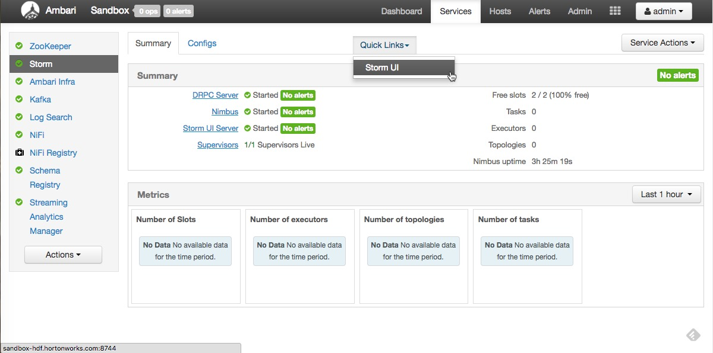
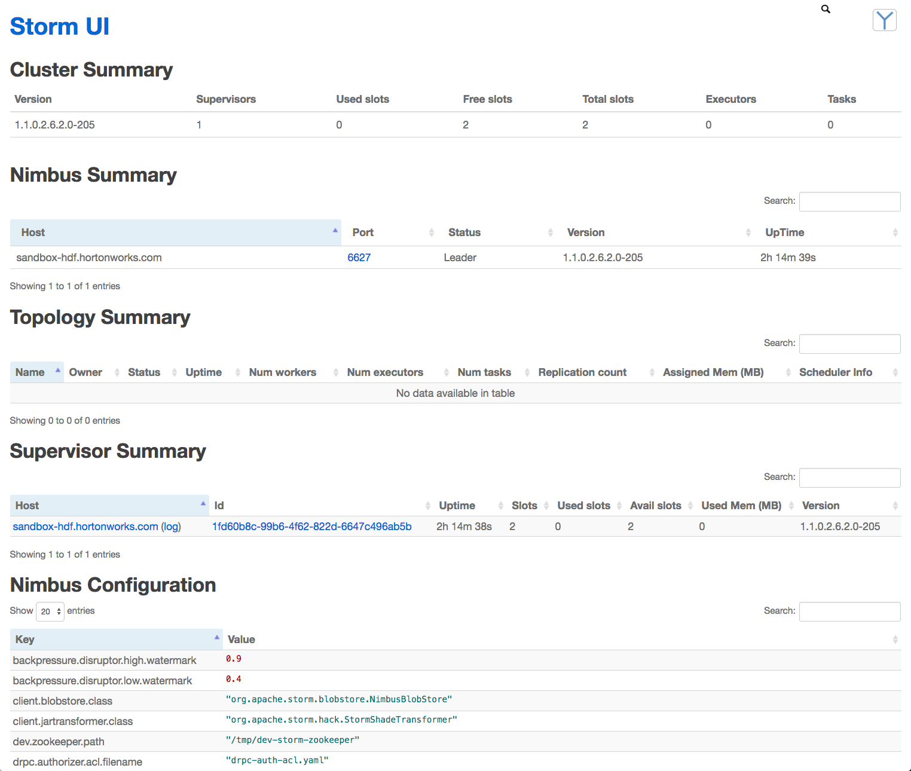
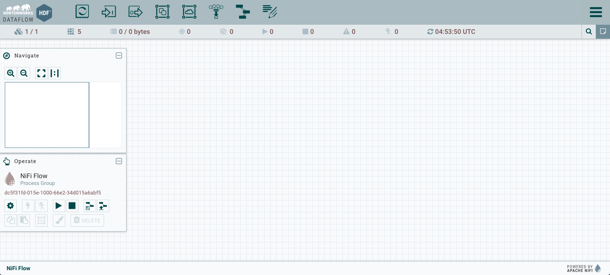
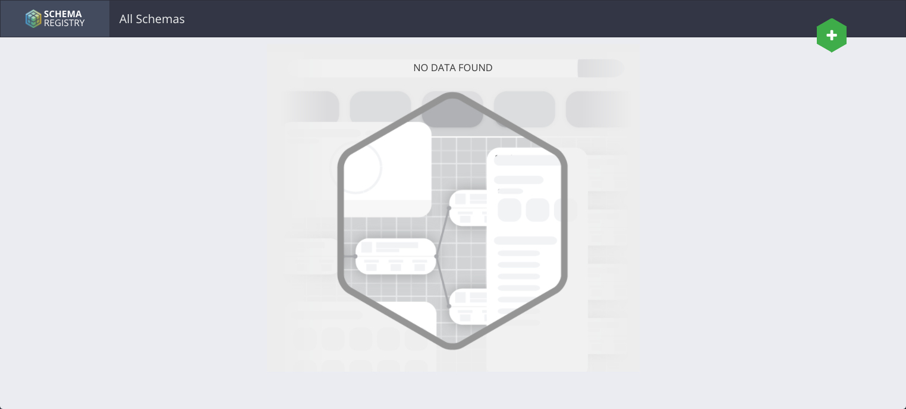
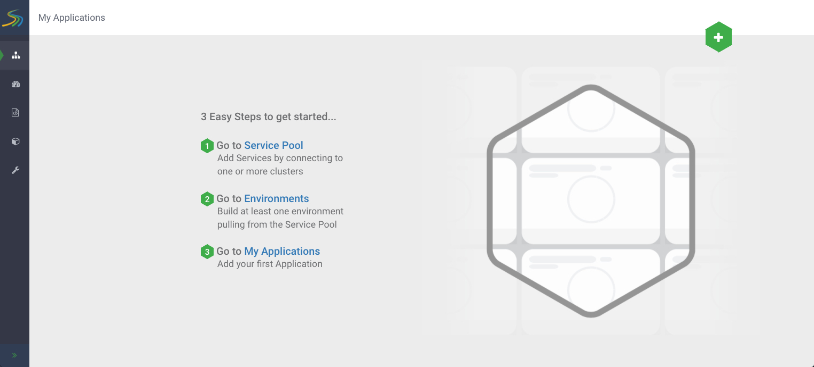

# Getting Started with Hortonworks DataFlow (HDF) Sandbox

## Introduction

Building Internet of Things (IOT) related applications is faster and simpler by using the open source data-in-motion framework known as Hortonworks DataFlow (HDF). Learn how to build IOT applications in a virtual test environment that keeps your home computing environment safe. HDF can be learned through an HDF sandbox. Tutorials have been developed and tested against the sandbox to make getting started with Big Data and IOT a smoother process.

By the end of this tutorial, you will be familiar with the data-in-motion tools from the HDF platform that can be used to build your applications.

## Prerequisites

-   Downloaded and Installed [HDF Sandbox](https://hortonworks.com/tutorial/sandbox-deployment-and-install-guide/)

## Outline

-   [Concepts](#concepts)
-   [Step 1: Explore the Splash Page](#step-1-explore-the-splash-page)
-   [Step 2: Beginner or Experienced?](#step-2-beginner-or-experienced)
-   [Step 3: How to Access the HDF Components](#step-3-how-to-access-the-hdf-components)
-   [Summary](#summary)
-   [Further Reading](#further-reading)
-   [Appendix A: Sandbox Reference Sheet](#appendix-a-sandbox-reference-sheet)
-   [Appendix B: Troubleshoot](#appendix-b-troubleshoot)

## Concepts

### What is a Sandbox?

The Sandbox is a straightforward, pre-configured, learning environment that contains the latest developments from Apache Big Data related tools, specifically these tools were assembled together into Hortonworks DataFlow (HDF). The Sandbox comes packaged in a virtual environment that can run in the cloud or on your personal machine. The sandbox allows you to learn to build streaming applications. Supplemental tutorials tested against the latest sandbox environment are provided at [HDF Tutorial Track](https://hortonworks.com/tutorials/?tab=product-hdf).

### HDF Analytics Sandbox

The HDF Analytics Sandbox Architecture comes with the following Big Data Tools:
Hadoop Core, Zookeeper, Storm, Kafka, Druid, NiFi, Schema Registry and Stream Analytics Manager (SAM) and Superset.

### Step 1: Explore the Splash Page

After starting your sandbox, to initiate your development session, open a browser at this address: `http://ip-address:1080`.

VMware Sandbox Session Example:

~~~
http://192.168.9.128:1080
~~~

VirtualBox/Docker Sandbox Session Example:

~~~
http://127.0.0.1:1080
~~~

>Hostname for VMware will be the IP address on the "welcome screen" that appears when you start your virtual machine. VirtualBox and Docker sandbox IP address will be the default 127.0.0.1.

**Figure 1: HDF Splash Page**

The HDF splash page in **Figure 1** presents the user with two tracks: "NEW TO HDF" and "ADVANCED HDF." "NEW TO HDF" track when pressing the "LAUNCH DASHBOARD" will open the Ambari Dashboard while "ADVANCED HDF" will open the advanced quick links of the HDF component's UIs.

### Step 2: Beginner or Experienced?

From the HDF splash page, there are two tracks for the Big Data and IOT journey, the beginner and experienced user. If you are new to HDF, head to the "NEW TO HDF" shown in **Figure 2** track, become acquainted with Ambari and start learning how to build streaming applications by way of [tutorials](https://hortonworks.com/tutorials/?tab=product-hdf). Else if you are an experienced user who has worked with some of the HDF components to build streaming applications previously, head to the "ADVANCED HDF" shown in **Figure 3** track for quick links to access components you will need.

**Figure 2: NEW TO HDF TRACK**

**Figure 3: ADVANCED HDF TRACK**

### Step 3: How to Access the HDF Components

The HDF components accessed most often for building applications are:

Hyperlink Approach:

| HDF Component | URL     | Login Credentials |
| :------------- | :------------- | :------------- |
| Ambari       | `http://ip-address:8080`       | admin/admin |
| Storm UI       | `http://ip-address:8744`       | not needed |
| Superset       | `http://ip-address:9089/login`       | admin/hortonworks1 |
| NiFi       | `http://ip-address:9090/nifi`       | not needed |
| Registry       | `http://ip-address:7788`       | not needed |
| Streaming Analytics Manager       | `http://ip-address:7777`       | not needed |
| Sandbox Web Shell Client | `http://ip-address:4200` | root/hadoop |

In the HDF Platform, each service that has a UI most often used in the tutorials is illustrated in **Figures 4-9**.

**Figure 4: Used Ambari Quick Link to Access Storm UI**

_Apache Ambari_

- Open source management platform
- Provides ongoing cluster management and maintenance (cluster size irrelevant)
via Web UI and REST API (cluster operations automation)
- Centralizes security setup, visualizes cluster health and extends cluster capability by wrapping custom services under management

For more information, refer to [Apache Ambari Documentation](https://ambari.apache.org/)

**Figure 5: Storm UI**

_Apache Storm_

- Open source distributed realtime computation system
- Processes unbound streams of data at a million tuples per second per node
- Easy to become familiar with because it integrates queuing and database technologies as well as allows developers to create stream applications in any programming language

For more information, refer to [Apache Storm Components Guide](https://docs.hortonworks.com/HDPDocuments/HDP2/HDP-2.6.3/bk_storm-component-guide/content/ch_storm-overview.html)

**Figure 6: Superset Dashboard**

_Apache Superset (Incubating)_

- Open source data visualization web application
- Intuitive interface for visualizing data with over 30+ options
- Incorporates a security/permission model that establishes which features and datasets an individual can access

For more information, refer to [Apache Superset (incubating)](https://superset.incubator.apache.org/)

**Figure 7: NiFi Canvas**

_Apache NiFi_

- Open source realtime data logistics and simple event processing platform
- Suitable from a wide range of devices from the small network edge devices to enterprise data clusters and even the cloud
- Manage the movement of data between any source and destination and provides data agnostics to work with various systems, formats, schemas, protocols, speeds, sizes, etc.

For more information, refer to [Apache NiFi Documentation](https://hortonworks.com/apache/nifi/)

**Figure 8: Schema Registry Dashboard**

_Schema Registry_

- Shared repository of schemas
- Allows for flexibility to save, edit, or retrieve schemas for data that applications (NiFi, SAM, etc) need to access
- Easily attaches schemas to individual pieces of data to provide greater operational efficiency without the additional overhead

For more information, refer to [Schema Registry Documentation](https://hortonworks.com/open-source/schema-registry/)

**Figure 9: Streaming Analytics Manager (SAM) Dashboard**

- Open source visual drag and drop stream applications builder
- Design, develop, deploy and manage streaming applications through a visual paradigm approach within minutes without writing code

For more information, refer to [SAM Documentation](https://hortonworks.com/open-source/streaming-analytics-manager/)

## Summary

Congratulations! Now you know about the different features available in the HDF sandbox. You can use these HDF components to began building your own applications to solve data-in-motion problems. If you want to learn more about HDF, check out the documentation in the Further Reading section below. If you want to explore more in depth how you can use the HDF tools to build applications, visit the Hortonworks HDF Sandbox tutorials.

## Further Reading

- [HDF Documentation](https://docs.hortonworks.com/HDPDocuments/HDF3/HDF-3.0.2/index.html)
- [HDF Tutorial Track](https://hortonworks.com/tutorials/?tab=product-hdf)

## Appendix A: Sandbox Reference Sheet

In the HDF sandbox cheat sheet, it is a reference of common knowledge and tasks often done in the sandbox.

### Learn the IP Address of Your Sandbox

Once the Sandbox VM or container is installed, it settles to the host of your environment, the IP address varies depending on your Virtual Machine (VMware, VirtualBox) or container (Docker). Once the sandbox is running, it will tell you the IP address. An example of typical IP addresses for each supported environment:

Docker: `IP Address = 127.0.0.1`

VirtualBox: `IP Address = 127.0.0.1`

VMware: `IP Addrss = 192.168.x.x`

### Map Sandbox IP to Your Desired Hostname in the Hosts File

Mac, Linux and Windows all have a hosts file. This file once configured enables the IP address of the sandbox to be mapped to a hostname that is easier to remember than a number. For HDF sandbox, we include an example of the sandbox IP address mapped to the hostname `sandbox-hdf.hortonworks.com`

OS X user, copy/paste the command in your terminal:

~~~
echo '{IP-Address} sandbox-hdf.hortonworks.com' | sudo tee -a /private/etc/hosts
~~~
> NOTE: In single machine, just replace {Host-Name} with 127.0.0.1

Linux users, copy/paste the command in your terminal:

~~~
echo '{IP-Address} sandbox-hdf.hortonworks.com' | sudo tee -a /etc/hosts
~~~
> NOTE: In single machine, just replace {Host-Name} with 127.0.0.1

Windows 10 users, open Notepad as an **administrator**. Open the "hosts" file at this path: `c:\Windows\System32\drivers\etc\hosts` and add:

~~~bash
127.0.0.1   localhost   sandbox-hdf.hortonworks.com
~~~

> Note: Make sure to remove the "#" hash symbol from the left side of the line and add "sandbox-hdf.hortonworks.com".

Then save the file.

If you did not change "hosts" file, you would be required to enter the IP address followed by the port number as shown in **Figure 10**:

**Figure 10: `http://192.168.9.128:8080` => Ambari Dashboard**

Once a hostname is name is mapped to the IP address of the VMware (or other VM) sandbox, that hostname followed by the port number will be suffice to access the HDF component:

**Figure 11: `http://sandbox-hdf.hortonworks.com:8080` => Ambari Dashboard**

Notice in **Figure 10**, the user refers to the explicit IP address of the VMware (or other VM) HDF Sandbox, but once the IP address is mapped to a hostname, then the user can use an ALIAS shown in **Figure 11** in place of that IP address.

### Setup Ambari admin Password Manually

Due to possibility of passwords being vulnerable to being hacked, we recommend
you change your Ambari admin password to be unique.

1. Start your sandbox and open web shell client:

~~~
http://sandbox-hdf.hortonworks.com:4200
~~~

2. The login credentials:

~~~
root/hadoop
~~~

3. Type the following commands:

~~~
# Update password
ambari-admin-password-reset
# If Ambari doesn't restart automatically, restart ambari service
ambari-agent restart
~~~

> **Note:** Now you can login to ambari as an admin user to perform operations, such as starting and stopping services.

## Appendix B: Troubleshoot

### Troubleshoot Problems

Check [Hortonworks Community Connection](https://hortonworks.com/community/forums/)(HCC) for answers to problems you may come across during your hadoop journey.

### Technique for Finding Answers in HCC

-   Insert quotes around tutorial question or problem search string
-   Be specific by including keywords (error, tutorial name, etc.)
