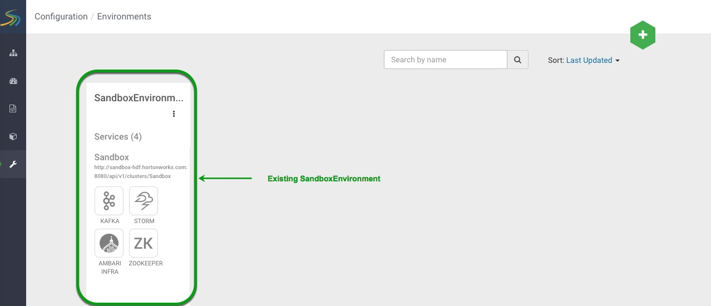
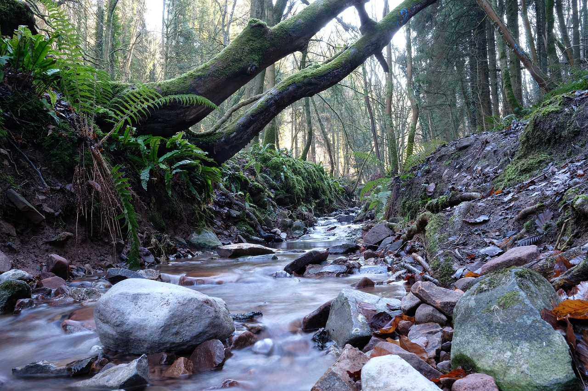
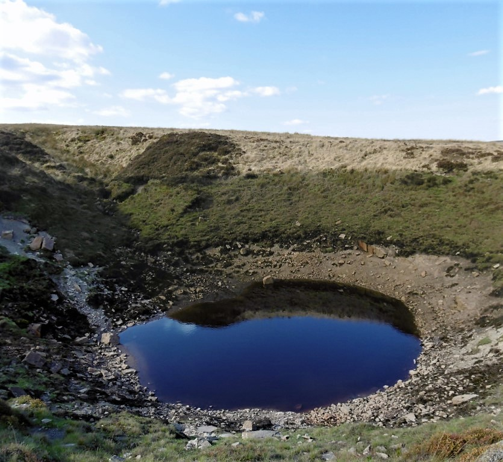

# Lesson - Stream Processing & SAM

## Objective

To become acquainted with the idea of stream processing and where Stream Analytics Manager (SAM) fits in. To learn about some of the key concepts of SAM.

## Outline

- [Introduction to Stream Processing](#introduction-to-stream-processing)
- [Streaming Analytics Manager](#streaming-analytics-manager)
- [Summary](#summary)
- [Further Reading](#further-reading)

## Introduction to Stream Processing

In the **stream processing model**, data is sent directly into a data analytics engine to be computed one by one with results occurring in real-time. In the realm of **batch processing**, data is collected over time, then it is fed into a data analytics engine.

**When to use Stream Processing?**

When you need data analytic results in real-time, you can create multiple data stream sources using Apache Kafka, then use the visual stream processing tool SAM to pull in these data sources. With SAM you can leverage its visualization programming paradigm to feed the data into its suite of analytic tools and obtain near-instant analytic results.

Fraud Detection in which transaction data is being generated instantaneously calls for using stream processing. SAM will be able to detect anomalies, which signal fraud in real-time and stop these fraudulent transactions before they can finish.

**History**

Previously, developers had to use headless stream processing tools like Apache Storm and Spark Streaming, eventually many developers in the open source community came together to provide the "head" or "visual canvas" that integrates Apache Storm behind the scenes as the stream processing engine.

## Streaming Analytics Manager

A part of developing the SAM topology requires setting up your **service pool** and **environment**, so you can add a stream **application**. Once you have these three components established, you will be able to start building your SAM topology.

## Service Pool

A service pool is the set of services related to your Ambari Managed Cluster on HDF. A **service** is an entity in which an Application Developer uses to build stream topologies. Examples include:

- a Storm Cluster for Stream Application deployment
- a Kafka Cluster in which the stream application uses to create streams
- a Druid Data Store to which the stream application writes

The list of managed service pools is located in **Configuration**  tab. For our case, we have one service pool pre-loaded into our CDF Sandbox shown in **Figure 1**, but in larger projects, you will probably have more.

**Figure 1: Sandbox Service Pool**

## Environment

An environment is a named entity which represents a set of services chosen from different service pools. When a new stream application is created, they are assigned an environment by the developer. Thus, the stream application can only use services associated with your chosen environment

The list of managed environments is located in the **Configuration** tab. For our case, we have one environment pre-loaded into our CDF Sandbox shown in **Figure 2**

**Figure 2: Sandbox Environment**

## Application

An application is the stream analytics manager topology. For example the application you will create is shown in **Figure 3**.

**Figure 3: Trucking-IoT-Demo**

Once the above three components are created, a SAM Developer, can start building their topology.

## SAM Topology Components

SAM's topology visual editor allows you to drag and drop components into the canvas, so you can add the first processor to your topology or connect new processors to your existing topology.

**Source**

Source is a component that ingests data from various data stream sources, such as messaging systems or distributed file systems, such as Kafka or HDFS, into their topology.

A nice analogy shown in **Figure 4** is a visualization of water in which there are multiple streams being pulled into a body of water that keeps on flowing:

**Figure 4: Data Stream Sources**

**Processor**

Processor is a component that performs the transformations, computation, joining and filtering on data as it moves through the stream.

In nature, as portrayed in **Figure 5** we have rocks that process our water and other forms of natural solid materials that filter our water the way processors filter our data down to the insights we want:

**Figure 5: Processors**

**Sink**

Sink is a component that stores data into a datastore or distributed file system, such as Druid, HBase, HDFS, JDBC, etc.

In a body of water, there are many water sinkholes correlating to the idea that data can be stored in different locations, here is a visual representation:

**Figure 6: Data Sinks**

## Summary

Congratulations! You are now familiar with the concept of stream processing and when you would need to use a stream processing tool such as SAM. Now that you are aware of the fundamental concepts in SAM, let's jump into building a SAM topology.

## Further Reading

- [Stream Processing](https://hortonworks.com/info/value-streaming-integration/)
- [Stream Analytics Manager](https://docs.hortonworks.com/HDPDocuments/HDF3/HDF-3.1.1/bk_streaming-analytics-manager-user-guide/content/ch_sam-manage.html)
- [Apache Storm](https://docs.hortonworks.com/HDPDocuments/HDP2/HDP-2.6.4/bk_storm-component-guide/content/ch_storm-overview.html)
- [Apache Kafka](https://docs.hortonworks.com/HDPDocuments/HDP2/HDP-2.6.4/bk_kafka-component-guide/content/ch_introduction_kafka.html)
- [Kafka in Trucking IoT on HDF](https://hortonworks.com/tutorial/kafka-in-trucking-iot/)
