# Getting Started with Apache Zeppelin

## Introduction

Apache Zeppelin is a web-based notebook that enables interactive data analytics. With Zeppelin, you can make beautiful data-driven, interactive and collaborative documents with a rich set of pre-built language back-ends (or interpreters) such as Scala (with Apache Spark), Python (with Apache Spark), SparkSQL, Hive, Markdown, Angular, and Shell.

With a focus on Enterprise, Zeppelin has the following important features:

- Livy integration (REST interface for interacting with Spark)
- Security:
  - Execute jobs as authenticated user
  - Zeppelin authentication against LDAP
  - Notebook authorization

The purpose of this tutorial is to guide you through basic functionalities of Zeppelin so that you may create your own data analysis applications or import existent Zeppelin Notebooks; additionally, you will learn advanced features of Zeppelin like creating and binding interpreters, and importing external libraries.

## Prerequisites

- Downloaded and deployed the [Hortonworks Data Platform (HDP)](https://www.cloudera.com/downloads/hortonworks-sandbox/hdp.html?utm_source=mktg-tutorial) Sandbox
- Ensure Spark version 2.x or later is installed

## Outline

- [Launching Zeppelin](#launching-zeppelin)
- [Creating a Notebook](#creating-a-notebook)
- [Importing a Notebook](#importing-a-notebook)
- [Deleting a Notebook](#deleting-a-notebook)
- [Adding a Paragraph](#adding-a-paragraph)
- [Running a Paragraph](#running-a-paragraph)
- [Clearing Paragraph Output](#clearing-paragraph-output)
- [Installing an Interpreter](#installing-an-interpreter)
- [Creating an Interpreter](#creating-an-interpreter)
- [Binding an Interpreter](#binding-an-interpreter)
- [Exporting a Notebook](#exporting-a-notebook)
- [Importing External Libraries](#importing-external-libraries)
- [Summary](#summary)
- [Further Reading](#further-reading)

## Concepts

This tutorial is the fundamental base which will be used in future Spark tutorials and covers important topics such as creating notebooks, importing and expanding existing notebooks, and binding different back-ends to your environment so that you may use Zeppelin to it's full potential.

## Launching Zeppelin

There are two  ways to access Zeppelin in the HDP environment, the first is through Amabari's **Quick Links** and the second is by navigating to Zeppelin's dedicated port on your browser.

### Launching Zeppelin through Ambari

Login to Ambari (operations console) using **amy_ds/amy_ds** as a username/password combination.

>NOTE: Recall that Ambari is accessible at **http://sandbox-hdp.hortonworks.com:8080** on your browser while the Sandbox is running. If you're new to the HDP Sandbox environment, make sure to review [Learning the Ropes of the HDP Sandbox.](https://hortonworks.com/tutorial/learning-the-ropes-of-the-hortonworks-sandbox/)

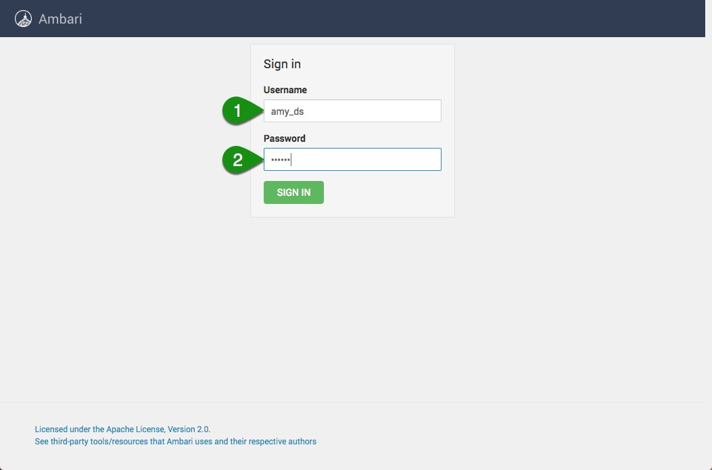

Once you are in Ambari click on Zeppelin Notebook select Zeppelin UI under Quick Links.

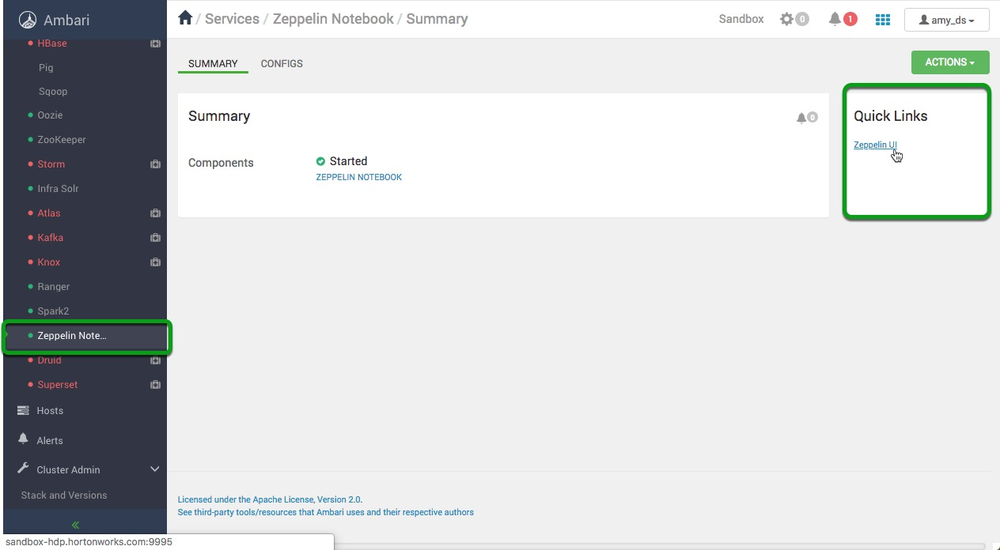

Voila, you should see default Zeppelin menu.

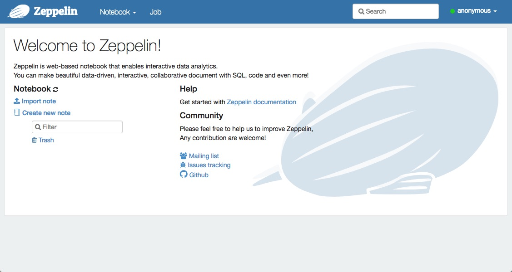

### Launching Zeppelin from URL

The second option to launch a Zeppelin instance is by opening a browser and navigating to **http://sandbox-hdp.hortonworks.com:9995** while your Sandbox is running.

>NOTE: For this approach to work you must have already renamed the sandbox IP address in your **hosts** file. If you need assistance renaming your default IP in the hosts file this visit the [Learning the Ropes of the HDP Sandbox Tutorial](https://hortonworks.com/tutorial/learning-the-ropes-of-the-hortonworks-sandbox/#map-sandbox-ip-to-your-desired-hostname-in-the-hosts-file)

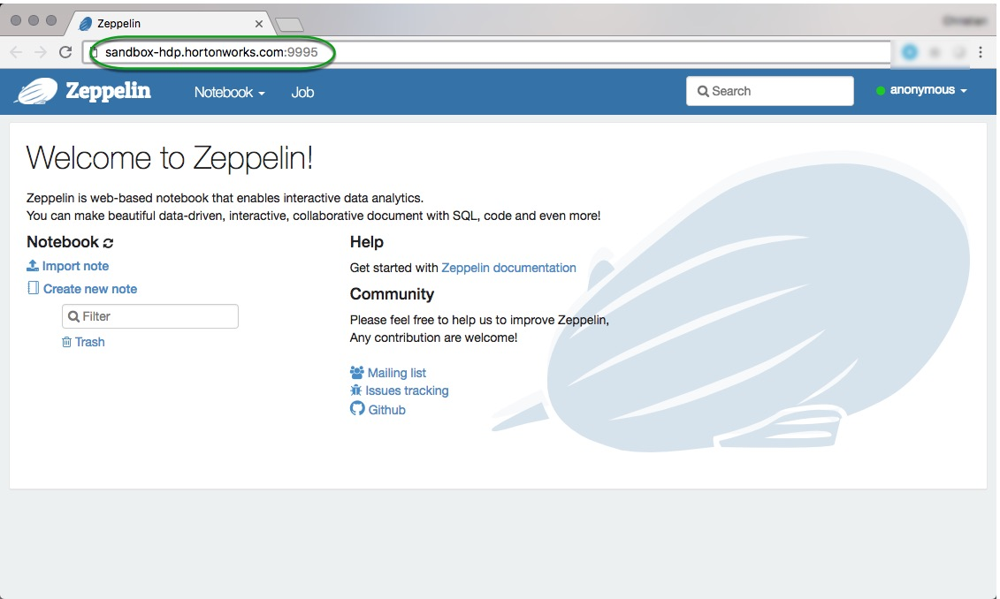

Now let's create your first notebook.

## Creating a Notebook

To create a notebook:

1\. Under the “Notebook” tab, choose **Create new note**.


2\. You will see the following window. Type a name for the new note (In this case we will call it _Spark on HDP_), for now let's leave the interpreter option on the default setting. You will learn about interpreters in subsequent sections; Finally, click on create.

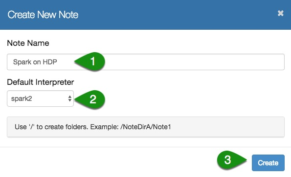

By default the new notebook will be opened with a blank paragraph, if you want to come back to work on it at a later time you will find your notebook on the main Zeppelin UI.

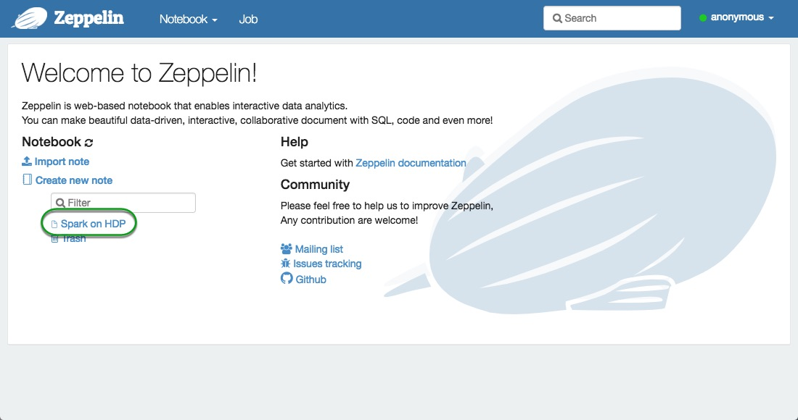

Great, now you know how to create a notebook from scratch. Before we being coding, let's learn about different ways to import an already existent Zeppelin Notebook.

## Importing a Notebook

Instead of creating a new notebook, you may want to import an existing one.

There are two ways to import Zeppelin notebooks, either by pointing to json notebook file local to your environment or by providing a url to raw file hosted elsewhere, e.g. on github. We'll cover both ways of importing those files.

**1\. Importing a JSON file**

On the Zeppelin UI click Import.


Next, click **Select JSON File** button.

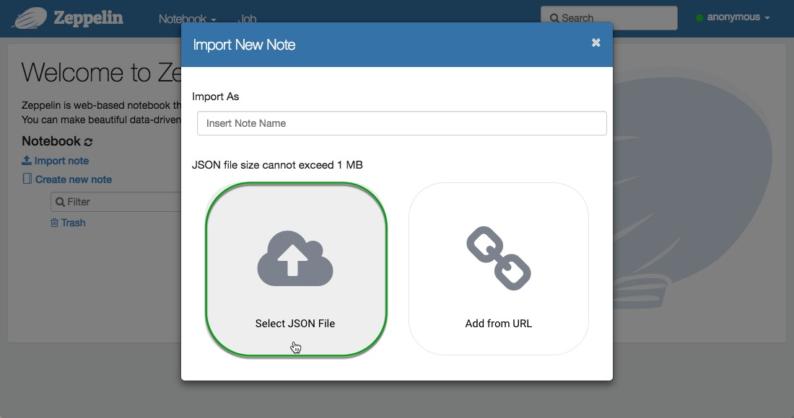

Finally, select the notebook you want to import and click **Open**.

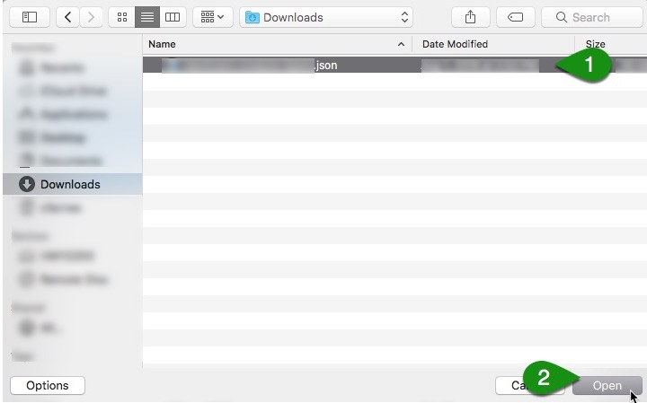

Now you should see your imported notebook among other notebooks on the main Zeppelin screen.

**2\. Importing a Notebook with a URL**

Click Import note.


Next, click **Add from URL** button.

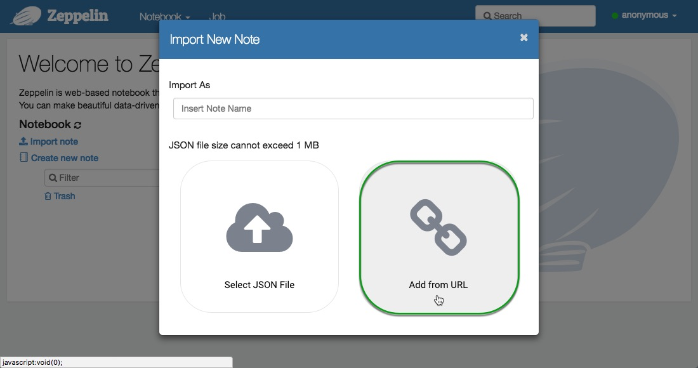

Finally, paste the url to the (raw) json file and click on **Import Note**.

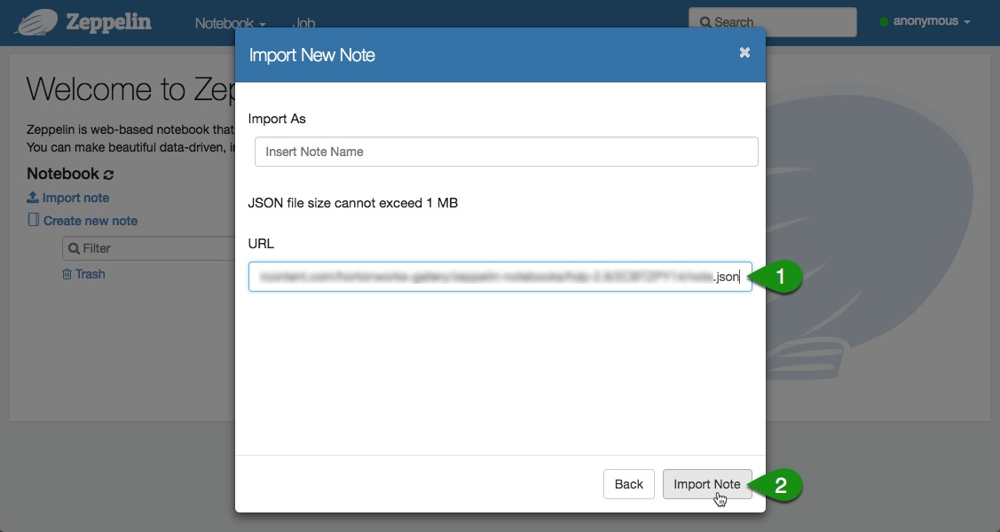

Now you should see your imported notebook among other notebooks on the main Zeppelin screen.

## Deleting a Notebook

If you would like to delete a notebook you can do so by going to the Zeppelin Welcome Page. On the left side of the page under **Notebook** you will see various options such as **Import note**, **Create new note**, a **Filter** box, right under the **Filter** box is where you will find notebooks that you created or imported.

To delete a notebook(see image below as reference)

1\. Hover over the notebook that you want to delete

Various icons will appear including a trashcan.

2\. Click on the trashcan icon

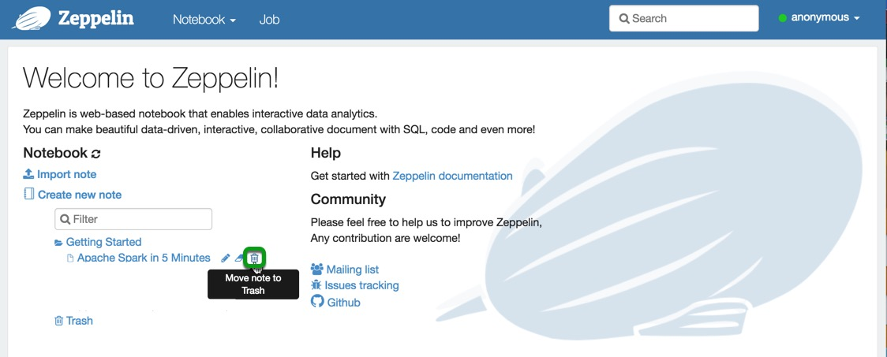

A prompt will ask you if you want to  **Move this note to trash?**, click **OK**.

The notebook has now been moved to the Zeppelin's trash folder. You can always restore the notebook back by clicking on the **Trash** folder, hover over the notebook you want to restore, there you will see two options a curved arrow that says **Restore note** and an **x** that allows you to remove items permanently. If you want to restore an notebook click on **Restore note** and on **x** to delete the item permanently from Zeppelin.

## Adding a Paragraph

By now you must be eager to begin coding or expanding on the notebook you imported. Adding a paragraph in Zeppelin is very simple. Begin by opening the notebook that you want to work on, for this part of the tutorial we will use the _Spark On HDP_ Notebook we created earlier.

Next, hover over either the lower or upper edge of an existent paragraph and you will see the option to add a paragraph appear.


Click above to add the new paragraph before the existent one.


Or click below to add the new paragraph after the current paragraph.

Okay, now that you have either created or imported a notebook and wrote paragraphs, the next step is to run the paragraphs.

## Running a Paragraph

There are two ways of running a paragraph in a Zeppelin Notebook, step 1 and 2 covers how to run individual paragraphs. Step 3 will show you how to you all paragraphs with one click.

1\. Click the play button (blue) triangle on the right hand side of the paragraph or

2\. Press **Shift + Enter**


3\.Click the play button (blue) triangle at the top of the Zeppelin Notebook as shown on the image below.


## Clearing Paragraph Output

To clear the output of a specific paragraph:

1\. Click on the gear located on the far right hand side of the paragraph.

2\. Select **Clear Output**

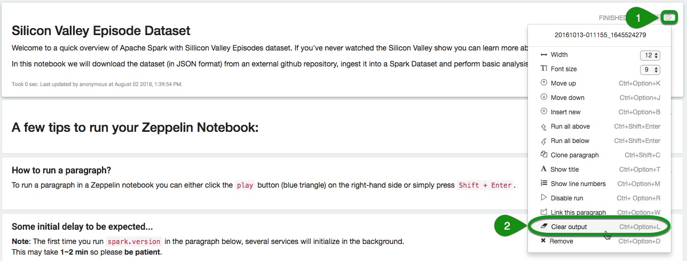

This will clear the output of that specific paragraph

To clear the output of the whole Zeppelin Notebook go to the top of the Notebook and select the eraser icon. A prompt will appear asking *Do you want to clear all output?* Press **OK**.  


## Installing an Interpreter

In this section we will review how to install a Zeppelin interpreter for use in the Zeppelin UI. Please note the [supported interpreters](https://zeppelin.apache.org/supported_interpreters.html) to ensure that the interpreter you want to install.

Open **Web Shell** by navigating to http://sandbox-hdp.hortonworks.com:4200

To display a list of the available interpreters issue the following command:

~~~bash
/usr/hdp/current/zeppelin-server/bin/install-interpreter.sh --list
~~~

next, issue the following command:

~~~bash
/usr/hdp/current/zeppelin-server/bin/install-interpreter.sh --name shell,jdbc,python...
~~~

> Note: In this example we are highlighting shell, jdbc, and python; however, any community supported interpreter can be installed this way.

 Output you should see:

 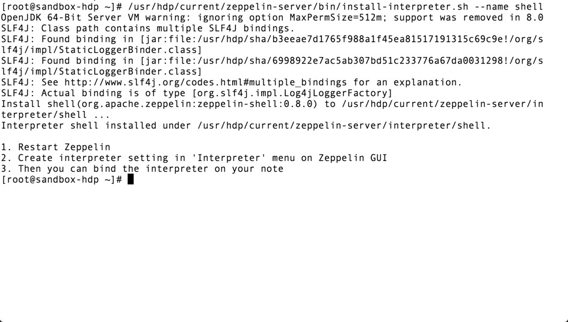

 Restart Zeppelin from Ambari UI.

Refer to [creating an interpreter section](#creating-an-interpreter) to enable usage on the Zeppelin Web Application.

## Creating an Interpreter

Zeppelin Notebooks supports various interpreters which allow you to perform many operations on your data. Below are just a few of operations you can do with Zeppelin interpreters:

- Ingestion
- Munging
- Wrangling
- Visualization
- Analysis
- Processing

 These are some of the interpreters that will be utilized throughout our various Spark tutorials.

| Interpreter | Description|
| :---| :--- |
| **%spark2** | Spark interpreter to run Spark 2.x code written in Scala |
| **%spark2.sql** |Spark SQL interpreter (to execute SQL queries against temporary tables in Spark)  |
| **%sh**| Shell interpreter to run shell commands like move files |
| **%angular** | Angular interpreter to run Angular and HTML code |
| **%md**  | Markdown for displaying formatted text, links, and images |

Note the **%** at the beginning of each interpreter. Each paragraph needs to start with **%** followed by the interpreter name. The image below showcases three interpreters, Markdown, Spark and Shell.

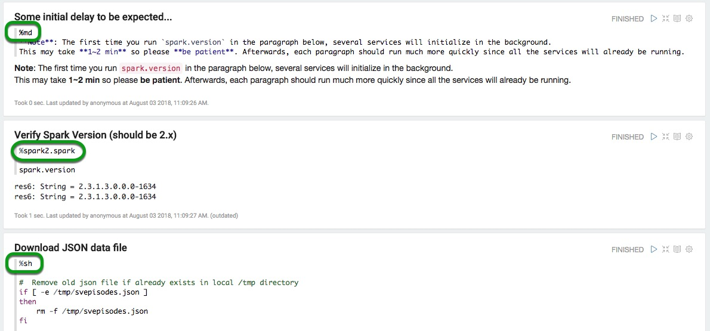

To create an interpreter in Zeppelin:

1\. Click on **anonymous** which is located on the right hand side of the Zeppelin Welcome page

2\. On the drop down select **Interpreter**

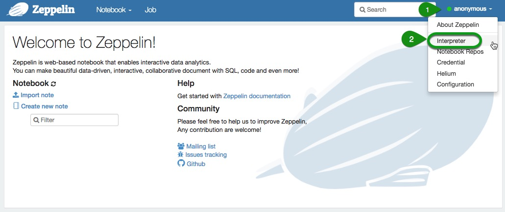

3\. On the right hand corner of the Interpreters page you will see **Create**, click on it

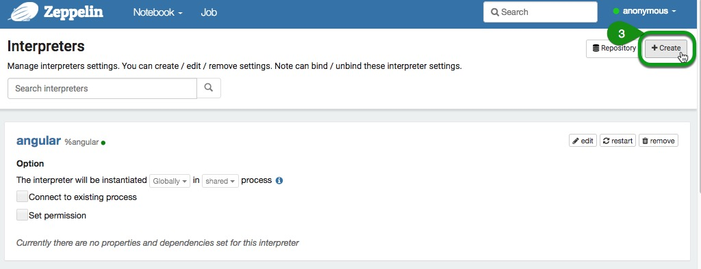

This will bring up the **Create new interpreter** option. We will use the shell interpreter as an example.

4\. Type **sh** in the **Interpreter Name** box

5\. Type **sh** in the **Interpreter Group** as well

6\. Click on **Save**

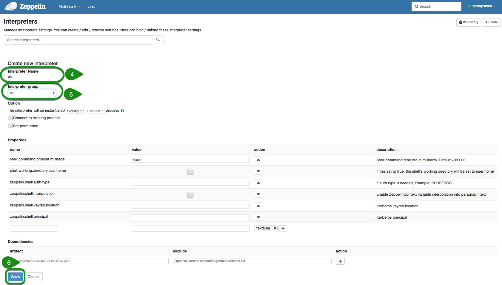

Once you are done creating the interpreter you need to bind it to the notebook you will be using it in. The next section will cover how to bind the interpreter into a notebook.

## Binding an Interpreter

To bind the interpreter you just created you need to reopen the notebook you want to bind your new interpreter in.

1\. Click on the gear at the top right side of your Zeppelin Notebook. Note that when you click on that gear it says **Interpreter binding**

The settings section appears and you can see your newly created interpreter, in our case the shell interpreter **sh**.

2\.  Click on the interpreter and it will change from white to blue.

3\. Click on **Save**

Your new shell interpreter is ready to be put to use.

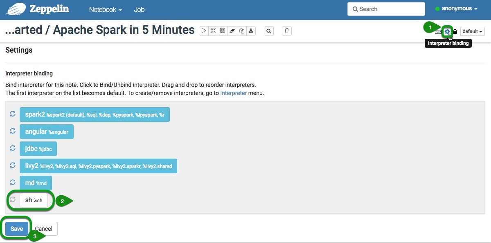

## Exporting a Notebook

To export a notebook that you have been working on you can do so by simply going top of the notebook you are working on.

1\. Click the download icon shown in the image below:


This will download the notebook as a JSON file into your local computer.

## Importing External Libraries

As you explore Zeppelin you will probably want to use one or more external libraries. For example, to run [Magellan](http://hortonworks.com/blog/magellan-geospatial-analytics-in-spark/) you need to import its dependencies; you will need to include the Magellan library in your environment. There are three ways to include an external dependency in a Zeppelin notebook:

1\.Using the **%dep** interpreter (**Note**: This will only work for libraries that are published to Maven.)

```
%dep
z.load("group:artifact:version")
```

2\. Using the **%spark2** interpreter

```
%spark2
```

3\. Using the **import** statement

```
import ...
```

Here is an example that imports the dependency for Magellan using **%dep** interpreter:

```
%dep
z.addRepo("Spark Packages Repo").url("http://dl.bintray.com/spark-packages/maven")
z.load("com.esri.geometry:esri-geometry-api:1.2.1")
z.load("harsha2010:magellan:1.0.3-s_2.10")
```

## Summary

Congratulations! You now know the basic functionalities of Zeppelin. Now you can create, import, delete and run a Zeppelin Notebook. Additionally, you know how to create and bind an interpreter, export a notebook and  import external libraries.

We hope that we’ve got you interested and excited enough to further explore Spark with Zeppelin.Make sure to checkout other tutorials for more in-depth examples of the Spark SQL module, as well as other Spark modules used for Streaming and/or Machine Learning tasks. We also have a very useful Data Science Starter Kit with pre-selected videos, tutorials, and white papers.


## Further Reading

- [Spark Overview](https://spark.apache.org/docs/latest/)
- [Apache Zeppelin](https://zeppelin.apache.org/)
- [Hortonworks Community Connection](https://community.hortonworks.com/index.html)
