# Hadoop Tutorial – Getting Started with HDP

## Spark - Risk Factor

## Introduction

In this tutorial we will introduce Apache Spark. In the earlier section of the lab you have learned how to load data into HDFS and then manipulate it using Hive. We are using the Truck sensor data to better understand risk associated with every driver. This section will teach you how to compute risk using Apache Spark.

## Prerequisites

This tutorial is a part of a series of hands on tutorials to get you started on HDP using the Hortonworks sandbox. Please ensure you complete the prerequisites before proceeding with this tutorial.

- Downloaded and deployed the [Hortonworks Data Platform (HDP)](https://www.cloudera.com/downloads/hortonworks-sandbox/hdp.html?utm_source=mktg-tutorial) Sandbox
- [Learning the Ropes of the HDP Sandbox](https://hortonworks.com/tutorial/learning-the-ropes-of-the-hortonworks-sandbox/)
- [Loading Sensor Data into HDFS](https://hortonworks.com/tutorial/getting-started-with-hdp/section/2/)
- [Hive - Data ETL](https://hortonworks.com/tutorial/getting-started-with-hdp/section/3/)

## Outline

- [Concepts](#concepts)
- [Apache Spark Basics](#apache-spark-basics)
- [Configure Spark services using Ambari](#configure-spark-services-using-ambari)
- [Create a Hive Context](#create-a-hive-context)
- [Create a RDD from Hive Context](#create-a-rdd-from-hive-context)
- [Querying Against a Table](#querying-against-a-table)
- [Load and save data into Hive as ORC](#load-and-save-data-into-hive-as-orc)
- [Full Spark Code Review](#full-spark-code-review)
- [Summary](#summary)
- [Further Reading](#further-reading)
- [Appendix A: Run Spark in the Spark Interactive Shell](#run-spark-in-shell)

## Concepts

MapReduce has been useful, but the amount of time it takes for the jobs to run can at times be exhaustive. Furthermore, MapReduce jobs only work for a specific set of use cases. There is a need for computing framework that works for a wider set of use cases.

Apache Spark was designed to be a fast, general-purpose, easy-to-use computing platform. It extends the MapReduce model and takes it to a whole other level. The speed comes from the in-memory computations. Applications running in memory allow for much faster processing and response.

## Apache Spark Basics

[Apache Spark](https://hortonworks.com/hadoop/spark/) is a fast, in-memory data processing engine with elegant and expressive development [APIs](https://spark.apache.org/docs/1.6.1/api/R/index.html) in [Scala](https://spark.apache.org/docs/1.6.1/api/scala/index.html#package), [Java](https://spark.apache.org/docs/1.6.1/api/java/index.html), [Python](https://spark.apache.org/docs/1.6.1/api/python/index.html) and [R](https://spark.apache.org/docs/1.6.1/api/R/index.html) that allow data workers to efficiently execute machine learning algorithms that require fast iterative access to datasets. Spark on [Apache Hadoop YARN](https://hortonworks.com/hadoop/YARN) enables deep integration with Hadoop and other YARN enabled workloads in the enterprise.

You can run batch application such as MapReduce types jobs or iterative algorithms that build upon each other. You can also run interactive queries and process streaming data with your application. Spark also provides a number of libraries which you can easily use to expand beyond the basic Spark capabilities such as Machine Learning algorithms, SQL, streaming, and graph processing. Spark runs on Hadoop clusters such as Hadoop YARN or Apache Mesos, or even in a Standalone Mode with its own scheduler. The Sandbox includes Spark 2.3.1.

Let's get started!

## Configure Spark services using Ambari

1\.  Log on to Ambari Dashboard as `maria_dev`. At the bottom left corner of the services column, check that Spark2 and Zeppelin Notebook are running.

**Note:** If these services are disabled, start these services.

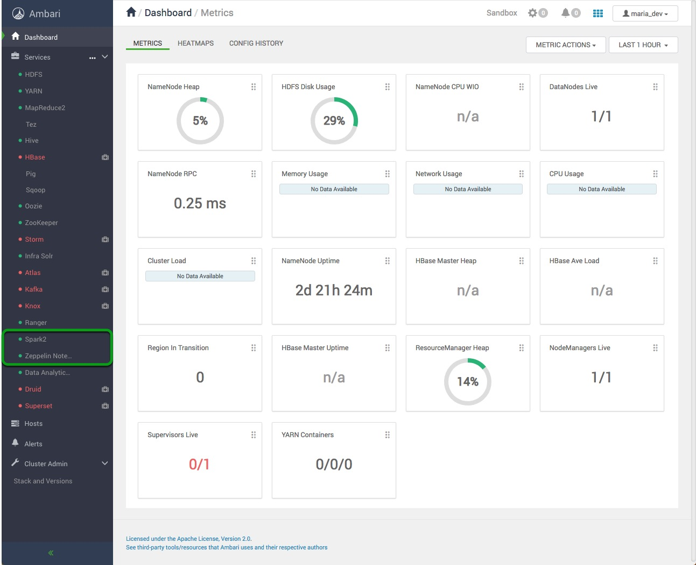

2\. Open Zeppelin interface using URL: [http://sandbox-hdp.hortonworks.com:9995/](http://sandbox-hdp.hortonworks.com:9995/)

You should see a Zeppelin Welcome Page:

Optionally, if you want to find out how to access the Spark shell to run code on Spark refer to [Appendix A](#run-spark-in-shell).

3\. Create a Zeppelin Notebook

Click on a Notebook tab at the top left and select **Create new note**. Name your notebook:

`Compute Riskfactor with Spark`

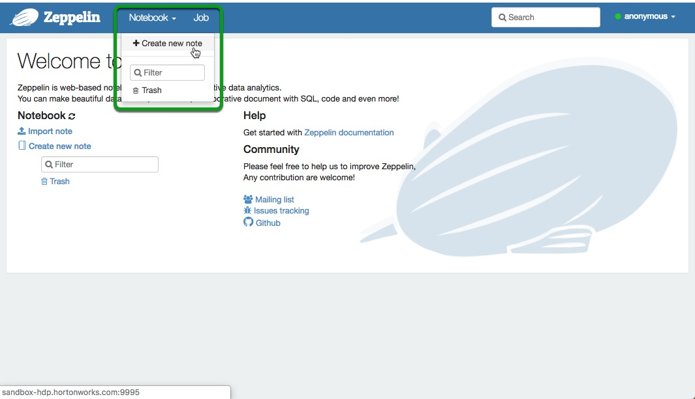

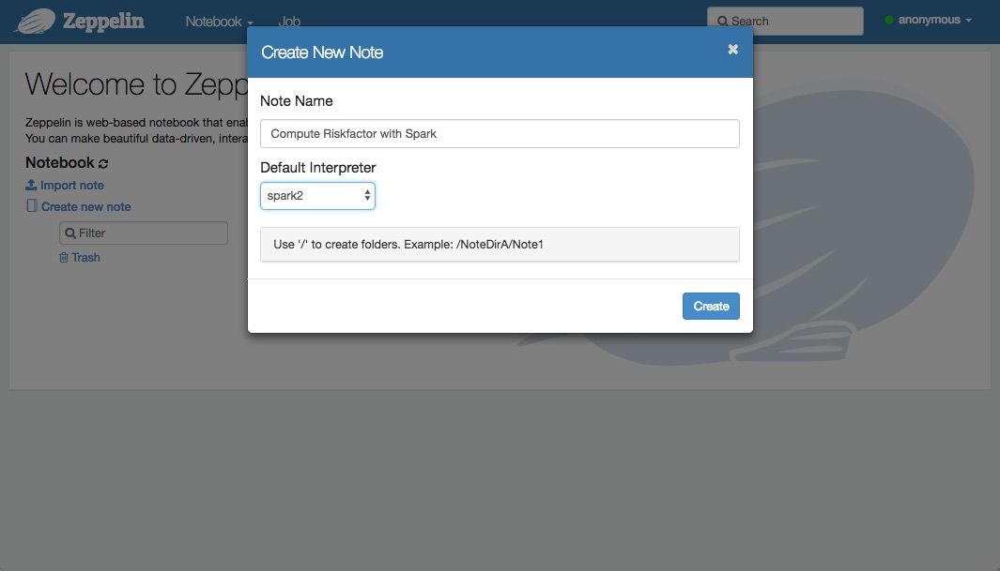

## Create a Hive Context

For improved Hive integration, [ORC file](https://hortonworks.com/blog/orcfile-in-hdp-2-better-compression-better-performance/) support has been added for Spark. This allows Spark to read data stored in ORC files. Spark can leverage ORC file’s more efficient columnar storage and predicate pushdown capability for even faster in-memory processing. HiveContext is an instance of the Spark SQL execution engine that integrates with data stored in Hive. The more basic SQLContext provides a subset of the Spark SQL support that does not depend on Hive. It reads the configuration for Hive from hive-site.xml on the classpath.

### Import sql libraries:

If you already have a `riskfactor` table on your sandbox you must remove it so that you can populate it again using Spark. Copy and paste the following code into your Zeppelin notebook, then click the play button. Alternatively, press `shift+enter` to run the code.

### Instantiate SparkSession

~~~scala
%spark2
val hiveContext = new org.apache.spark.sql.SparkSession.Builder().getOrCreate()
~~~

## Create a RDD from Hive Context

**What is an RDD?**

Spark’s primary core abstraction is called a Resilient Distributed Dataset or RDD. It is a distributed collection of elements that is parallelized across the cluster. In other words, a RDD is an immutable collection of objects that is partitioned and distributed across multiple physical nodes of a YARN cluster and that can be operated in parallel.

There are three methods for creating a RDD:

1. Parallelize an existing collection. This means that the data already resides within Spark and can now be operated on in parallel.
2. Create a RDD by referencing a dataset. This dataset can come from any storage source supported by Hadoop such as HDFS, Cassandra, HBase etc.
3. Create a RDD by transforming an existing RDD to create a new RDD.

We will be using the later two methods in our tutorial.

**RDD Transformations and Actions**
Typically, RDDs are instantiated by loading data from a shared filesystem, HDFS, HBase, or any data source offering a Hadoop InputFormat on a YARN cluster.

Once a RDD is instantiated, you can apply a [series of operations](https://spark.apache.org/docs/1.2.0/programming-guide.html#rdd-operations). All operations fall into one of two types: [transformations](https://spark.apache.org/docs/1.2.0/programming-guide.html#transformations) or [actions](https://spark.apache.org/docs/1.2.0/programming-guide.html#actions).

- **Transformation** operations, as the name suggests, create new datasets from an existing RDD and build out the processing DAG that can then be applied on the partitioned dataset across the YARN cluster. Transformations do not return a value. In fact, nothing is evaluated during the definition of these transformation statements. Spark just creates these Direct Acyclic Graphs or DAG, which will only be evaluated at runtime. We call this *lazy* evaluation.
- An **Action** operation, on the other hand, executes a DAG and returns a value.

## Read CSV Files into Apache Spark

In this tutorial we will use the CSV files we stored in HDFS in previous sections. Additionally, we will leverage Global Temporary Views on SparkSessions to programmatically query DataFrames using SQL.

### Import CSV data into a data frame without a user defined schema

~~~scala
%spark2
/**
 * Let us first see what temporary views are already existent on our Sandbox
 */
hiveContext.sql("SHOW TABLES").show()
~~~

If you have not created any temporary views in this Spark instance there should not be any tables:

First we must read data from HDFS, in this case we are reading from a csv file without having defined the schema first:

~~~scala
%spark2
val geoLocationDataFrame = spark.read.format("csv").option("header", "true").load("hdfs:///tmp/data/geolocation.csv")

/**
 * Now that we have the data loaded into a DataFrame, we can register a temporary view.
 */
geoLocationDataFrame.createOrReplaceTempView("geolocation")
~~~

Let's verify that the data in our CSV file was properly loaded into our data frame:

~~~scala
%spark2
hiveContext.sql("SELECT * FROM geolocation LIMIT 15").show()
~~~

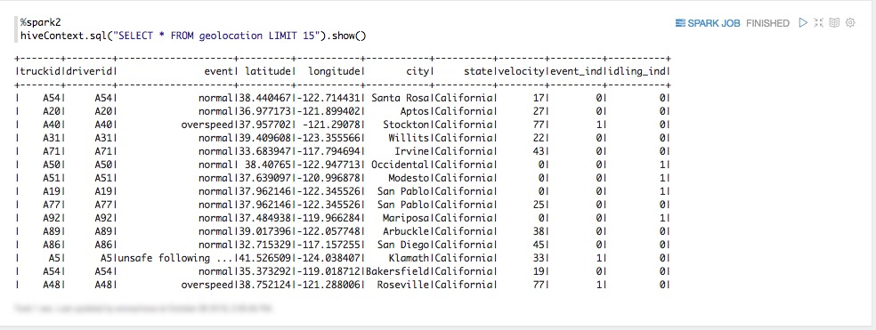

Note that our data is casted onto the appropriate type when we register it as a temporary view:

~~~scala
%spark2
hiveContext.sql("DESCRIBE geolocation").show()
~~~

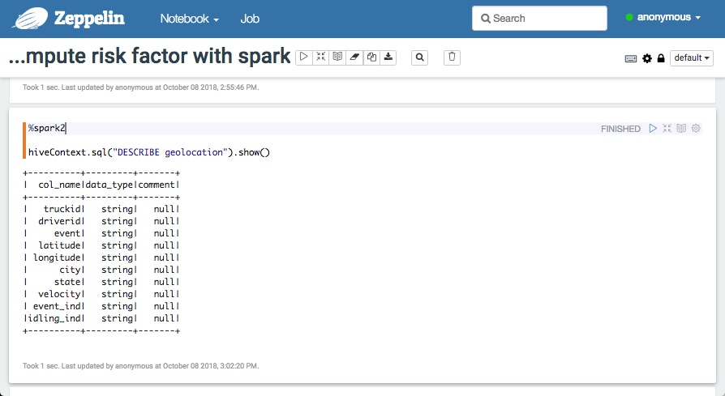

Alternatively, we can define our schema with specific types, we will explore this option on the next paragraph.

### Import CSV data into a data frame with a user defined schema

~~~scala
%spark2
/**
 * The SQL Types library allows us to define the data types of our schema
 */
import org.apache.spark.sql.types._

/**
 * Recall from the previous tutorial section that the driverid schema only has two relations:
 * driverid (a String), and totmiles (a Double).
 */
val drivermileageSchema = new StructType().add("driverid",StringType,true).add("totmiles",DoubleType,true)
~~~

Now we can populate `drivermileageSchema` with our CSV files residing in HDFS

~~~scala
%spark2
val drivermileageDataFrame = spark.read.format("csv").option("header", "true").schema(drivermileageSchema)load("hdfs:///tmp/data/drivermileage.csv")
~~~

Finally, let's create a temporary view

~~~scala
%spark2
drivermileageDataFrame.createOrReplaceTempView("drivermileage")
~~~

We can use SparkSession and SQL to query `drivermileage`

~~~scala
%spark2
hiveContext.sql("SELECT * FROM drivermileage LIMIT 15").show()
~~~

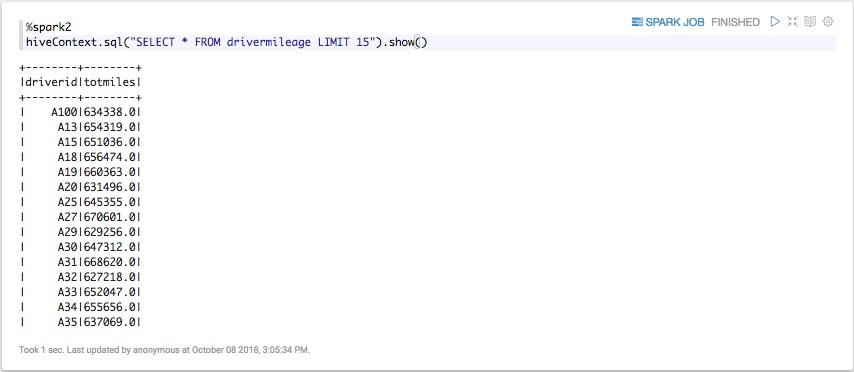

### Query Tables To Build Spark RDD

We will do a simple select query to fetch data from `geolocation` and `drivermileage` tables to a spark variable. Getting data into Spark this way also allows to copy table schema to RDD.

~~~scala
%spark2
val geolocation_temp0 = hiveContext.sql("SELECT * FROM geolocation")
val drivermileage_temp0 = hiveContext.sql("SELECT * FROM drivermileage")
~~~

Now let's register temporary global tables from our dataFrames and use SQL syntax to query against that table.

~~~scala
%spark2
geolocation_temp0.createOrReplaceTempView("geolocation_temp0")
drivermileage_temp0.createOrReplaceTempView("drivermileage_temp0")

hiveContext.sql("SHOW TABLES").show()
~~~

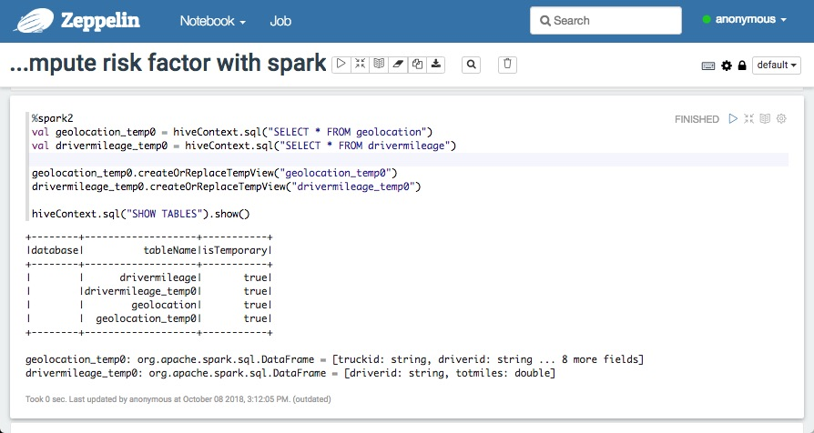

## Querying Against Registered Temporary Tables

Next, we will perform an iteration and a filter operation. First, we need to filter drivers that have non-normal events associated with them and then count the number for non-normal events for each driver.

~~~scala
%spark2
val geolocation_temp1 = hiveContext.sql("SELECT driverid, COUNT(driverid) occurance from geolocation_temp0 WHERE event!='normal' GROUP BY driverid")
/**
 * Show RDD
 */
geolocation_temp1.show(10)
~~~

- As stated earlier about RDD transformations, select operation is a RDD transformation and therefore does not return anything.

- The resulting table will have a count of total non-normal events associated with each driver. Register this filtered table as a temporary table so that subsequent SQL queries can be applied to it.

~~~scala
%spark2
geolocation_temp1.createOrReplaceTempView("geolocation_temp1")
hiveContext.sql("SHOW TABLES").show()
~~~

- You can view the result by executing an action operation on the temporary view.

~~~scala
%spark2
hiveContext.sql("SELECT * FROM geolocation_temp1 LIMIT 15").show()
~~~

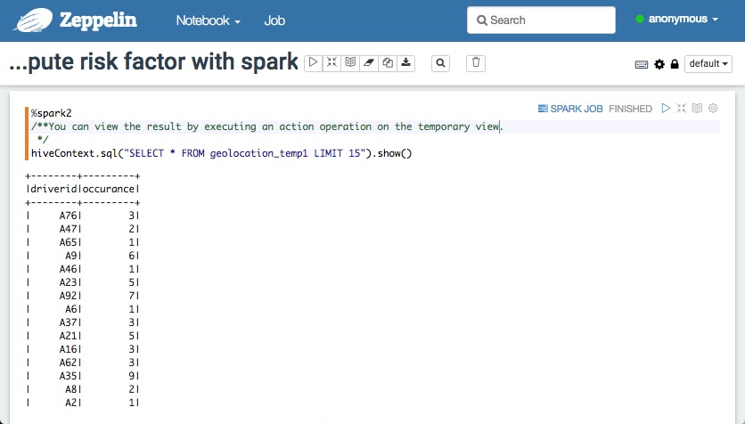

### Perform join Operation

In this section we will perform a join operation geolocation_temp1 table has details of drivers and count of their respective non-normal events. drivermileage_temp0 table has details of total miles travelled by each driver.

- We will join two tables on common column, which in our case is `driverid`.

~~~scala
%spark2
val joined = hiveContext.sql("select a.driverid,a.occurance,b.totmiles from geolocation_temp1 a,drivermileage_temp0 b where a.driverid=b.driverid")
~~~

- The resulting data set will give us total miles and total non-normal events for a particular driver. Register this filtered table as a temporary table so that subsequent SQL queries can be applied to it.

~~~scala
%spark2
joined.createOrReplaceTempView("joined")
hiveContext.sql("SHOW TABLES").show()
~~~

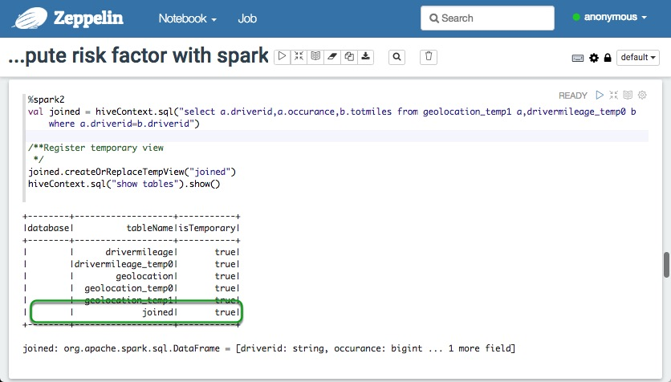

- You can view the result by executing action operation on our temporary view.

~~~scala
%spark2
/**
 * We can view the result from our query with a select statement
 */
hiveContext.sql("SELECT * FROM joined LIMIT 10").show()
~~~

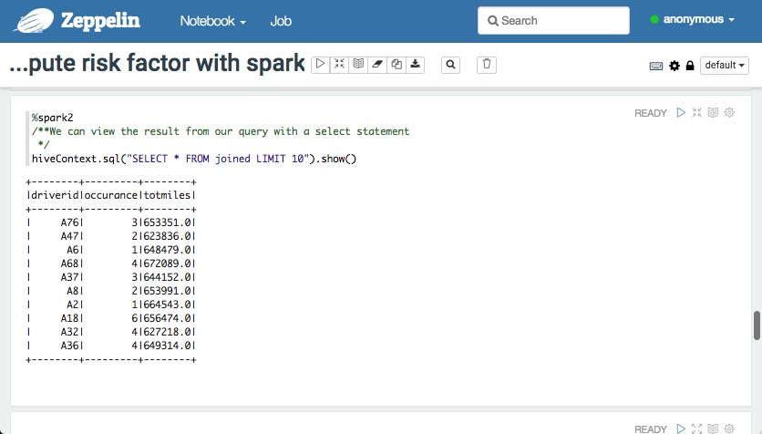

### Compute Driver Risk Factor

In this section we will associate a driver risk factor with every driver. The risk factor for each driver is the number of abnormal occurrences over the total number of miles driver. Simply put, a high number of abnormal occurrences over a short amount of miles driven is an indicator of high risk. Let's translate this intuition into an SQL query:

~~~scala
%spark2
val risk_factor_spark = hiveContext.sql("SELECT driverid, occurance, totmiles, totmiles/occurance riskfactor FROM joined")
~~~

- The resulting data set will give us total miles and total non-normal events and what is a risk for a particular driver. Register this filtered table as a temporary table so that subsequent SQL queries can be applied to it.

~~~scala
%spark2
risk_factor_spark.createOrReplaceTempView("risk_factor_spark")
hiveContext.sql("SHOW TABLES").show()
~~~

- View the results

~~~scala
%spark2
risk_factor_spark.show(10)
~~~

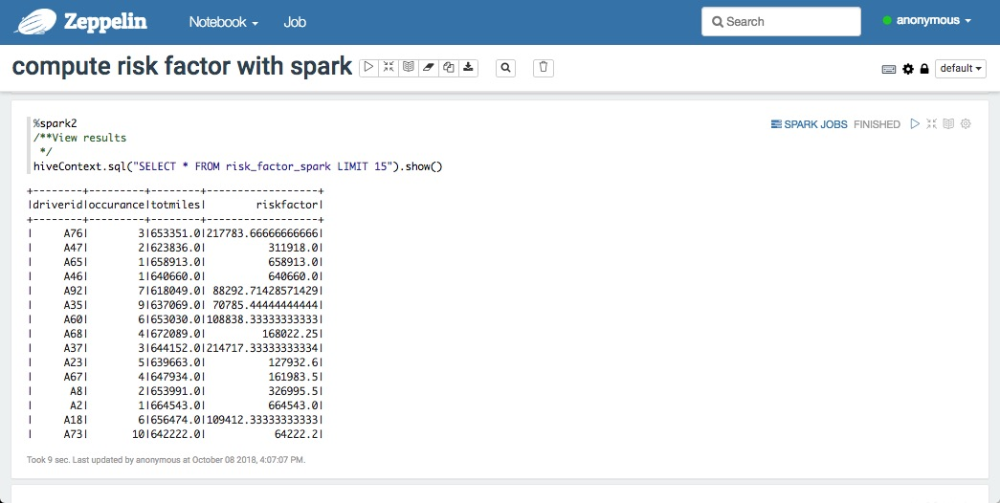

## Save Table as CSV

After finding the risk factor for each driver we might want to store our results as a CSV on HDFS:

~~~scala
%spark2
risk_factor_spark.coalesce(1).write.csv("hdfs:///tmp/data/riskfactor")
~~~

There will be a directory structure with our data under `user/maria_dev/data/` named `riskfactor` there we can find our csv file with a auto generated name given to it by Spark.

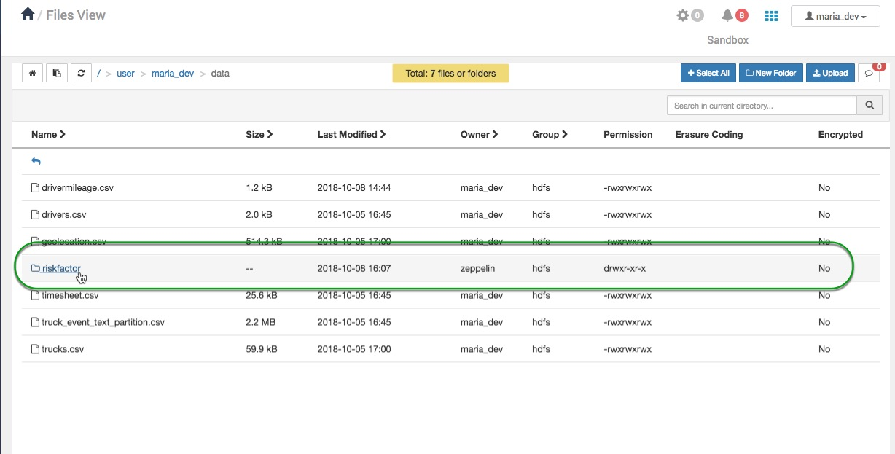

## Full Spark Code Review

**Instantiate SparkSession**

~~~scala
%spark2
val hiveContext = new org.apache.spark.sql.SparkSession.Builder().getOrCreate()
~~~

**Shows tables in the default Hive database**

~~~scala
hiveContext.sql("SHOW TABLES").show()
~~~

**Select all rows and columns from tables, stores Hive script into variable
and registers variables as RDD**

~~~scala
val geolocation_temp0 = hiveContext.sql("SELECT * FROM geolocation")

val drivermileage_temp0 = hiveContext.sql("SELECT * FROM drivermileage")

geolocation_temp0.createOrReplaceTempView("geolocation_temp0")
drivermileage_temp0.createOrReplaceTempView("drivermileage_temp0")

val geolocation_temp1 = hiveContext.sql("SELECT driverid, count(driverid) occurance FROM geolocation_temp0 WHERE event!='normal' GROUP BY driverid")

geolocation_temp1.createOrReplaceTempView("geolocation_temp1")
~~~

**Load first 15 rows from geolocation_temp2, which is the data from
drivermileage table**

~~~scala
hiveContext.sql("SELECT * FROM geolocation_temp1 LIMIT 15").show()
~~~

**Create joined to join 2 tables by the same driverid and register joined
as a RDD**

~~~scala
val joined = hiveContext.sql("SELECT a.driverid,a.occurance,b.totmiles FROM geolocation_temp1 a,drivermileage_temp0 b WHERE a.driverid=b.driverid")

joined.createOrReplaceTempView("joined")
~~~

**Load first 10 rows and columns in joined**

~~~scala
hiveContext.sql("SELECT * FROM joined LIMIT 10").show()
~~~

**Initialize risk_factor_spark and register as an RDD**

~~~scala
val risk_factor_spark = hiveContext.sql("SELECT driverid, occurance, totmiles, totmiles/occurance riskfactor from joined")

risk_factor_spark.createOrReplaceTempView("risk_factor_spark")
~~~

**Print the first 15 lines from the risk_factor_spark table**

~~~scala
hiveContext.sql("SELECT * FROM risk_factor_spark LIMIT 15").show()
~~~

## Summary

Congratulations! Let’s summarize the Spark coding skills and knowledge we acquired to compute the risk factor associated with every driver. Apache Spark is efficient for computation because of its **in-memory data processing engine**. We learned how to integrate Hive with Spark by creating a **Hive Context**. We used our existing data from Hive to create an **RDD**. We learned to perform **RDD transformations and actions** to create new datasets from existing RDDs. These new datasets include filtered, manipulated and processed data. After we computed **risk factor**, we learned to load and save data into Hive as **ORC**.

## Further Reading

To learn more about Spark, checkout these resources:

- [Spark Tutorials](https://hortonworks.com/tutorials/?filters=apache-spark)
- [Apache Spark](https://hortonworks.com/hadoop/spark/)
- [Apache Spark Welcome](http://spark.apache.org/)
- [Spark Programming Guide](http://spark.apache.org/docs/latest/programming-guide.html#passing-functions-to-spark)
- [Learning Spark](http://www.amazon.com/Learning-Spark-Lightning-Fast-Data-Analysis/dp/1449358624/ref=sr_1_1?ie=UTF8&qid=1456010684&sr=8-1&keywords=apache+spark)
- [Advanced Analytics with Spark](http://www.amazon.com/Advanced-Analytics-Spark-Patterns-Learning/dp/1491912766/ref=pd_bxgy_14_img_2?ie=UTF8&refRID=19EGG68CJ0NTNE9RQ2VX)

## Appendix A: Run Spark in the Spark Interactive Shell 

1\.  Using the [built-in SSH Web Client](https://hortonworks.com/tutorial/learning-the-ropes-of-the-hortonworks-sandbox/#shell-web-client-method) (aka shell-in-a-box), logon using **maria_dev**/**maria_dev**

2\.  Let's enter the Spark interactive shell by typing the command:
- `spark-shell`

This will load the default Spark Scala API. Issue the command `:help` for help and `:quit` to exit.

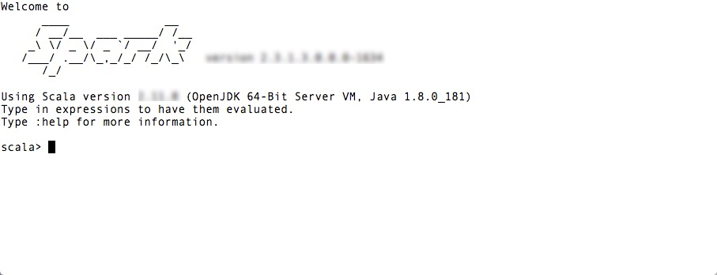

- Execute the commands:

~~~scala
val hiveContext = new org.apache.spark.sql.SparkSession.Builder().getOrCreate()
~~~

~~~scala
hiveContext.sql("SHOW TABLES").show()
~~~

~~~scala
val geoLocationDataFrame = spark.read.format("csv").option("header", "true").load("hdfs:///tmp/data/geolocation.csv")
~~~

~~~scala
geoLocationDataFrame.createOrReplaceTempView("geolocation")
hiveContext.sql("SELECT * FROM geolocation LIMIT 15").show()
~~~

~~~scala
hiveContext.sql("DESCRIBE geolocation").show()
~~~

~~~scala
import org.apache.spark.sql.types._
~~~

~~~scala
val drivermileageSchema = new StructType().add("driverid",StringType,true).add("totmiles",DoubleType,true)
~~~

~~~scala
val drivermileageDataFrame = spark.read.format("csv").option("header", "true").schema(drivermileageSchema)load("hdfs:///tmp/drivermileage.csv")
drivermileageDataFrame.createOrReplaceTempView("drivermileage")
~~~

~~~scala
hiveContext.sql("SELECT * FROM drivermileage LIMIT 15").show()
~~~

~~~scala
val geolocation_temp0 = hiveContext.sql("SELECT * FROM geolocation")
~~~

~~~scala
val drivermileage_temp0 = hiveContext.sql("SELECT * FROM drivermileage")
~~~

~~~scala
geolocation_temp0.createOrReplaceTempView("geolocation_temp0")
~~~

~~~scala
drivermileage_temp0.createOrReplaceTempView("drivermileage_temp0")
~~~

~~~scala
hiveContext.sql("SHOW TABLES").show()
~~~

~~~scala
val geolocation_temp1 = hiveContext.sql("SELECT driverid, count(driverid) occurance FROM geolocation_temp0 WHERE event!='normal' GROUP BY driverid")
~~~

~~~scala
geolocation_temp1.show(10)
~~~

~~~scala
geolocation_temp1.createOrReplaceTempView("geolocation_temp1")
~~~

~~~scala
hiveContext.sql("SHOW TABLES").show()
~~~

~~~scala
hiveContext.sql("SELECT * FROM geolocation_temp1 LIMIT 15").show()
~~~

~~~scala
val joined = hiveContext.sql("select a.driverid,a.occurance,b.totmiles from geolocation_temp1 a,drivermileage_temp0 b where a.driverid=b.driverid")
~~~

~~~scala
joined.createOrReplaceTempView("joined")
~~~

~~~scala
hiveContext.sql("SELECT * FROM joined LIMIT 10").show()
~~~

~~~scala
val risk_factor_spark = hiveContext.sql("select driverid, occurance, totmiles, (totmiles/occurance) riskfactor from joined")
~~~

~~~scala
risk_factor_spark.createOrReplaceTempView("risk_factor_spark")
~~~

~~~scala
hiveContext.sql("SHOW TABLES").show()
~~~

~~~scala
val joined = hiveContext.sql("SELECT a.driverid,a.occurance,b.totmiles FROM geolocation_temp2 a,drivermileage_temp1 b WHERE a.driverid=b.driverid")
~~~

~~~scala
hiveContext.sql("SELECT * FROM risk_factor_spark LIMIT 15").show()
~~~

~~~scala
risk_factor_spark.coalesce(1).write.csvrisk_factor_spark.coalesce(1).write.csv("hdfs:///tmp/data/riskfactor")
~~~
