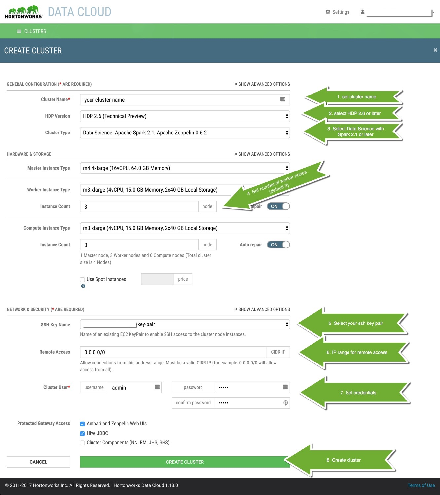

# Getting Started with Apache Spark and Apache Zeppelin on HDCloud

## Introduction

This tutorial will help you quickly spin-up a cloud environment where you can dynamically resize your cluster from one to hundred's of nodes. HDCloud is ideal for short-lived on-demand processing, allowing you to quickly perform heavy computation on large datasets without impacting production clusters. HDCloud gives you the ultimate control to allocate the resources necessary to accomplish your goals within a reasonable time-frame.

In this tutorial we will focus on spinning up a Data Science persona environment that's ideally suited to our Apache Spark cloud based tutorial series.

## Getting Started Videos

For a quick overview on how to get started with HDCloud, checkout these short three-part videos:

[Part 1 of 3](https://youtu.be/Q5ovR8YTFSg) - Setting up HDCloud Controller

[Part 2 of 3](https://youtu.be/yhFU-D0Uijw) - Setting up a three-node Cluster

[Part 3 of 3](https://youtu.be/YrEwOqbw7Is) - Launching Apache Ambari for operations and Apache Zeppelin for data wrangling and advanced analytics

## Environment Setup Details

Below are detailed steps behind the getting started videos:

1a. Create an [Amazon Web Services (AWS) Account](https://aws.amazon.com/) if you don't have one

1b. Follow this step-by-step doc to [Setup and Launch a Controller on HDCloud](https://hortonworks.com/products/cloud/aws/)

1c. Create a *Data Science* [Cluster](https://hortonworks.github.io/hdp-aws/create/index.html) (use settings listed below)

Select/specify the following for your cluster:

  - HDP Version: HDP 2.6 or later
  - Cluster Type: "Data Science: Apache Spark 2.1+, Apache Zeppelin 0.6.2+" or later
  - Worker instance count: one or more
  - Remote Access: 0.0.0.0/0

Here's a screenshot with sample settings:

## Next Steps

Now that you have your HDCloud environment set-up, checkout one of these cloud-ready tutorials:

1) [Spark in 5 Minutes tutorial](https://hortonworks.com/tutorial/hands-on-tour-of-apache-spark-in-5-minutes/) analyzing a Silicon Valley film series dataset.

2) A more in depth [tutorial on Spark SQL](https://hortonworks.com/tutorial/learning-spark-sql-with-zeppelin/)
