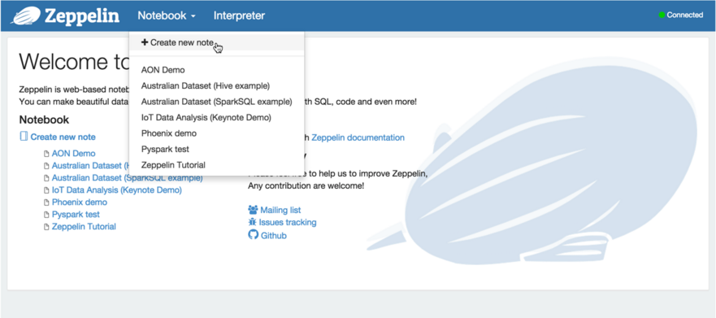
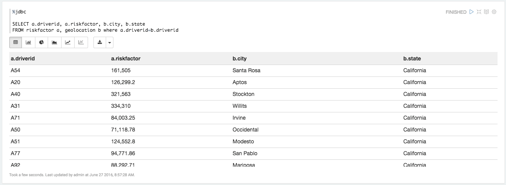
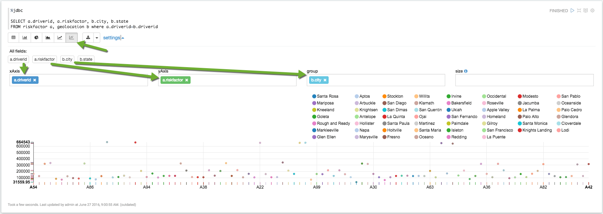

# Lab 5: Data Reporting With Zeppelin

## Data Visualization using Apache Zeppelin

## Introduction

In this tutorial you will be introduced to Apache Zeppelin. In the earlier section of lab, you learned how to perform data visualization
using Excel. This section will teach you to visualize data using Zeppelin.

## Prerequisites

The tutorial is a part of series of hands on tutorial to get you started on HDP using the Hortonworks sandbox. Please ensure you complete the prerequisites before proceeding with this tutorial.

*   Hortonworks Sandbox
*   [Learning the Ropes of the Hortonworks Sandbox](http://hortonworks.com/hadoop-tutorial/learning-the-ropes-of-the-hortonworks-sandbox/)
*   Lab 1: Load sensor data into HDFS
*   Lab 2: Data Manipulation with Apache Hive
*   Lab 3: Use Pig to compute Driver Risk Factor/ Lab 4: Use Spark to compute Driver Risk Factor
*   Working Zeppelin installation
*   Allow yourself approximately one hour to complete this tutorial.

## Outline

*   [Apache Zeppelin](#apache-zeppelin)
*   [Step 5.1: Create a Zeppelin Notebook](#step5.1)
*   [Step 5.2: Execute a Hive Query](#step5.2)
*   [Step 5.3: Build Charts Using Zeppelin](#step5.3)
*   [Summary](#summary-lab5)
*   [Suggested Readings](#suggested-readings-lab5)

## Apache Zeppelin 

Apache Zeppelin provides a powerful web-based notebook platform for data analysis and discovery.
Behind the scenes it supports Spark distributed contexts as well as other language bindings on top of Spark.

In this tutorial we will be using Apache Zeppelin to run SQL queries on our geolocation, trucks, and
riskfactor data that we've collected earlier and visualize the result through graphs and charts.

NOTE: We can also run queries via various interpreters for the following (but not limited to) spark, hawq and postgresql.

## Step 5.1: Create a Zeppelin Notebook 

### 5.1.1 Navigate to Zeppelin Notebook

1) Navigate to http://sandbox.hortonworks.com:9995 directly to open the Zeppelin interface.

2) Click on create note, name the notebook **Driver Risk Factor** and a new notebook shall get started.

## Step 5.2: Execute a Hive Query 

### 5.2.1 Visualize finalresults Data in Tabular Format

In the previous Spark and Pig tutorials you already created a table finalresults or riskfactor which gives the risk factor associated with every driver. We will use the data we generated in this table to visualize which drivers have the highest risk factor. We will use the jdbc hive interpreter to write queries in Zeppelin. jdbc by default runs hive.

1) Copy and paste the code below into your Zeppelin note.

~~~
%jdbc(hive)

SELECT * FROM riskfactor
~~~

2) Click the play button next to "ready" or "finished" to run the query in the Zeppelin notebook.
Alternative way to run query is "shift+enter."

Initially, the query will produce the data in tabular format as shown in the screenshot.

## Step 5.3: Build Charts using Zeppelin 

### 5.3.1 Visualize finalresults Data in Chart Format

1\. Iterate through each of the tabs that appear underneath the query.
Each one will display a different type of chart depending on the data that is returned in the query.

2\. After clicking on a chart, we can view extra advanced settings to tailor the view of the data we want

3\. Click settings to open the advanced chart features.

4\. To make a chart with `riskfactor.driverid` and `riskfactor.riskfactor SUM`, drag the table relations into the boxes as shown in the image below.

5\. You should now see an image like the one below.

6\. If you hover on the peaks, each will give the driverid and riskfactor.

7\. Try experimenting with the different types of charts as well as dragging and
dropping the different table fields to see what kind of results you can obtain.

8\. Let' try a different query to find which cities and states contain the drivers with the highest riskfactors.

~~~
%jdbc(hive)

SELECT a.driverid, a.riskfactor, b.city, b.state
FROM riskfactor a, geolocation b where a.driverid=b.driverid
~~~

9\. Run the query above using the keyboard shortcut Shift+Enter.
You should eventually end up with the results in a table below.

10\. After changing a few of the settings we can figure out which of the cities have the high risk factors.
Try changing the chart settings by clicking the **scatterplot** icon. Then make sure that the keys a.driverid
is within the xAxis field, a.riskfactor is in the yAxis field, and b.city is in the group field.
The chart should look similar to the following.

The graph shows that driver id number A39 has a high risk factor of 652417 and drives in Santa Maria.

## Summary 

Now that we know how to use Apache Zeppelin to obtain and visualize our data, we can use the skills
we've learned from our Hive, Pig, and Spark labs, as well and apply them to new kinds of data to
try to make better sense and meaning from the numbers!

## Suggested Readings 

- [Zeppelin on HDP](http://hortonworks.com/hadoop/zeppelin/)
- [Apache Zeppelin Docs](https://zeppelin.incubator.apache.org/docs/)
- [Zeppelin Homepage](https://zeppelin.incubator.apache.org/)
