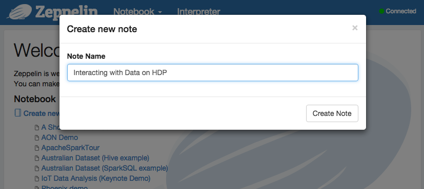
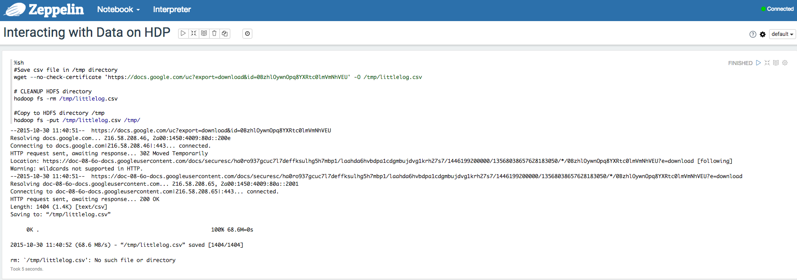
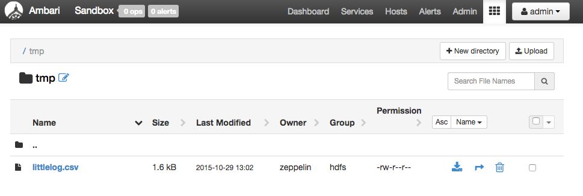

In this tutorial, we are going to walk through the process of using Apache Zeppelin and Apache Spark to interactively analyze data on a Apache Hadoop Cluster. In particular, you will learn:

1.  How to interact with Apache Spark from Apache Zeppelin
2.  How to read a text file from HDFS and create a RDD
3.  How to interactively analyze a data set through a rich set of Spark API operations

### Prerequisites

This tutorial is a part of series of hands-on tutorials to get you started with HDP using Hortonworks sandbox. Please ensure you complete the prerequisites before proceeding with this tutorial.

*   Downloaded and Installed [Hortonworks Sandbox 2.5](http://hortonworks.com/products/sandbox/)
*   [Learning the Ropes of the Hortonworks Sandbox](http://hortonworks.com/hadoop-tutorial/learning-the-ropes-of-the-hortonworks-sandbox/)
*   Finally, make sure to review a quick tutorial on [Getting Started with Apache Zeppelin](https://github.com/hortonworks/tutorials/blob/hdp-2.5/tutorials/hortonworks/getting-started-with-apache-zeppelin/tutorial.md).

**Create a Notebook**

If you're new to Zeppelin, make sure to checkout the [Getting Started Guide](https://github.com/hortonworks/tutorials/blob/hdp-2.5/tutorials/hortonworks/getting-started-with-apache-zeppelin/tutorial.md) before proceeding.

Create a new note and give it a meaningful name, e.g. I gave it *Interacting with Data on HDP*

Next, we'll start with a first paragraph and use a Shell interpreter. In Zeppelin, this is indicated by putting `%sh` at the top of a paragraph.

In that paragraph, we'll save an external `littlelog.csv` to our local sandbox `/tmp` directory and then copy it to our local HDFS `/tmp` directory

~~~ bash
%sh

# Save csv file in /tmp directory
wget --no-check-certificate 'https://docs.google.com/uc?export=download&id=0BzhlOywnOpq8OWFzQjJObUtlck0' -O /tmp/littlelog.csv

# Cleanup HDFS directory
hadoop fs -rm /tmp/littlelog.csv

# Copy to HDFS /tmp directory
hadoop fs -put /tmp/littlelog.csv /tmp/
~~~

Now, open the HDFS Files view in Ambari and navigate to `/tmp` directory to verify that `littlelog.csv` has been uploaded correctly.

Note: If you're not familiar with Ambari, make sure to review [Learning the Ropes of the Hortonworks Sandbox](http://hortonworks.com/hadoop-tutorial/learning-the-ropes-of-the-hortonworks-sandbox/) first.

In Spark, datasets are represented as a list of entries, where the list is broken up into many different partitions that are each stored on a different machine. Each partition holds a unique subset of the entries in the list. Spark calls datasets that it stores **Resilient Distributed Datasets** (RDDs).

So let’s create a RDD from our littlelog.csv:

~~~ java
val file = sc.textFile("hdfs://sandbox.hortonworks.com:8020/tmp/littlelog.csv")
~~~

Now we have a freshly created RDD. We have to use an action operation like collect() to gather up the data into the driver's memory and then to print out the contents of the file:

~~~ java
file.collect().foreach(println)
~~~

**Remember** doing a `collect()` action operation on a very large distributed RDD can cause your driver program to run out of memory and crash. So, **do not use collect()** except for when you are prototyping your Spark program on a small dataset.

Another way to print the content of the RDD is

~~~ java
file.toArray.foreach(println)
~~~

In fact you can easily discover other methods that apply to this RDD by auto-completion.

Type the name of the RDD followed by a `.`, in our case it’s `file`. and then press the `crtl` + `-` + `.`

Now let’s extract some information from this data.

Let’s create a map where the **state** is the key and the **number of visitors** is the value.

Since state is the 6th element in each row of our text in littlelog.csv _(index 5)_, we need to use a map operator to pass in the lines of text to a function that will parse out the 6th element and store it in a new RDD containing two elements as the key, then count the number of times it appears in the set and provide that number as the value in the second element of this new RDD.

By using the Spark API operator `map`, we have created or transformed our original RDD into a newer one.

So let’s do it step by step. First let’s filter out the blank lines.

~~~ java
val fltr = file.filter(_.length >  0)
~~~

WAIT!* What is that doing there? *

`_` is a shortcut or wildcard in Scala that essentially means ‘whatever happens to be passed to me’.

You can also write:

~~~ java
val fltr = file.filter( x => x.length >  0 )
~~~

So, in the above code the `_` or the `x` stands **for each row of our file** RDD: if the row length > 0 is, hence not empty, then assign it to fltr which is a new RDD.

So, we are invoking the method length on an unknown **whatever** and trusting that Scala will figure out that the thing in each row of the file RDD is actually a **String that supports the length** operator.

In other words within the parenthesis of our filter method we are defining the argument: ‘whatever’, and the logic to be applied to it.

This pattern of constructing a function within the argument to a method is one of the **fundamental characteristics** of Scala and once you get used to it, it will make sense and speed up your programming a lot.

Then let’s split the line into individual columns separated by `,` and then let’s grab the 6th columns, which means the column with index 5.

~~~ java
val keys = fltr.map(_.split(",")).map(a => a(5))
~~~

**Let’s illustrate the query above with an example:**

This is a row of the littlelog.csv file:

~~~ bash
20120315 01:17:06,99.122.210.248,[http://www.acme.com/SH55126545/VD55170364,{7AAB8415-E803-3C5D-7100-E362D7F67CA7},homestead,fl,usa](http://www.acme.com/SH55126545/VD55170364,{7AAB8415-E803-3C5D-7100-E362D7F67CA7},homestead,fl,usa)
~~~

if we execute the query, first, **each row** of the fltr RDD is having the `split(“,”)` method called on it.
It will seperate all columns with a `,` between them.

~~~ bash
[
  20120315 01:17:06,
  99.122.210.248,
  [http://www.acme.com/SH55126545/VD55170364,
  {7AAB8415-E803-3C5D-7100-E362D7F67CA7},
  homestead,
  fl,
  usa](http://www.acme.com/SH55126545/VD55170364,
  {7AAB8415-E803-3C5D-7100-E362D7F67CA7},
  homestead,
  fl,
  usa)
]
~~~

This split function results in an anonymous RDD consisting of arrays like the one above.

The anonymous RDD is passed to the map function.

In this case, each array in the anonymous RDD is assigned to the variable ‘a’.

Then we extract the 6th element from it, which ends up being added to the named RDD called **‘keys’** we declared at the start of the line of code.

Then let’s print out the values of the key.

~~~ java
keys.collect().foreach(println)
~~~

Notice that some of the states are not unique and repeat. We need to count how many times each key (state) appears in the log.

~~~ java
val stateCnt = keys.map(key =>  (key,1))  //print stateCnt stateCnt.toArray.foreach(println)
~~~

You can see, how our new RDD stateCnt looks like.`RDD[(String,  Int)]`.
The String is our key and the Integer is 1\.

Next, we will iterate through each row of the stateCnt RDD and pass their contents to a utility method available to our RDD that counts the distinct number of rows containing each key

~~~ java
val lastMap = stateCnt.countByKey
~~~

Now, let’s print out the result.

~~~ java
lastMap.foreach(println)
~~~

Result: a listing of state abbreviations and the count of how many times visitors from that state hit our website.

Note that at this point you still have access to all the RDDs you have created during this session. You can reprocess any one of them, for instance, again printing out the values contained in the keys RDD:

~~~ java
keys.collect().foreach(println)
~~~

I hope this has proved informative and that you have enjoyed this simple example of how you can interact with Data on HDP using Scala and Apache Spark.
