## Introduction

In this tutorial, we will explore how to quickly and easily deploy Apache Hadoop with [Apache Ambari](http://hortonworks.com/hadoop/ambari). We will spin up our own VM with [Vagrant](http://www.vagrantup.com/) and [Apache Ambari](http://hortonworks.com/hadoop/ambari). Vagrant is very popular with developers as it lets one mirror the production environment in a VM while staying with all the IDEs and tools in the comfort of the host OS.

If you’re just looking to get started with Hadoop in a VM, then you can simply download the [Hortonworks Sandbox](http://hortonworks.com/sandbox).

## Prerequisites

*   [VirtualBox](https://www.virtualbox.org/wiki/Downloads)
*   [Vagrant](http://vagrantup.com/)

## Outline

- [1. Spin up a VM with Vagrant](#spin-up)
- [2. Configure the VM](#configure-vm)
- [3. Setting up Passwordless SSH](#passwordless-ssh)
- [4. Set up Ambari](#setup-ambari)
- [5. Pseudo-Mode HDP Cluster Set up using Ambari](#pseudo-mode)

### 1. Spin up a VM with Vagrant 

Create a folder for this VM using:

~~~
mkdir hdp_vm
~~~

Install Virtualbox and Vagrant and then issue the following command:

~~~
vagrant box add hdp_vm https://github.com/2creatives/vagrant-centos/releases/download/v6.5.1/centos65-x86_64-20131205.box
~~~

It starts the download and gets added to the library of VMs with the name **hdp_vm**. Issue below command now to initialize the vagrant:

~~~
vagrant init hdp_vm
~~~

This command creates a VagrantFile in the folder. Use vi editor to make changes.

~~~
vi VagrantFile
~~~

Change the forwarded port to 8080 like this:

Change the memory size to 8 GB,

Save the file and launch the VM and SSH in and login as root and change to the home directory. Follow below steps:

~~~
vagrant up
vagrant ssh
sudo su
cd ~
~~~

### 2. Configure the VM 

Type `hostname` on command line to find out the hostname of the machine.

Edit /etc/hosts file to map the IP address with the hostname. The hosts file is used to recognize the mapping of hostnames to the IP addresses of the host. So the Ambari server consults this file to determine the IP address that corresponds to a host name. So in this case, the leftmost column is the IP address to be resolved, the second one is the hostname and the third one is just the alias for the host name.

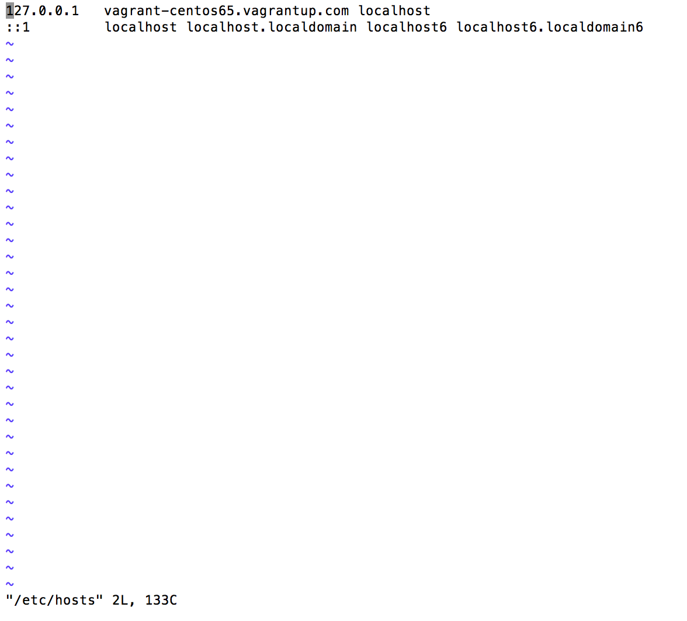

Install **ntp** and **wget** utility using following commands:

~~~
yum install ntp
yum install wget
~~~

NTP(Network Time Protocol) service is required when the computer clocks in servers are set manually, it gets drifted by each passing day if not closely monitored. So to avoid this, it is advisable to enable NTP to synchronize the time of all hosts within the cluster with Ambari server.
Start the **ntpd** service through:

~~~
chkconfig ntpd on
service ntpd start
~~~

### 3. Setting up Passwordless SSH 

It is required so that the Ambari server installed on one host can communicate with other hosts within the cluster to install Ambari agents. The server uses the key pair to access other hosts.
Generate the key using ssh-keygen

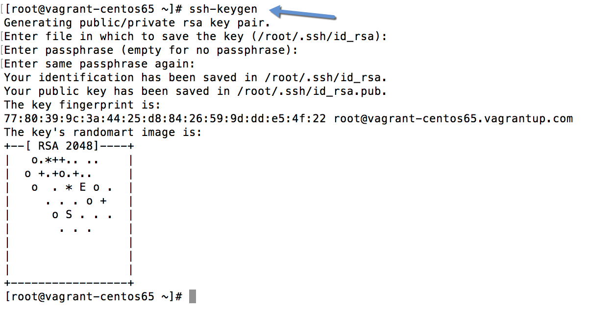

The keys will be placed in the folder **.ssh**.

Copy the **id_rsa** file to /vagrant folder so that you can access the private key from the host machine as /vagrant is automatically the shared folder between host and guest OSs.

Also append id_rsa.pub, the public key to the authorized_keys keys file.

### 4. Set up Ambari 

Download and copy the ambari repository bits to **/etc/yum/repos.d**:

~~~
wget http://public-repo-1.hortonworks.com/ambari/centos6/2.x/updates/2.2.2.0/ambari.repo
mv ambari.repo /etc/yum.repos.d
yum repolist
~~~

Install ambari-server now using:

~~~
yum install ambari-server
~~~

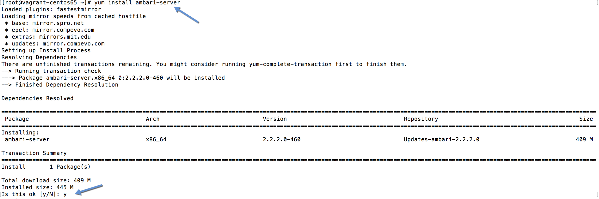

Setup the ambari-server and follow the default configurations:

~~~
ambari-server setup
~~~

Start the ambari-server using:

~~~
service ambari-server start
~~~

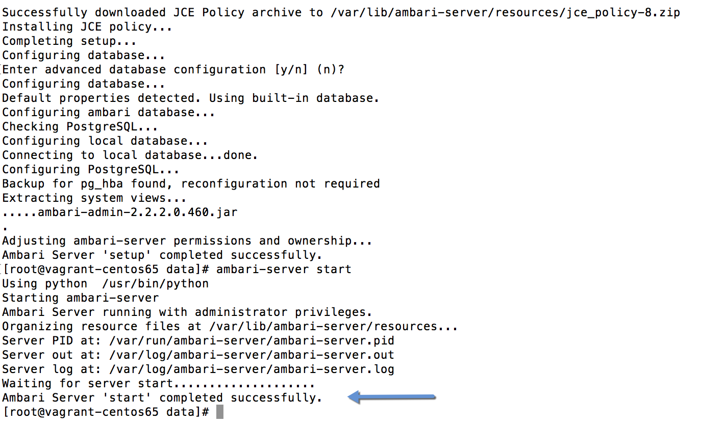

### 5. Pseudo-Mde HDP Cluster Set up using Ambari 

Go to browser and type `127.0.0.1:8080` to access Ambari. The default username and password is **admin** and **admin** respectively.

Go to Launch Install Wizard to start the installation

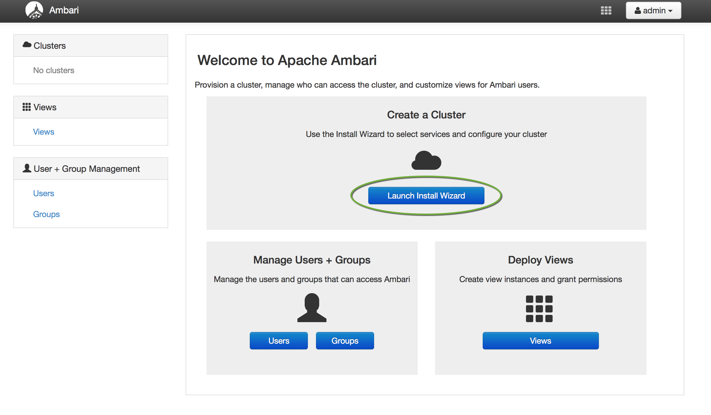

Give a name to your cluster. It is really difficult to change the cluster name after it is set. Perhaps, pick a good name.

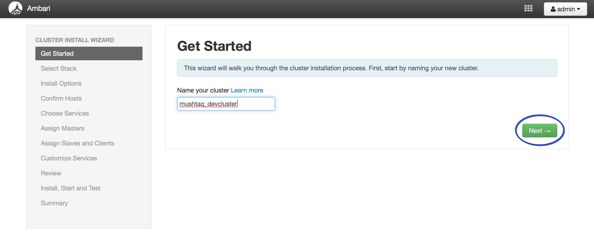

Select the HDP version.

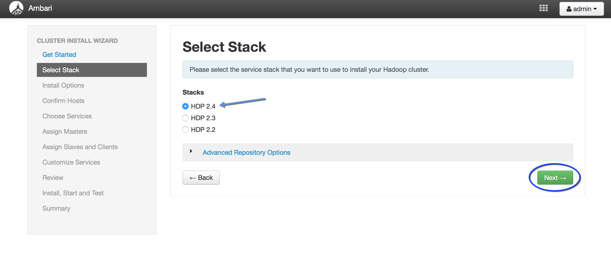

Give the hostname of your machine . You can also put hostnames like host[1-100].domain.com to avoid typing each one. Then click on the `Choose file` button to provide the SSH key that was created earlier.

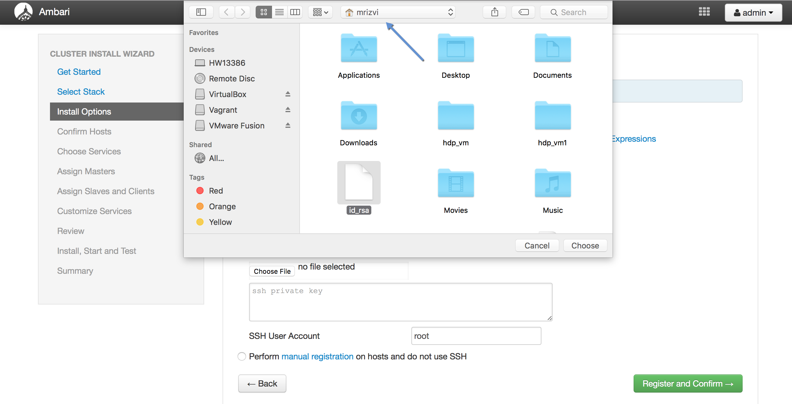

Next, click on Register and Confirm.

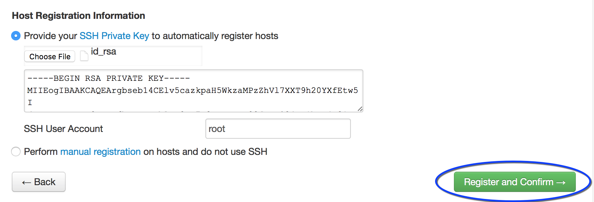

Confirm the list of hosts that needs to be added in the cluster.

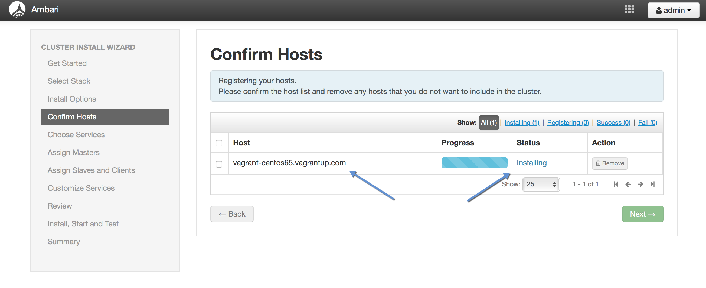

View the progress and wait for the Success message. Remove warnings for the smooth installation of the cluster.

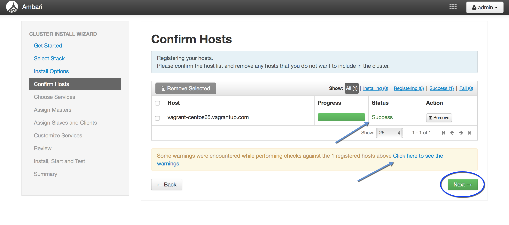

Choose the services that you want to install on your cluster.

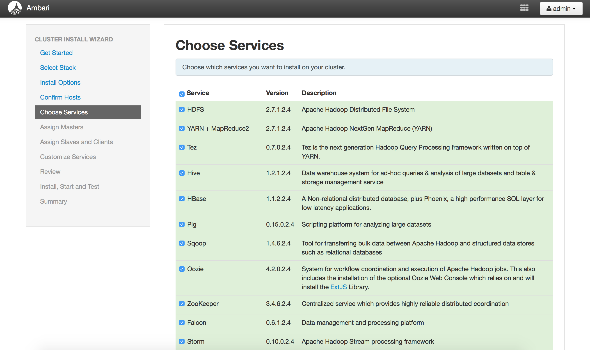

After checking the required boxes, click on Next

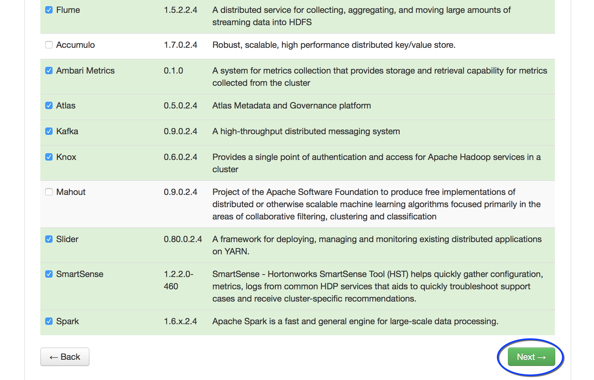

Assign the hostname of all master components. As it is a pseudo-mode cluster, all master components will be installed on 1 machine.

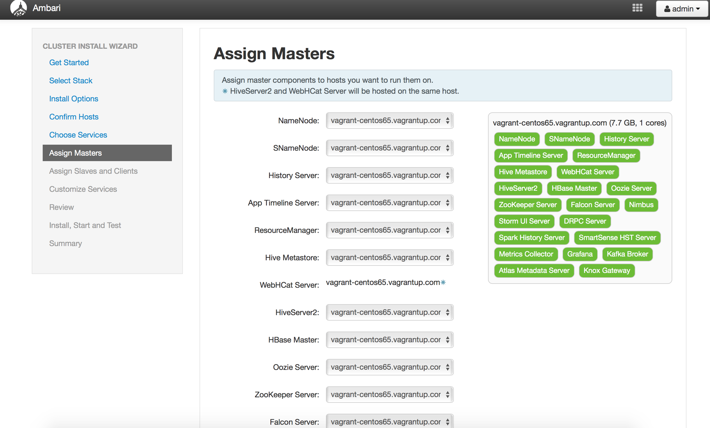

Assign slave and client components.

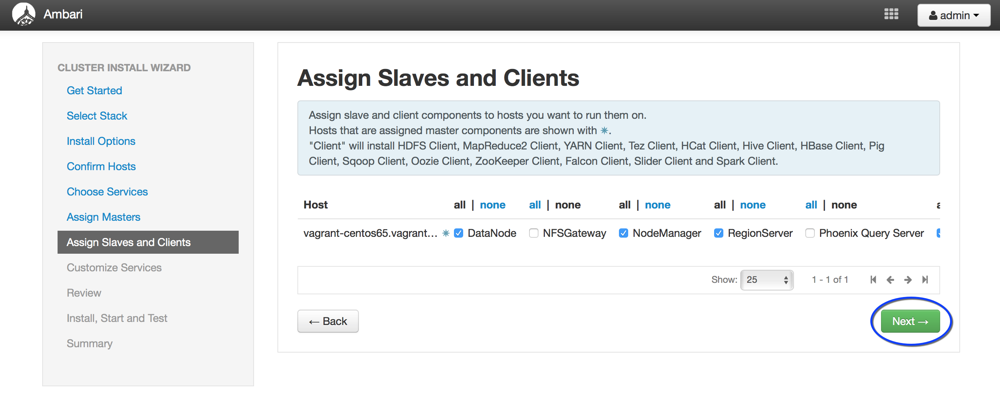

In **Customize Services** step, give the credentials for the service components that are marked with a white number against the red background.

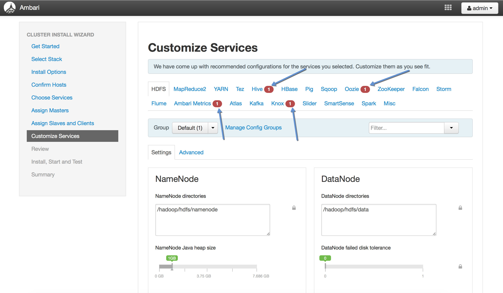

After entering the credentials, start the installation.

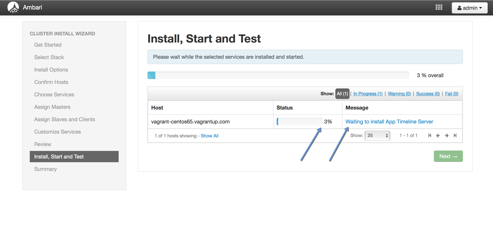

You can view the progress of each component installation

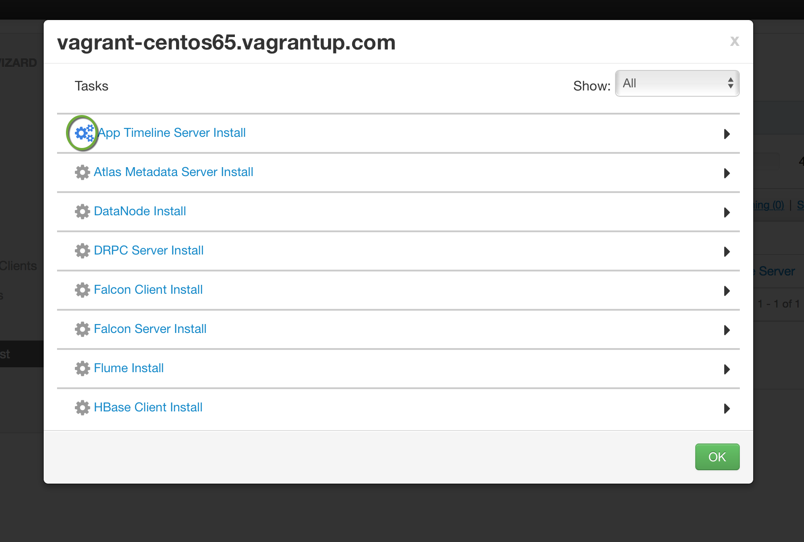

and the standard output of each component.

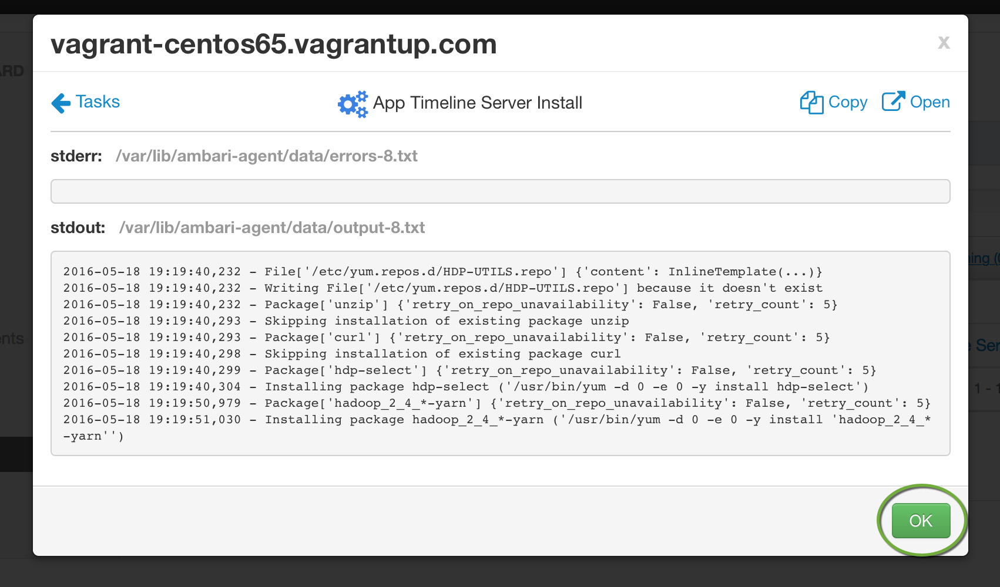

Wait for some time for the installation. Once it gets completed, you will see the Ambari Dashboard:

Voila!!! We have our very own Hadoop VM.
Happy Hadooping!
