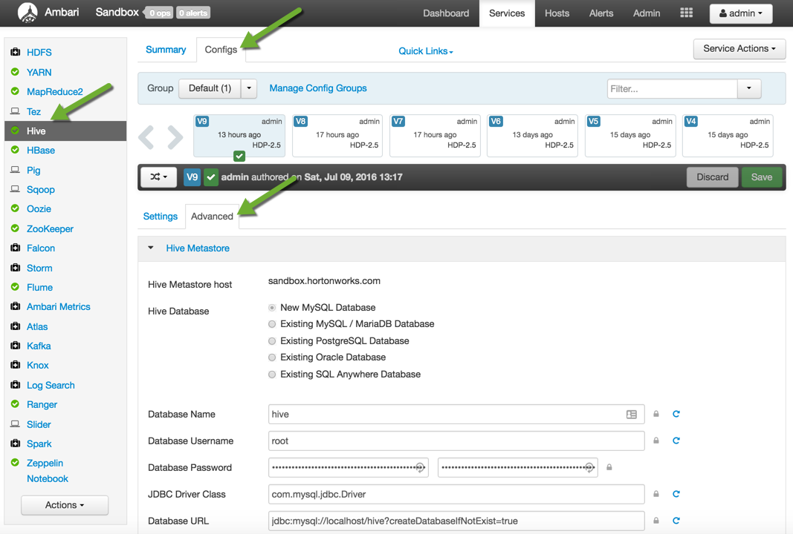
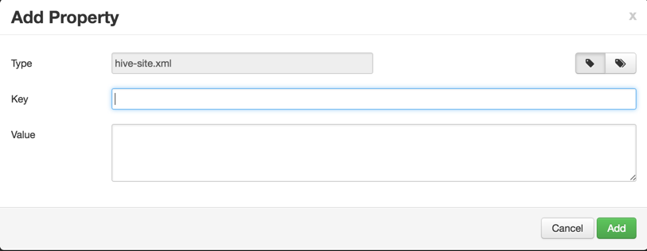
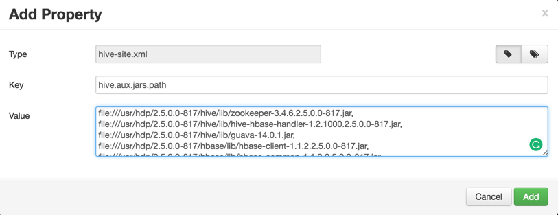
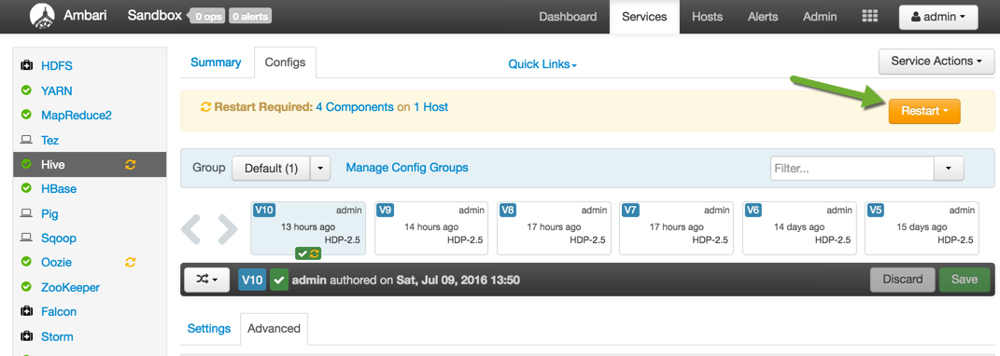
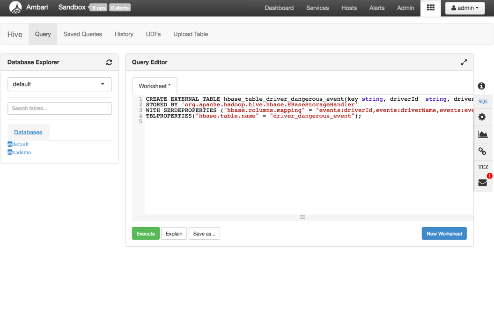
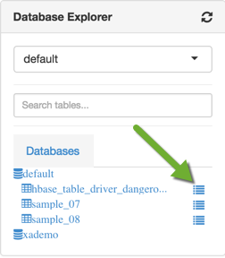
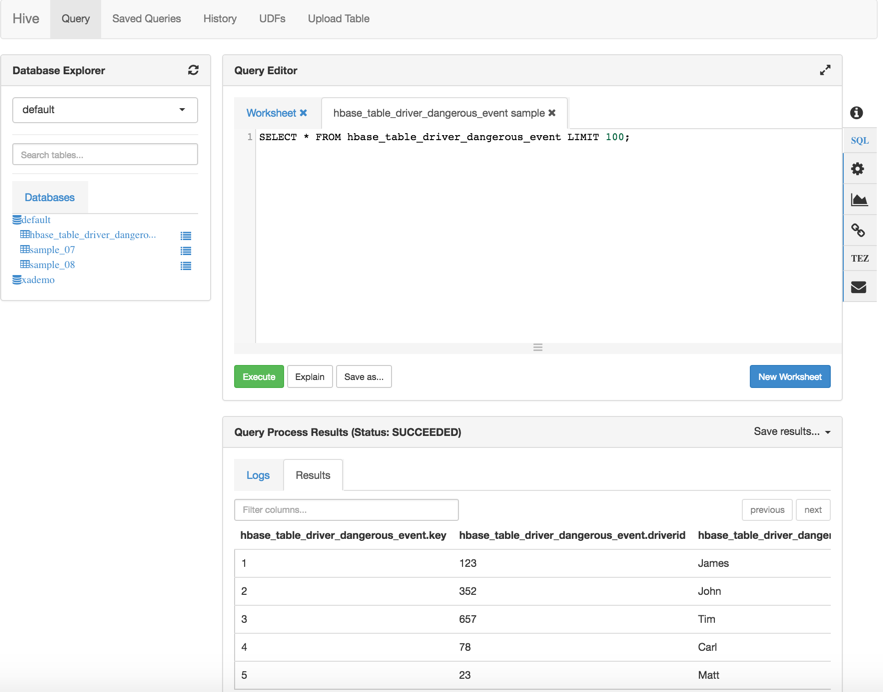

## Introduction

We can also use **Hive** to perform SQL queries on the data stored in HBase tables. We will use storage handler mechanism to create HBase tables via hive. **HBaseStorageHandler** allows Hive DDL for managing table definitions in both Hive metastore and HBase catalog simultaneously and consistently.

## Prerequisites

- [Download Hortonworks 2.5 Sandbox](http://hortonworks.com/downloads/#sandbox)
- Complete the [Learning the Ropes of the Hortonworks Sandbox tutorial,](http://hortonworks.com/hadoop-tutorial/learning-the-ropes-of-the-hortonworks-sandbox/) you will need it for logging into Ambari as an administrator user.
- Lab 1 : Introduction to HBase Concepts

## Outline

- [1: Setup HBase and Hive Integration](#setup-hbase-hive-integration)
- [2: Mapping Existing HBase tables to Hive](#mapping-hbase-tables-hive)
- [3: Summary](#summary)

### 1. Setup HBase and Hive Integration 

To set up the integration, there are some jar files which need to be added to value of hive.aux.jars.path property. There are 3 jars in the lib directory of Hive:

~~~
zookeeper-*.jar
guava-*.jar
hive-hbase-handler-*.jar
~~~

And 6 jars in the lib directory of HBase:

~~~
hbase-client-*.jar,
hbase-common-*.jar,
hbase-protocol-*.jar,
hbase-server-*.jar,
hbase-shell-*.jar,
hbase-thrift-*.jar
~~~

Let’s go to `Ambari` to add this property:

Click on `Hive → Configs → Advanced`

Scroll down to find **Custom hive-site** section, click on `Add Property` button, following pop up will come:

Type `hive.aux.jars.path` in key. Check your HDP version and give the jar names as per your version. I am adding following jars in value:

~~~
file:///usr/hdp/2.5.0.0-817/hive/lib/zookeeper-3.4.6.2.5.0.0-817.jar,
file:///usr/hdp/2.5.0.0-817/hive/lib/hive-hbase-handler-1.2.1000.2.5.0.0-817.jar,
file:///usr/hdp/2.5.0.0-817/hive/lib/guava-14.0.1.jar,
file:///usr/hdp/2.5.0.0-817/hbase/lib/hbase-client-1.1.2.2.5.0.0-817.jar,
file:///usr/hdp/2.5.0.0-817/hbase/lib/hbase-common-1.1.2.2.5.0.0-817.jar,
file:///usr/hdp/2.5.0.0-817/hbase/lib/hbase-protocol-1.1.2.2.5.0.0-817.jar,
file:///usr/hdp/2.5.0.0-817/hbase/lib/hbase-server-1.1.2.2.5.0.0-817.jar,
file:///usr/hdp/2.5.0.0-817/hbase/lib/hbase-shell-1.1.2.2.5.0.0-817.jar,
file:///usr/hdp/2.5.0.0-817/hbase/lib/hbase-thrift-1.1.2.2.5.0.0-817.jar
~~~

Your popup should look like this:

Click `Add` and then `Save`. You have to restart `Hive` and `Oozie` to get your change reflected.

### 2. Mapping Existing HBase tables to Hive 

We need to use External table to give Hive access to an existing HBase table with multiple columns and families. External tables are used when you want your tables to point to data files in place, therefore it has to be a folder you point to. In normal internal table in hive, data gets stored in default location in HDFS which is `/apps/hive/warehouse`.

Let’s create a corresponding Hive table for the HBase table `driver_dangerous_events`.
Select `Hive view` from the `menu` button next to `admin` button, type the following DDL:

~~~
CREATE EXTERNAL TABLE hbase_table_driver_dangerous_event(key string, driverId  string, driverName string, eventTime string, eventType string, latitudeColumn string, longitudeColumn string, routeId string, routeName string, truckId string)
STORED BY 'org.apache.hadoop.hive.hbase.HBaseStorageHandler'
WITH SERDEPROPERTIES ("hbase.columns.mapping" = "events:driverId,events:driverName,events:eventTime,events:eventType,events:latitudeColumn,events:longitudeColumn,events:routeId,events:routeName,events:truckId")
TBLPROPERTIES("hbase.table.name" = "driver_dangerous_event");
~~~

This statement registers the HBase table named `driver_dangerous_event` in the Hive metastore, accessible from Hive by the name `hbase_table_driver_dangerous_event`.
**HBaseStorageHandler** is used to register the HBase table with the Hive metastore.
**hbase.columns.mapping** is used to link Hive column names to the HBase table’s row key and columns. Your view should look like this:

Click on green `Execute` to run the query. Your table will be created. Now let’s verify the content of this table. Refresh the database explorer and click you will see your table created. Click on menu button next to it to view its data.

Wait for 10 seconds, you will see the data of the table.

## 3. Summary 

Congratulations! Lets summarize what we learned in this tutorial. Now we know how to integrate Hive with HBase and you can run any SQL query using Hive. Check out Lab 4 of this tutorial series where we will discuss about new HBase Backup and Restore utility.
