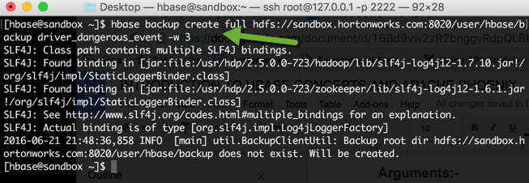
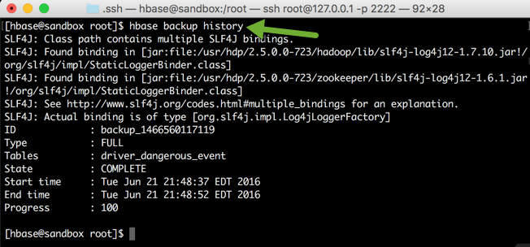
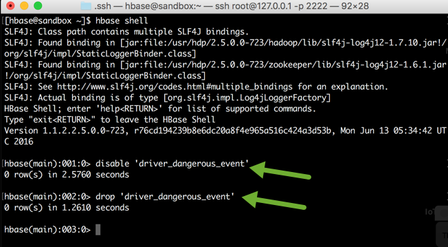
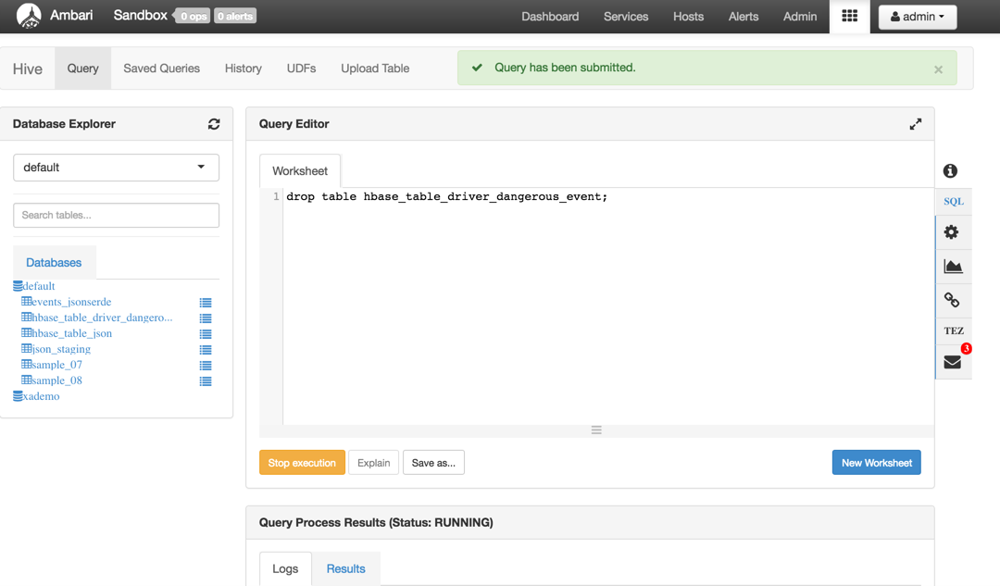
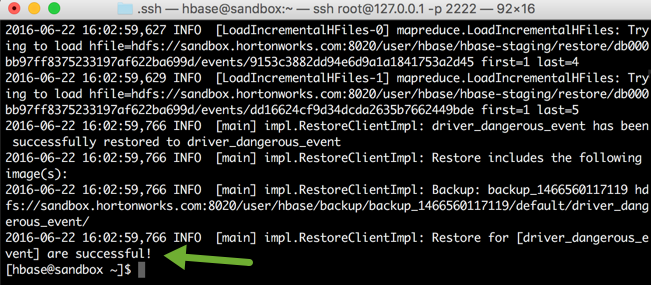
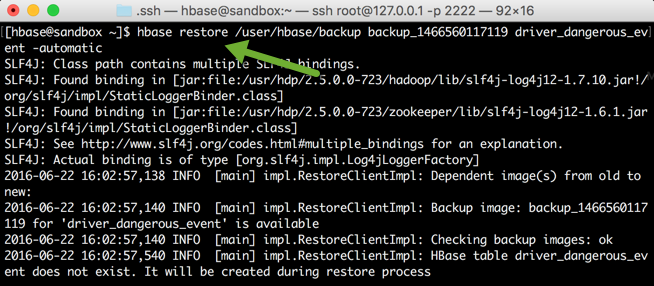

## Introduction

The HBase backup and restore utility helps you take backup of the table schema and data and enable you to recover your environment should failure occur. The HBase backup and restore utility also supports incremental backups. This means you don’t have to take full backup each time.

## Prerequisites

- [Download Hortonworks 2.5 Sandbox](http://hortonworks.com/downloads/#sandbox)
- Complete the [Learning the Ropes of the Hortonworks Sandbox tutorial,](http://hortonworks.com/hadoop-tutorial/learning-the-ropes-of-the-hortonworks-sandbox/) you will need it for logging into Ambari as an administrator user.
- Lab 1 : Introduction to HBase Concepts
- Lab 2 : Introduction to Phoenix Concepts

## Outline

- [1: Creating a Full Backup](#create-full-backup)
- [2: Backup Sets](#backup-sets)
- [3: Restoring a Backup](#restore-backup)
- [4: Summary](#summary)

## 1. Creating a Full Backup 

The first step in running the backup-and-restore utilities is to capture the complete data set in a separate image from the source. The syntax for creating HBase backup is as follows:

`hbase backup create { {full | incremental} {backup_root_path} {[tables] | [-set backup_set_name]} } [[-silent] | [-w number_of_workers] | [-b bandwidth_per_worker]]`

### Arguments:-

1. full | incremental - Full argument takes the full backup image. Incremental argument creates an incremental backup that has an image of data changes since the full backup or the previous incremental backup.

2. backup_root_path - the root path where you want to store your backup image.

3. tables (optional) - Specify the table or tables to backup. If no tables are specified, all tables are backed up.

4. -set backup_set_name (optional)- Calls an existing backup set in the command.

5. -silent (optional) - Ensures that the progress of the backup is not displayed on the screen.

6. -w number_of_workers (optional) - Specifies the number of parallel workers to copy data of the backup.

7. -b bandwidth_per_worker (optional) - Specifies the bandwidth of the worker in MB per second.

Now create a full backup of table `driver_dangerous_event` on `hdfs://sandbox.hortonworks.com:8020/user/hbase/backup`  HDFS path with 3 parallel workers. Run the following command from the command line:

~~~
$>hbase backup create full hdfs://sandbox.hortonworks.com:8020/user/hbase/backup driver_dangerous_event -w 3
~~~

You check whether the backup of your table is created in HDFS or not.

~~~
$>hadoop fs -ls /user/hbase/backup
~~~

One more way to check whether the backup is taken or not is by running:

~~~
$>hbase backup history
~~~

Note the backup_ID which will be used while restoring the data.

## 2. Backup Sets 

You can create a group of tables into a set so that it reduces the amount of repetitive inputs of table names. You can then use the `-set argument` to invoke named backup set in either hbase backup create or hbase backup restore utility. Syntax to create a backup set is:

`hbase backup set {[add] | [remove] | [list] | [describe] | [delete]} backup_set_name tables`

If you run the **hbase backup set add** command and specify a backup set name that does not yet exist on your system, a new set is created. If you run the command with the name of an existing backup set name, then the tables that you specify are added to the set.

### Arguments:

1. add  - Add tables to a backup set. Specify a backup_set_name value after this argument to create a backup set.
remove - Removes tables from the set. Specify the tables to remove in the tables argument.

2. list - Lists all backup sets.

3. describe - Use this subcommand to display on the screen a description of a backup set. This subcommand must precede a valid value for the backup_set_name value.

4. delete - Deletes a backup set. Enter the value for the backup_set_name option directly after the **hbase backup set delete** command.

5. backup_set_name (optional) - Used to assign or invoke a set name.

6. tables (optional) - list of tables to include in the backup set.

Now create a backup set called event which has a table driver_dangerous_event.

~~~
$>hbase backup set add event driver_dangerous_event
~~~

Let’s check whether our set is added or not using list:

~~~
$>hbase backup set list
~~~

## 3. Restoring a Backup 

The syntax for running a restore utility is as follows:

`hbase restore {[backup_root_path] | [backup_ID] | [tables]} [[table_mapping] | [-overwrite]]`

### Arguments:

1. backup_root_path - Specifies the parent location of the stored backup image.

2. backup_ID - The backup ID that uniquely identifies the backup image to be restored.

3. tables - Table or tables to be restored.

4. table_mapping (optional)- Directs the utility to restore data in the tables that are specified in the tables option. Each table must be mapped prior to running the command.

5. -overwrite  (optional) - Overwrites an existing table if there is one with the same name in the target restore location.

6. -automatic (optional) - Restores both the backup image and all the dependencies following the correct order.

Let’s drop a table so that restore utility can be tested. To drop a table in HBase, you first have to disable it and then drop it.

Run the following commands from the **hbase shell** to drop the table:

~~~
hbase>disable 'driver_dangerous_event'

hbase>drop 'driver_dangerous_event'
~~~

You also have to delete the mapping table from Phoenix to avoid any confusion.

Exit from the hbase shell and go to `/usr/hdp/current/phoenix-client/bin` and open the Phoenix shell using:

~~~
cd /usr/hdp/current/phoenix-client/bin
./sqlline.py localhost
~~~

Now drop that mapping table:

~~~
drop table "driver_dangerous_event";
~~~

Exit the Phoenix shell by typing `!quit` and now drop the table from Hive also. Go back to Hive view and drop the table:

~~~
drop table hbase_table_driver_dangerous_event;
~~~

Click on green `Execute` button, you will see something like this:

Now let’s restore the backup of this table which you created earlier in the tutorial:

> **NOTE**: Copy the same backup ID that you got while doing **hbase backup history**

~~~
$>hbase restore /user/hbase/backup backup_1466560117119 driver_dangerous_event -automatic
~~~

You can view the result at the end of this command’s execution.

## 4. Summary 

Congratulations! Lets summarize what we learned in this tutorial. We went through the new Backup & Restore utility in HBase. We created a full backup of our HBase table, created a backup set and then restore the deleted table.
