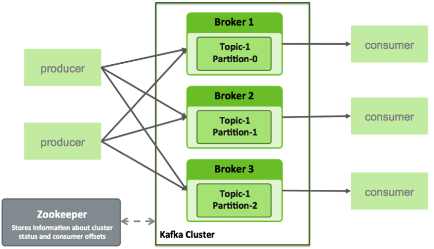
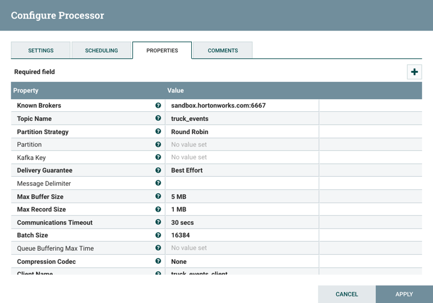
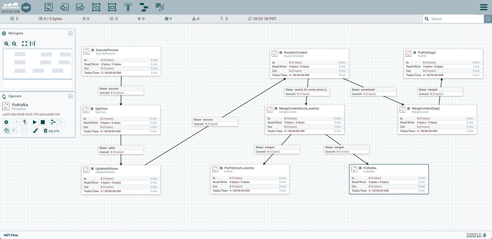
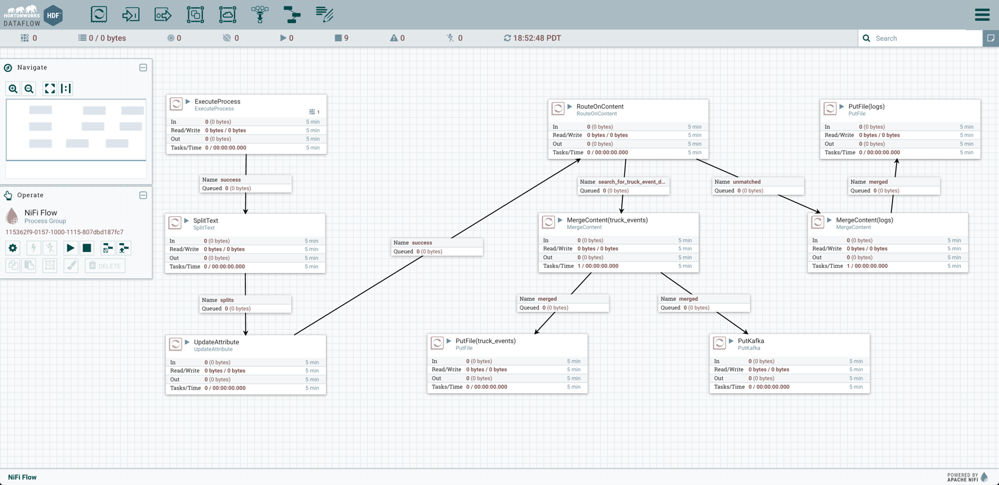

# Tutorial 2: Capture Real Time Event Stream with Apache Kafka

## Introduction

[Apache Kafka](http://kafka.apache.org/) can be used on the Hortonworks Data Platform to capture real-time events. We will begin with showing you how to configure Apache Kafka and Zookeeper. Next we will show you how to capture truck event data from Apache NiFi using Kafka.

## Pre-Requisites
*  Tutorial 0: Set Up Simulator, Apache Services and IDE Environment
*  Tutorial 1: Ingest, Route and Land Real Time Events with Apache NiFi
*  Downloaded and Installed latest [Hortonworks Sandbox](http://hortonworks.com/products/hortonworks-sandbox/#install)
*  You will need admin privileges for this tutorial, refer to [Learning the Ropes of the Hortonworks Sandbox](http://hortonworks.com/hadoop-tutorial/learning-the-ropes-of-the-hortonworks-sandbox/) to setup your Ambari admin password
*  Memory must be at least 8GB RAM, preferably 4 processor cores, else errors may occur in third tutorial

## Outline

*   [Apache Kafka](#apache-kafka-tutorial1)
*   [Step 1: Create Kafka Topic](#define-kafka-topic-tutorial1)
*   [Step 2: Create NiFi PutKafka Processor](#create-nifi-putkafka-tutorial1)
*   [Summary](#summary-tutorial1)
*   [Further Reading](#further-reading-tutorial1)

## Apache Kafka 

[Apache Kafka](http://kafka.apache.org/) is an open source messaging system designed for:

*   Persistent messaging
*   High throughput
*   Distributed
*   Multi-client support
*   Real time

Kafka Producer-Broker-Consumer

## Tutorial Overview

1.  Create Kafka topics for Truck events.
2.  Write Kafka Producers for Truck events.

### Step 1: Create a Kafka Topic 

### 1.1 SSH into the Sandbox

SSH into the Sandbox to define the Kafka topic. Type the following command:

~~~bash
ssh root@sandbox.hortonworks.com -p 2222
~~~

> NOTE: You can also SSH using a program like Putty for Windows or the Terminal application on a Mac.

### 1.2 Create a new Topic

Use the `kafka-topics.sh` script (which should be in your PATH), create a new topic named `truck_events`:

~~~bash
[root@sandbox ~]# kafka-topics.sh --create --zookeeper sandbox.hortonworks.com:2181 --replication-factor 1 --partitions 2 --topic truck_events
~~~

If the `kafka-topics.sh` script is not in your PATH and you get a command not found error, then change directories to where the Kafka scripts are installed:

~~~bash
[root@sandbox ~]# cd /usr/hdp/current/kafka-broker/bin/
~~~

You will need to **add a dot and a slash (./)** to the beginning of the commands:

~~~bash
[root@sandbox bin]# ./kafka-topics.sh --create --zookeeper sandbox.hortonworks.com:2181 --replication-factor 1 --partitions 2 --topic truck_events
~~~

Also note that sometimes ZooKeeper does not listen on `localhost`, so you may need to use `sandbox.hortonworks.com` or the Sandbox’s IP address instead.

The output should show your topic was created:

### 1.3 Verify the topic was created successfully

Check if topic `truck_events` was created successfully with the following command:

~~~bash
[root@sandbox ~]# ./kafka-topics.sh --list --zookeeper sandbox.hortonworks.com:2181
~~~

You should see `truck_events` in the list of topics (and probably your only topic):

### Step 2: Create NiFi PutKafka Processor 

In the previous tutorial, we stored the truck event data into a file. Now we can use the [PutKafka](https://nifi.apache.org/docs/nifi-docs/components/org.apache.nifi.processors.kafka.PutKafka/index.html) processor since the Kafka service is running, we have access to the "Known Broker", "Topic Name" and "Client Name." We will send the truck event contents of a FlowFile to Kafka as a message. Similar to the Kafka Producer, NiFi acts as a producer since it creates messages and publishes them to the Kafka broker for further consumption.

1\. If not already open, navigate to the NiFi Web Interface at `http://sandbox.hortonworks.com:9090/nifi/`. For vmware and azure, the port may be different.

2\. If your data flow is still running, click on the stop button  in the **actions** toolbar to stop the flow.

### 2.1 Add PutKafka Processor

1\. Drag the processor icon onto your graph. Add the **PutKafka** processor.

2\. Right click on the Putkafka processor, click on **configure**.

3\. The warning message tells us, we need to add "Known Broker", "Topic Name" and "Client Name" values to our Properties section. Enter the following information into the **Properties** section in the **Configure Processor** window:

~~~
# Property = Value
Known Brokers = sandbox.hortonworks.com:6667
Topic Name = truck_events
Message Delimiter = press “Shift+enter”
Client Name = truck_events_client
~~~

> Note: Every property above is required except **Message Delimiter**, but this property is helpful with splitting apart the contents of the FlowFile.

**Known Brokers** can be found in **Kafka** configs under listeners

**Topic Name** is the name you created earlier for Kafka. Type the following command to see your topic name: ./kafka-topics.sh --list --zookeeper sandbox.hortonworks.com:2181.

**Message Delimiter** set as "Shift+enter" in the value field makes each line of incoming FlowFile a single message, so kafka does not receive an enormous flowfile as a single message.

**Client Name** can be named to your liking, it is the name that is used when communicating with kafka.

4\. Open the Configure Processor window again, navigate to the **Settings** tab. Set the **Auto termination relationship** to `success` and `failure`. Click **apply**.

5\. Connect the **MergeContent(truck_events)** processor to **PutKafka**. A Create Connection window will appear, set the **For relationship** to `merged`.

You should obtain a similar dataflow as the following:

> Note: If there is a warning symbol after updating the PutKafka, verify that the property values are correct. Check **3**. in case you need to review the values changed.

6\. Let’s start our Hortonworks DataFlow to see a real live stream of truck event data be read from NiFi and written to a Kafka cluster. In the **actions** toolbar, hit the **start** button.

> Dataflow generates data, filtering truck events from the dataflow and sending those events to kafka.

### 2.2 Verify PutKafka Published Message to Kafka

After a few seconds, stop the NiFi DataFlow using the **stop** button in the **actions** toolbar.
To verify that the PutKafka processor successfully published messages to the Kafka cluster, execute the following command to start a consumer to see the produced events:

~~~bash
[root@sandbox ~]# cd /usr/hdp/current/kafka-broker/bin/
[root@sandbox bin]# ./kafka-console-consumer.sh --zookeeper sandbox.hortonworks.com:2181 --topic truck_events --from-beginning
~~~

Your terminal should show that messages successfully published to Kafka:

## Summary 

This tutorial gave you brief glimpse of how to use Apache Kafka to capture real-time event data as a message and verify that Kafka successfully received those messages. In our next tutorial, you will create HBase and Hive tables to ingest real-time streaming data using Storm.

## Further Reading 
- [Apache Kafka Documentation](http://kafka.apache.org/)
- [Kafka Overview](http://hortonworks.com/hadoop/kafka/)
- [Apache Zookeeper Documentation](https://zookeeper.apache.org/)
- HCC Article: [Kafka Best Practices](https://community.hortonworks.com/content/kbentry/49789/kafka-best-practices.html)
