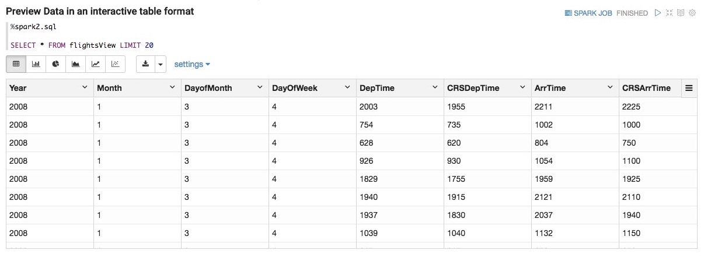
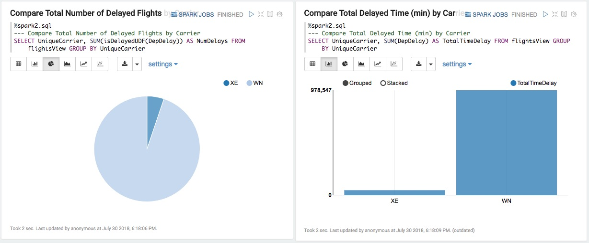
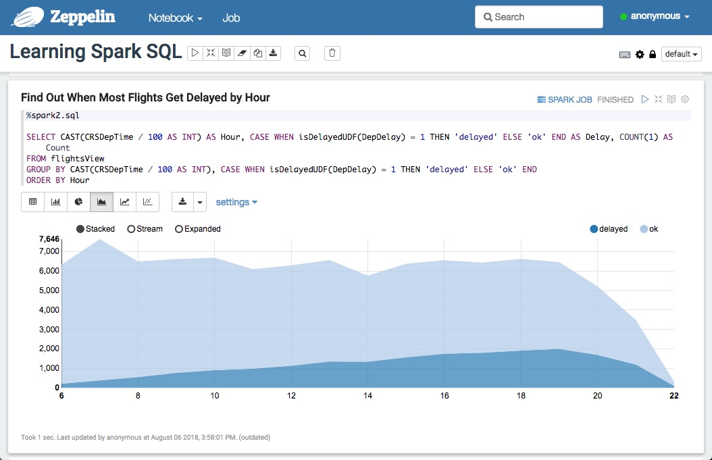

# Learning Spark SQL with Zeppelin

## Introduction

In this two-part lab-based tutorial, we will first introduce you to Apache Spark SQL. Spark SQL is a higher-level Spark module that allows you to operate on DataFrames and Datasets, which we will cover in more detail later. At the end of the tutorial we will provide you a Zeppelin Notebook to import into Zeppelin Environment.

In the second part of the lab, we will explore an airline dataset using high-level SQL API. We will visualize the dataset and write SQL queries to find insights on when and where we can expect highest delays in flight arrivals and departures.

The lab is part of our Apache Zeppelin based lab series, providing an intuitive and developer friendly web-based environment for data ingestion, wrangling, munging, visualization and more. In this tutorial we will first review the concepts used, a Zeppelin Notebook containing the code used in the tutorial and further instructions is provided at the end of this tutorial.

## Prerequisites

- Downloaded and deployed the [Hortonworks Data Platform (HDP)](https://hortonworks.com/downloads/#sandbox) Sandbox
- [Getting Started with Apache Zeppelin](https://hortonworks.com/tutorial/getting-started-with-apache-zeppelin/)
- Having basic knowledge of [Scala](http://www.dhgarrette.com/nlpclass/scala/basics.html), the Zeppelin notebook uses basic  syntax
- Review [Learning the Ropes of HDP Sandbox](https://hortonworks.com/tutorial/learning-the-ropes-of-the-hortonworks-sandbox/)
- [Create Shell Interpreter](https://hortonworks.com/tutorial/getting-started-with-apache-zeppelin/#creating-an-interpreter)

## Outline

- [Concepts](#concepts)
- [Using DataFrame and Dataset API to Analyze Airline Data](#using-dataframe-and-dataset-api-to-analyze-airline-data)
- [Using SQL API to analyze Airline data](#using-sql-api-to-analyze-the-airline-data)
- [Putting It All Together](#putting-it-all-together)
- [Import the Zeppelin Notebook](#import-the-zeppelin-notebook)
- [Summary](#summary)
- [Further Reading](#further-reading)

## Concepts

As mentioned earlier, this is a two-part lab. In the first part of the lab, we will cover Spark SQL's Datasets and DataFrames, which are distributed collections of data conceptually equivalent to a table in a relational database or a dataframe in Python or R. Both provide rich optimizations and translate to an optimized lower-level Spark code. The main difference between the Datasets and DataFrames is that Datasets are strongly typed, requiring consistent value/variable type assignments. The Dataset is available in Scala and Java (strongly typed languages), while DataFrame additionally supports Python and R languages.

If this is a bit confusing, don't worry. Once you run through this lab you will find that both the Dataset and DataFrame APIs provide an intuitive way of interacting with the data. We will take you through several steps of exploring and selecting relevant data, and creating User Defined Functions (UDFs) to apply basic filters to columns of interest, e.g. to determine which flights were delayed.

In part two of the lab, we will create a temporary view to store our DataFrame in memory and make its contents accessible via a SQL API. This will allow us to run SQL queries against this temporary view allowing for an even richer exploration of the data with built in Zeppelin visualizations.

We will wrap up by persisting our results to a permanent table that can then be shared with other people.

One thing to remember is that in both part one and part two of the lab the queries on Datasets/DataFrames or the temporary view will translate to an underlying optimized form of Spark Resilient Distributed Datasets (RDDs) assuring that all code is executed in a parallel/distributed fashion. To learn more about RDDs, which are beyond the scope of this tutorial, see the  [Spark docs](http://spark.apache.org/docs/latest/programming-guide.html#resilient-distributed-datasets-rdds).

## Using DataFrame and Dataset API to Analyze Airline Data

### Datasets and DataFrames

A Dataset is a distributed collection of data. Dataset provides the benefits of strong typing, ability to use powerful lambda functions with the benefits of (Spark SQL’s) optimized execution engine. A Dataset can be constructed from JVM objects and then manipulated using functional transformations (map, flatMap, filter, etc.). The Dataset API is available in Scala and Java.

A DataFrame is a Dataset organized into named columns. It is conceptually equivalent to a table in a relational database or a data frame in R/Python, but with richer optimizations under the hood. DataFrames can be constructed from a wide array of sources such as: structured data files, tables in Hive, external databases, or existing RDDs. The DataFrame API is available in Scala, Java, Python, and R. In Scala and Java, a DataFrame is represented by a Dataset of Rows. In the Scala API, DataFrame is simply a type alias of Dataset[Row]. (Note that in Scala type parameters (generics) are enclosed in square brackets.)

Throughout this document, we will often refer to Scala/Java Datasets of Rows as DataFrames. You can view the reference documentation at [Apache Spark](http://spark.apache.org/docs/2.0.0/sql-programming-guide.html#datasets-and-dataframes).

### Dataset description

In this tutorial we will be using a large record of airplane flights including the date of flight, departure time, arrival time, among other data-points to infer which flights are likely to be delayed and find out what the delay time is on average, this is the full description of the data:

| |**Name**|**Description**
:-----:|:-----|:-----
1|Year|1987-2008
2|Month|1-12
3|DayofMonth|1-31
4|DayOfWeek|1 (Monday) - 7 (Sunday)
5|DepTime|actual departure time (local, hhmm)
6|CRSDepTime|scheduled departure time (local, hhmm)
7|ArrTime|actual arrival time (local, hhmm)
8|CRSArrTime|scheduled arrival time (local, hhmm)
9|UniqueCarrier|unique carrier code
10|FlightNum|flight number
11|TailNum|plane tail number
12|ActualElapsedTime|in minutes
13|CRSElapsedTime|in minutes
14|AirTime|in minutes
15|ArrDelay|arrival delay, in minutes
16|DepDelay|departure delay, in minutes
17|Origin|origin IATA airport code
18|Dest|destination IATA airport code
19|Distance|in miles
20|TaxiIn|taxi in time, in minutes
21|TaxiOut|taxi out time in minutes
22|Cancelled|was the flight cancelled?
23|CancellationCode|reason for cancellation (A = carrier, B = weather, C = NAS, D = security)
24|Diverted|1 = yes, 0 = no
25|CarrierDelay|in minutes
26|WeatherDelay|in minutes
27|NASDelay|in minutes
28|SecurityDelay|in minutes
29|LateAircraftDelay|in minutes

Through the use of user defined functions in the Notebook you will find the percentage of delayed flights:

We found out some of the information that we needed; however, we can do better. Zeppelin has powerful visualization tools such as graphs and tables that we can use to present our newly found data in a more appealing format. In the second part of the tutorial we explore different ways in which we can present data.

## Using SQL API to Analyze the Airline Data

As you can see, the data displayed in Part 1 of the notebook included can be more interactive. To have a more dynamic experience, a temporary (in-memory) view is created and it is used to query and interact with the data via tables or graphs. The temporary view will allow us to execute SQL queries against it for as long as the Spark session is alive.

Here is a preview of the temporary table used in this tutorial's Zeppelin Notebook:

Making use of Zeppelin's visualization tools let's compare the total number of delayed flights and the delay time by carrier:

Great! we found what we were looking for. Now that we know the basics we can extrapolate some more useful data; for example, we would like to know when the optimal time to travel is:

## Putting It All Together

Now, with all these basic analytics in Part 1 and 2 of this lab, you should have a fairly good idea which flights have the most delays, on which routes, from which airports, at which hour, on which days of the week and months of the year, and be able to start making meaningful predictions yourself. That’s the power of using Spark with Zeppelin – having one powerful environment to perform data munging, wrangling, visualization and more on large datasets.

### Persisting Results / Data

Finally, let’s persist some of our results by saving our DataFrames in an optimized file format called ORC.

In our Zeppelin Notebook we store our DataFrame in the following command:

~~~scala
// Save and Overwrite our new DataFrame to an ORC file
flightsWithDelays.write.format("orc").mode(SaveMode.Overwrite).save("flightsWithDelays.orc")
~~~

Let's break this statement down.

~~~scala
flightsWithDelays.write.format("orc")
~~~

### What is an ORC file format?

ORC (Optimized Row-Column) is a self-describing, type-aware columnar file format designed for Hadoop workloads. It is optimized for large streaming reads, but with integrated support for finding required rows quickly. Storing data in a columnar format lets the reader read, decompress, and process only the values that are required for the current query. Because ORC files are type-aware, the writer chooses the most appropriate encoding for the type and builds an internal index as the file is written. [More information here.](https://orc.apache.org/)

~~~scala
mode(SaveMode.Overwrite)
~~~

|          Mode (Scala/Java)         |                                                                                                                             Meaning                                                                                                                            |
|:----------------------------------:|:----------------------------------------------------------------------------------------------------------------------------------------------------------------------------------------------------------------------------------------------------------------|
| **SaveMode.ErrorIfExists (default)** | When saving a DataFrame to a data source, if data already exists, an exception is expected to be thrown.                                                                                                                                                       |
|          **SaveMode.Append**         | When saving a DataFrame to a data source, if data/table already exists, contents of the DataFrame are expected to be appended to existing data.                                                                                                                |
|        **SaveMode.Overwrite**        | Overwrite mode means that when saving a DataFrame to a data source, if data/table already exists, existing data is expected to be overwritten by the contents of the DataFrame.                                                                                |
|          **SaveMode.Ignore**         | Ignore mode means that when saving a DataFrame to a data source, if data already exists, the save operation is expected to not save the contents of the DataFrame and to not change the existing data. This is similar to a CREATE TABLE IF NOT EXISTS in SQL. |

## Import the Zeppelin Notebook

 Great! now you are familiar with the concepts used in this tutorial and you are ready to Import the _Learning Spark SQL_ notebook into your Zeppelin environment. (If at any point you have any issues, make sure to checkout the [Getting Started with Apache Zeppelin](https://hortonworks.com/tutorial/getting-started-with-apache-zeppelin/) tutorial).

To import the notebook, go to the Zeppelin home screen.

1\. Click **Import note**

2\. Select **Add from URL**

3\. Copy and paste the following URL into the **Note URL**

~~~text
https://github.com/hortonworks/data-tutorials/raw/dev/tutorials/hdp/learning-spark-sql-with-zeppelin/assets/Learning%20Spark%20SQL.json
~~~

4\. Click on **Import Note**

Once your notebook is imported, you can open it from the Zeppelin home screen by:

5\. Clicking on **Clicking on the Learning Spark SQL**

Once the **Learning Spark SQL** notebook is up, [bind the Shell Interpreter](https://hortonworks.com/tutorial/getting-started-with-apache-zeppelin/#binding-an-interpreter) to the **Learning Spark SQL** notebook. Follow all the directions within the notebook to complete the tutorial.

## Summary

Once you have completed part one and part two of the lab you should have a basic tool set to start exploring new datasets using a high-level programmatic Dataset or DataFrame APIs, or a SQL API. Both APIs provide the same performance while giving you the choice to choose one or both to accomplish a task demanding high performance data exploration, wrangling, munging, and visualization.

## Further Reading

- You may want to checkout a short introductory tutorial on [Machine Learning with Spark](https://hortonworks.com/tutorial/intro-to-machine-learning-with-apache-spark-and-apache-zeppelin/).
- [Predicting Airline Delays using SparkR](https://hortonworks.com/tutorial/predicting-airline-delays-using-sparkr/)
- [Hortonworks Community Connection (HCC)](https://community.hortonworks.com/spaces/85/data-science.html?type=question) is a great resource for questions and answers on Spark, Data Analytics/Science, and many more Big Data topics.
- [Hortonworks Apache Spark Overview](https://docs.hortonworks.com/HDPDocuments/HDP3/HDP-3.0.1/spark-overview/content/analyzing_data_with_apache_spark.html)
- [Hortonworks Apache Zeppelin Overview](https://docs.hortonworks.com/HDPDocuments/HDP3/HDP-3.0.1/zeppelin-overview/content/overview.html)
