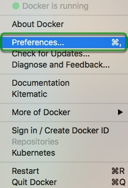

# Deploying Hortonworks Sandbox on Docker

## Introduction

This tutorial walks through the general approach for installing the Hortonworks Sandbox (HDP or HDF) onto Docker on your computer.

## Prerequisites

-   [Download the Hortonworks Sandbox](https://hortonworks.com/downloads/#sandbox)
-   Docker Installed
    -   [Docker For Linux](https://docs.docker.com/engine/installation/linux/)
    -   [Docker For Windows](https://docs.docker.com/docker-for-windows/install/)
    -   [Docker For Mac](https://docs.docker.com/docker-for-mac/install/)
-   A computer with at least **8 GB of RAM to spare**.

## Outline

-   [Configure Docker Memory](#configure-docker-memory)
    -   [For Linux](#for-linux)
    -   [For Windows](#for-windows)
    -   [For Mac](#for-mac)
-   [Load Sandbox Into Docker](#load-sandbox-into-docker)
-   [Start Sandbox](#start-sandbox)
    -   [For HDP 2.6 Sandbox](#for-hdp-26-sandbox)
    -   [For HDF 3.0 Sandbox](#for-hdf-30-sandbox)
-   [Further Reading](#further-reading)

## Configure Docker Memory

### For Linux

No special configuration needed for Linux.

### For Windows

After [installing Docker For Windows](https://docs.docker.com/docker-for-windows/install/), open the application and click on the Docker icon in the menu bar.  Select **Settings**.


Select the **Advanced** tab and adjust the dedicated memory to **at least 8GB of RAM**.


### For Mac

After [installing Docker For Mac](https://docs.docker.com/docker-for-mac/install/), open the application and click on the Docker icon in the menu bar.  Select **Preferences**.



Select the **Advanced** tab and adjust the dedicated memory to **at least 8GB of RAM**.


## Load Sandbox Into Docker

After you've [downloaded the sandbox](https://hortonworks.com/downloads/#sandbox), open a console/terminal and issue the following command to load the sandbox image:

-   ```docker load -i <sandbox-docker-image-path>```

Make sure the image was imported successfully - run the following command:

-   ```docker images```

You should see **sandbox-hdp** on the list.


### Error(s) you may encounter
1\. **No space left on device**:

-   Solution(s)
    -   [Increase the size of base Docker for Mac VM image](<https://community.hortonworks.com/content/kbentry/65901/how-to-increase-the-size-of-the-base-docker-for-ma.html>)

2\. **Docker Load -i** command failed for HDF:

-   Use **Docker import** as follows:
    -   ```docker import <sandbox-docker-image-path>```

-   If Docker image is not named **sandbox-hdf**, then tag that image to **sandbox-hdf** and remove the old image:

    -   ```docker tag <old_image id> sandbox-hdf```
    -   ```docker rmi <old image>```

## Start Sandbox

Based on your sandbox and operating system, download and execute one of these scripts:

#### HDP Sandbox

-   For Linux/Mac: Use this [start_sandbox-hdp.sh](assets/start_sandbox-hdp.sh)
-   For Windows: Use this [start-start_sandbox-hdp.ps1](assets/start_sandbox-hdp.ps1)

#### HDF Sandbox

-   For Linux/Mac: Use this [start_sandbox-hdf.sh](assets/start_sandbox-hdf.sh)
-   For Windows: Use this [start_sandbox-hdf.ps1](assets/start_sandbox-hdf.ps1)

You should see something like:


The sandbox is now created and ready for use.

Welcome to the Hortonworks Sandbox!

## Further Reading

-   Follow-up with the tutorial: [Learning the Ropes of the Hortonworks Sandbox](https://hortonworks.com/tutorial/learning-the-ropes-of-the-hortonworks-sandbox)
-   [Browse all tutorials available on the Hortonworks site](https://hortonworks.com/tutorials/)
