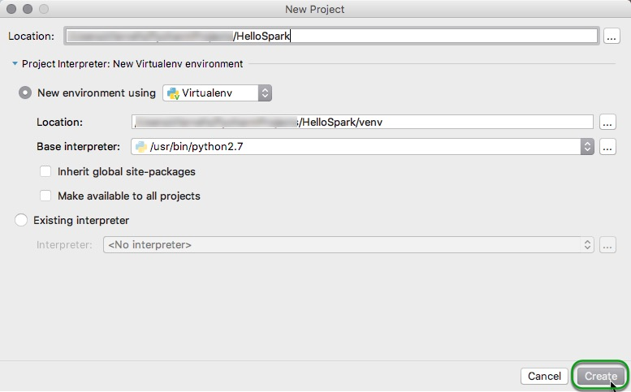
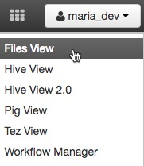

# Setting up a Spark Development Environment with Python

## Introduction

This tutorial will teach you how to set up a full development environment for developing Spark applications. For this tutorial we'll be using Python, but Spark also supports development with [Java](https://hortonworks.com/tutorial/setting-up-a-spark-development-environment-with-java/), [Scala](https://hortonworks.com/tutorial/setting-up-a-spark-development-environment-with-scala/) and R.

We'll be using PyCharm Professional Edition as our IDE. PyCharm community edition can also be used, but some of the techniques we'll show you in this tutorial will only work with Professional Edition. By the end of the tutorial, you'll know how to set up Spark with PyCharm and how to deploy your code to the sandbox or a cluster.

## Prerequisites

-   Installed [Hortonworks Data Platform (HDP) Sandbox](https://hortonworks.com/downloads/#sandbox)
-   Installed [Python](https://www.python.org/)
-   Installed [PyCharm](https://www.jetbrains.com/pycharm/)

## Outline

-   [Create New PyCharm Project](#create-new-pycharm-project)
-   [Download and Save Dataset](#download-and-save-dataset)
-   [Create a Spark Application](#create-a-spark-application)
-   [Deploying to the Sandbox](#deploying-to-the-sandbox)
-   [Deploying to the Cloud](#deploying-to-the-cloud)

## Create New PyCharm Project

>Note: Instructions may vary based on operating system.

To create a new project select **File** -> **New Project**. Name the project **HelloSpark** and save in **~/PycharmProjects/HelloSpark**.



You should now have an empty project called HelloSpark.

## Download and Save Dataset

For our first application we're going to build a simple program that performs a word count on the collected works of Shakespeare - [Download the file](assets/shakespeare.txt).

We need to save two copies of this dataset. One, inside PyCharm project for testing on local system and another on HDFS (Hadoop Distributed File System) for testing on the sandbox.

1\. On local system, copy **shakespeare.txt** to **~/PycharmProjects/HelloSpark**

2\. Upload to HDFS (make sure sandbox is up and running):
-   Navigate to [sandbox-hdp.hortonworks.com:8080](http://sandbox-hdp.hortonworks.com:8080)
-   Login using username/password as **maria_dev** / **maria_dev**
-   Once you've logged into Ambari Manager, mouse over the drop-down menu on the upper-right hand corner and click on **Files View**.
-   Open the **tmp** folder and click the **upload** button in the upper-right corner to upload the file. Make sure it's named **shakespeare.txt**.



## Create a Spark Application

Now the fun part begins!

Let's create the application:

-   Right-click on **HelloSpark**
-   Select **New** -> **File**, name it **Main.py**


-   Copy the following code into it:

```
from pyspark import SparkContext, SparkConf

conf = SparkConf().setAppName('MyFirstStandaloneApp')
sc = SparkContext(conf=conf)

text_file = sc.textFile("./shakespeare.txt")

counts = text_file.flatMap(lambda line: line.split(" ")) \
             .map(lambda word: (word, 1)) \
             .reduceByKey(lambda a, b: a + b)

print ("Number of elements: " + str(counts.count()))
counts.saveAsTextFile("./shakespeareWordCount")
```

To run your program, click **Run** -> **Run...** from IDE menu and select **Main**. That's all it takes to perform a word count in Spark. The results are saved in **shakespeareWordCount**.

>Note: **pyspark** package may need to be installed.


## Deploying to the Sandbox

In this section we will deploy our code on the Hortonworks Data Platform (HDP) Sandbox.

First, we need to modify the code. We need to read the dataset from HDFS instead of the local PyCharm project.

```
# REPLACE THIS
text_file = sc.textFile("./shakespeare.txt")

# TO THIS
text_file = sc.textFile("hdfs:///tmp/shakespeare.txt")
```

```
# REPLACE THIS
counts.saveAsTextFile("./shakespeareWordCount")

# TO THIS
counts.saveAsTextFile("hdfs:///tmp/shakespeareWordCount")
```

Copy **Main.py** to HDP sandbox using **scp**: ```scp -P 2222 ./Main.py root@sandbox-hdp.hortonworks.com:/root```

Next, open sandbox shell using [shell-in-a-box](http://sandbox-hdp.hortonworks.com:4200) or **ssh**: ```ssh -p 2222 root@sandbox-hdp.hortonworks.com```

Finally, use **spark-submit** to run the program: ```spark-submit ./Main.py```

The results are saved on HDFS: **/tmp/shakespeareWordCount**. You will see a word count output that looks like this:

```
...
(u'fawn', 11)
(u'Fame,', 3)
(u'mustachio', 1)
(u'protested,', 1)
(u'sending.', 3)
(u'offendeth', 1)
(u'instant;', 1)
(u'scold', 4)
(u'Sergeant.', 1)
(u'nunnery', 1)
(u'Sergeant,', 2)
...
```

## Deploying to the Cloud

In this section we'll learn how to deploy our code to a real cluster. If you don't have a cluster available you can quickly set one up using [Hortonworks Cloud Solutions](https://hortonworks.com/products/data-platforms/cloud/).

These services are designed to let you quickly spin up a cluster for a few hours (perhaps on cheaper spot instances), run a series of jobs, then spin the cluster back down to save money. If you want a permanent installation of Hadoop that will run for months without being shutdown, you should download [Hortonworks Data Platform](https://hortonworks.com/downloads/#data-platform) and install on your servers.

After setting up a cluster the process of deploying our code is similar to deploying to the sandbox. We need to scp our code to the cluster:
```
scp -P 2222 -i "key.pem" ~/PycharmProjects/HelloSpark/Main.py root@[ip address of a master node]:root
```

Then open a second terminal window and ssh into the master node:
```
ssh -p 2222 -i "key.pem" root@[ip address of a master node]
```

Then use **spark-submit** to run our code:
```
spark-submit ~/Main.py --master yarn --deploy-mode client
```

Notice that we specified the parameters **--master yarn** - it means we want Spark to run in a distributed mode rather than on a single machine, and we want to rely on YARN (a cluster resource manager) to fetch available machines to run the job. If you aren't familiar with YARN, it is especially important if you want to run several jobs simultaneously on the same cluster. When configured properly, a YARN queue will provide different users or process a quota of cluster resources they're allowed to use. It also provides mechanisms for allowing a job to take full use of the cluster when resources are available and scaling existing jobs down when additional users or jobs begin to submit jobs.

The parameter **--deploy-mode client** indicates we want to use the current machine as the driver machine for Spark. The driver machine is a single machine that initiates a Spark job, and is also where summary results are collected when the job is finished. Alternatively, we could have specified **--deploy-mode cluster**, which would have allowed YARN to choose the driver machine.

It's important to note that a poorly written Spark program can accidentally try to bring back many Terabytes of data to the driver machine, causing it to crash. For this reason you shouldn't use the master node of your cluster as your driver machine. Many organizations submit Spark jobs from what's called an edge node, which is a separate machine that isn't used to store data or perform computation. Since the edge node is separate from the cluster, it can go down without affecting the rest of the cluster. Edge nodes are also used for data science work on aggregate data that has been retrieved from the cluster. For example, a data scientist might submit a Spark job from an edge node to transform a 10 TB dataset into a 1 GB aggregated dataset, and then do analytics on the edge node using tools like R and Python. If you plan on setting up an edge node, make sure that machine doesn't have the DataNode or HostManager components installed, since these are the data storage and compute components of the cluster. You can check this on the host tab in Ambari.
