# Setting up a Spark Development Environment with Scala

## Introduction

This tutorial will teach you how to set up a full development environment for developing and debugging Spark applications. For this tutorial we'll be using Scala, but Spark also supports development with [Java](https://hortonworks.com/tutorial/setting-up-a-spark-development-environment-with-scala/), and [Python](https://hortonworks.com/tutorial/setting-up-a-spark-development-environment-with-python/). We will be using be using **[IntelliJ](https://www.jetbrains.com/idea/download) _Version: 2018.2_** as our IDE running on **_Mac OSx High Sierra_**, and since we're using [Scala](https://docs.scala-lang.org/) we'll use [SBT](https://www.scala-sbt.org/1.x/docs/index.html) as our build manager. By the end of the tutorial, you'll know how to set up IntelliJ, how to use SBT to manage dependencies, how to package and deploy your Spark application, and how to connect your live program to a debugger.

## Prerequisites

- Downloaded and deployed the [Hortonworks Data Platform (HDP)](https://hortonworks.com/downloads/#sandbox) Sandbox
- Basic [Scala](http://www.dhgarrette.com/nlpclass/scala/basics.html) syntax
- Installed [Scala _Version 2.11.8_](https://www.scala-lang.org/download/) or higher
- Installed [SBT](https://www.scala-sbt.org/download.html)
- Installed [Apache Spark](https://spark.apache.org/downloads.html) _Version 2.x_ or higher

## Outline

- [Set up IntelliJ](#set-up-intellij)
- [Creating a new IntelliJ Project](#creating-a-new-intellij-project)
- [SBT](#sbt)
- [Create a Spark Application](#create-a-spark-application)
- [Deploying to the Sandbox](#deploying-to-the-sandbox)
- [Deploying to the Cloud](#deploying-to-the-cloud)
- [Live Debugging](#live-debugging)
- [Summary](#summary)
- [Further Reading](#further-reading)

## Set up IntelliJ

To install the IntelliJ Scala plugin navigate to **preferences > Plugins > Browse Repositories > search for and install the Scala**. Your screen should look something like this:

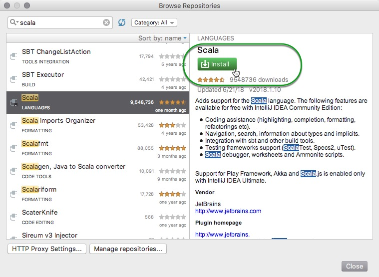

Finally, restart IntelliJ so the plugin takes effect.

Now that we have IntelliJ, Scala and SBT installed we're ready to start building a Spark program.

## Creating a new IntelliJ Project

To create a new project start IntelliJ and select **Create New Project**:

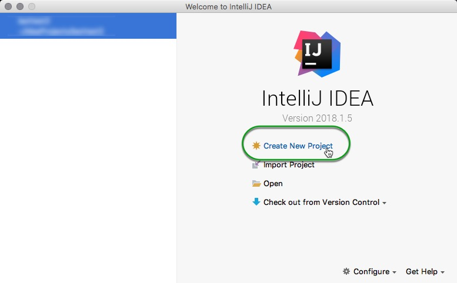

Next, select **Scala** with **sbt** and click next.

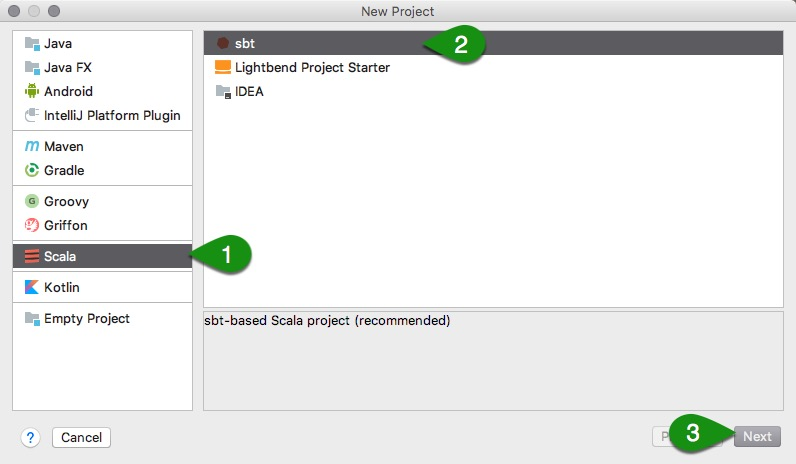

Now name your project **_HelloScala_** and select your appropriate sbt and Scala versions

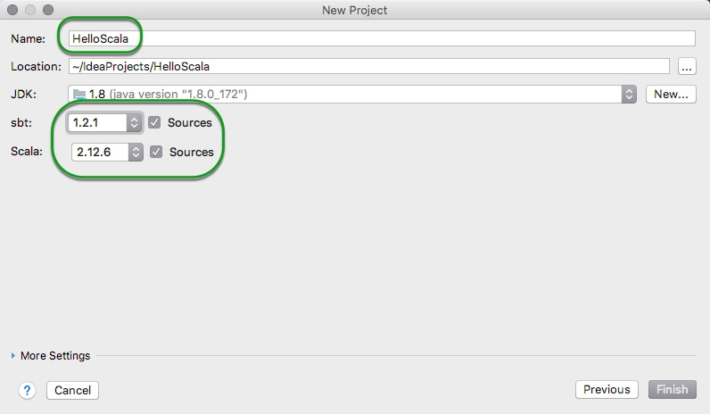

Click on finish to proceed.

IntelliJ should make a new project with a default directory structure. It may take a minute or two to generate all the folders needed, in the end your folder structure should look something like this:

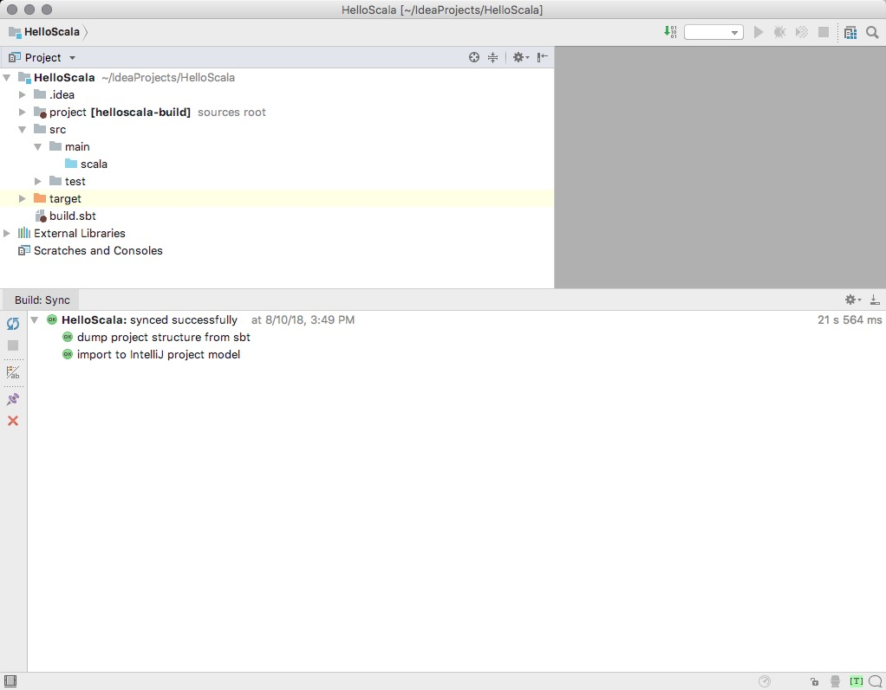

Let's break down the project structure.

- _.idea_: These are IntelliJ configuration files.

- _project_: Files used during compilation. For example, build.properties allows you to change the SBT version used when compiling your project.

- _src_: Source Code. Most of your code should go into the main directory. The test folder should be reserved for test scripts.

- _target_: When you compile your project it will go here.

- _build.sbt_: The SBT configuration file. We'll show you how to use this file to import third party libraries and documentation.

## SBT

Before we start writing a Spark Application, we'll want to import the Spark libraries and documentation into IntelliJ. To perform this we're going to use SBT. This is necessary if we want IntelliJ to recognize Spark code. Add the following lines to the file build.sbt:

~~~scala
name := "HelloScala"

version := "1.0"

scalaVersion := "2.11.12"

// https://mvnrepository.com/artifact/org.apache.spark/spark-core
libraryDependencies += "org.apache.spark" %% "spark-core" % "2.2.0"
~~~

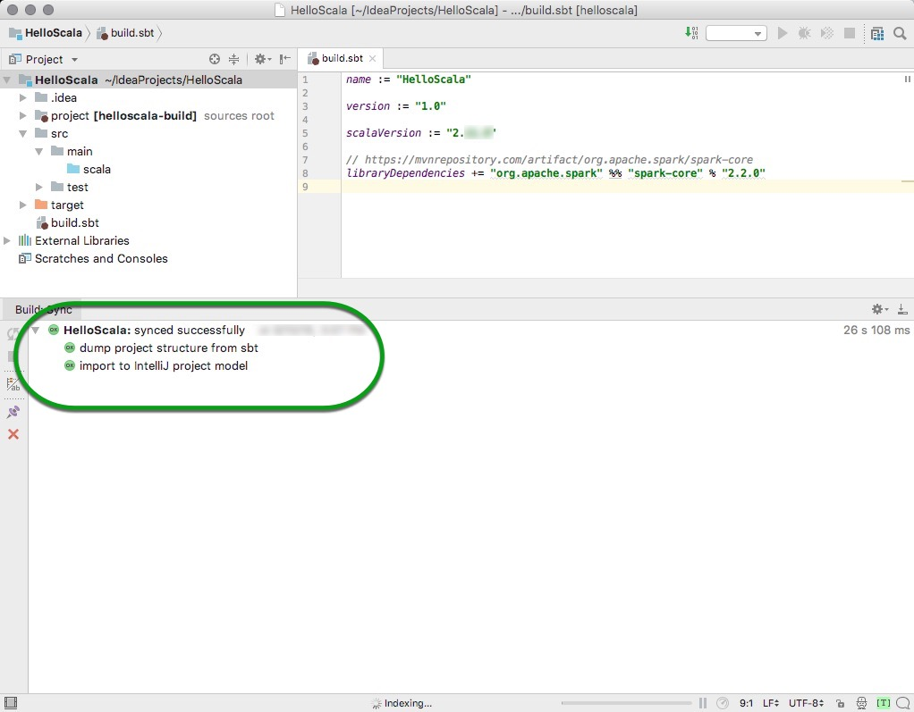

After you save the file, IntelliJ will automatically import the libraries and documentation needed to run Spark.

The SBT syntax can be confusing at first glance. All imports in SBT follow this format:

Group Id % Artifact Id  % Revision

Where in our case the Group Id is "org.apache.spark", Artifact Id is "spark-core". The "%%" syntax additionally appends the Scala version, in our case transforming "spark-core" into "spark-core_2.2". The important thing to remember is that each version of Spark is designed to be compatible with a specific version of Scala, so Spark might not compile or run correctly if you use the wrong version of Scala. For Spark 2.3.x you need to use Scala 2.11.12. You can check the Spark documentation [here](https://spark.apache.org/docs/latest/) for the appropriate version. If SBT fails to import your libraries you may want to search [mvnrepository](https://mvnrepository.com/artifact/org.apache.spark/spark-core) to find out what your **build.sbt** file should look like. For production work it is preferable to pull Spark directly from Hortonwork's repository, [this HCC article](https://community.hortonworks.com/articles/146583/how-to-setup-hortonworks-repository-for-spark-on-i.html) will help you get started setting up for production.

## Create a Spark Application

For our first **_Hello Scala_** application we're going to build a simple program that performs a word count on the collected works of Shakespeare. Right click and save [shakespeare.txt](assets/shakespeare.txt) to your computer, later we'll want to Spark to retrieve this file from HDFS (Hadoop Distributed File System), so let's place it there.

To upload to HDFS, first make sure the sandbox is on, then navigate to sandbox-hdp.hortonworks.com:8080 and login (default username/password is maria_dev/maria_dev).

Once you've logged into Ambari Manager, mouse over the drop-down menu on the upper-right hand corner and click on Files View. Then open the tmp folder and click the upload button in the upper-right corner to upload the file.

Make sure the file is named shakespeare.txt.

Now we're ready to start making our application.

Head back to your IDE and if it does not exist yet make a folder under _src/main_ called _resources_, and place shakespeare.txt there.

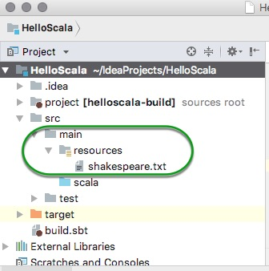

Next, create a new class class. Right click _scala_ > _New_ > _Scala Class_. When the IDE asks whether to create a class, object or trait, choose object. Name the file Main.scala.

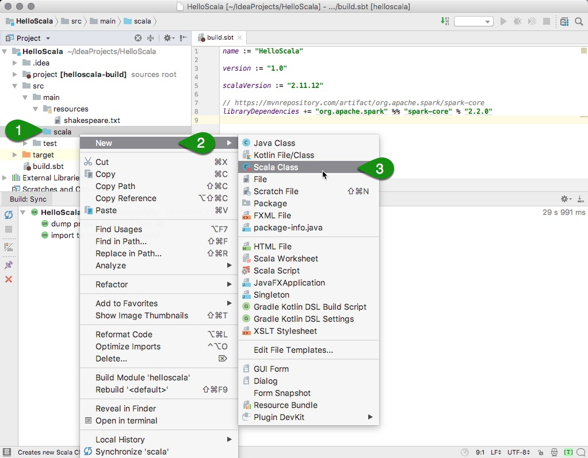

name your class **_HelloScala_** and choose **Object** Kind then click _ok_.

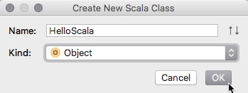

Copy this into your new file:

~~~ scala
object HelloScala {
  def main(args: Array[String]): Unit = {
    println("HelloWorld!")
  }
}
~~~

Now right click on the text editor and select **Run 'HelloScala'**. If everything is set up correctly, the IDE should print `HelloWorld!`

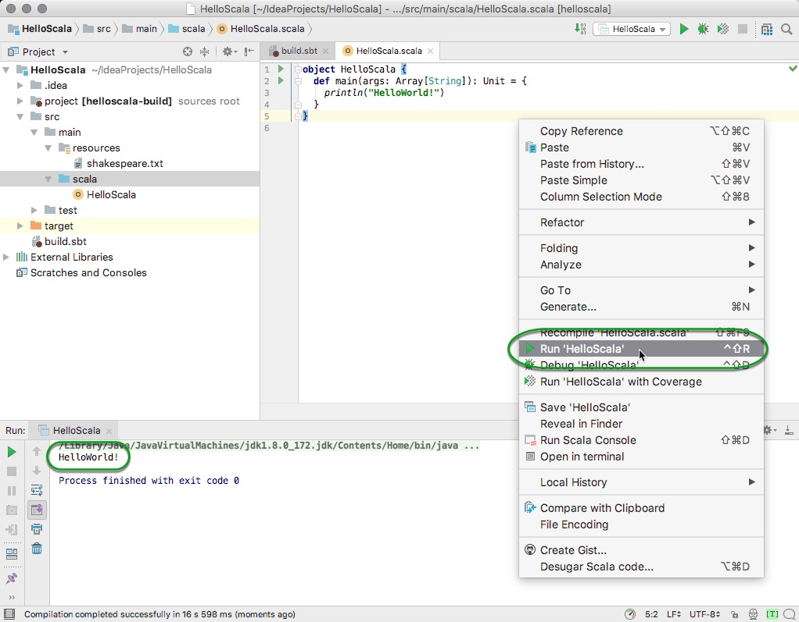

Now that we know the environment is set up correctly, replace the file with this code:

~~~scala
package main.scala

import org.apache.spark.{SparkConf, SparkContext}

object Main {

  def main(args: Array[String]) {

    //Create a SparkContext to initialize Spark
    val conf = new SparkConf()
    conf.setMaster("local")
    conf.setAppName("Word Count")
    val sc = new SparkContext(conf)

    // Load the text into a Spark RDD, which is a distributed representation of each line of text
    val textFile = sc.textFile("src/main/resources/shakespeare.txt")

    //word count
    val counts = textFile.flatMap(line => line.split(" "))
      .map(word => (word, 1))
      .reduceByKey(_ + _)

    counts.foreach(println)
    System.out.println("Total words: " + counts.count());
    counts.saveAsTextFile("/tmp/shakespeareWordCount");
  }

}
~~~

As before, right click on the text editor and select **Run 'HelloScala'** to run the program. This should run the Spark job and print the frequency of each word that appears in Shakespeare.

If you browse to the directory specified on

~~~scala
counts.saveAsTextFile("/tmp/shakespeareWordCount");
~~~

you will find the output of your program.

> NOTE: If would like a different output directory or you are usign a different operating system simply change this line to fit your needs.

Notice we've set this line:

~~~scala
conf.setMaster("local")
~~~

This tells Spark to run locally using this computer, rather than in distributed mode. To run Spark against multiple machines, we would need to change this value to YARN. We'll see how to do this later.

We've now seen how to deploy an application directly in an IDE. This is a good way to quickly build and test an application, but it is somewhat unrealistic since Spark is only running on a single machine. In production use Spark will usually process data stored on a distributed file system like HDFS (or perhaps S3 or Azure Blog Storage if running in the cloud). Spark is also usually run in clustered mode (ie, distributed across many machines).

In the next two sections we'll learn how to deploy distributed Spark applications. First we'll learn how to deploy Spark against the Hortonworks Data Platform Sandbox, which is a single-node Hadoop environment, and then we'll learn how to deploy Spark in the cloud.

## Deploying to the Sandbox

In this section we'll be deploying against the Hortonworks Data Platform Sandbox. Although we're still running Spark on a single machine, we'll be using HDFS and YARN (a cluster resource manager), so this will be a closer approximation of running a full distributed cluster than what we've done previously.

The first thing we want to do is change this line:

~~~scala
val textFile = sc.textFile("src/main/resources/shakespeare.txt")
~~~

_to this:_

~~~scala
val textFile = sc.textFile("hdfs:///tmp/shakespeare.txt")
~~~

_and this:_

~~~scala
counts.saveAsTextFile("/tmp/shakespeareWordCount");
~~~

_to this:_

~~~scala
counts.saveAsTextFile("hdfs:///tmp/shakespeareWordCount");
~~~

This tells Spark to read and write to HDFS instead of locally. **Make sure to save the file.**

### Creating a JAR file

We are going to package this code into a compiled jar file that can be deployed on the sandbox. A jar is a file that contains both our code and all the dependencies that our code needs to work. By packaging our code as an assembly we guarantee that all dependency jars (as defined in build.sbt) will be present when our code runs.

First find the path to the projects main folder. Right click on the main file and select _Copy Path_, now the path is copied to your clipboard.

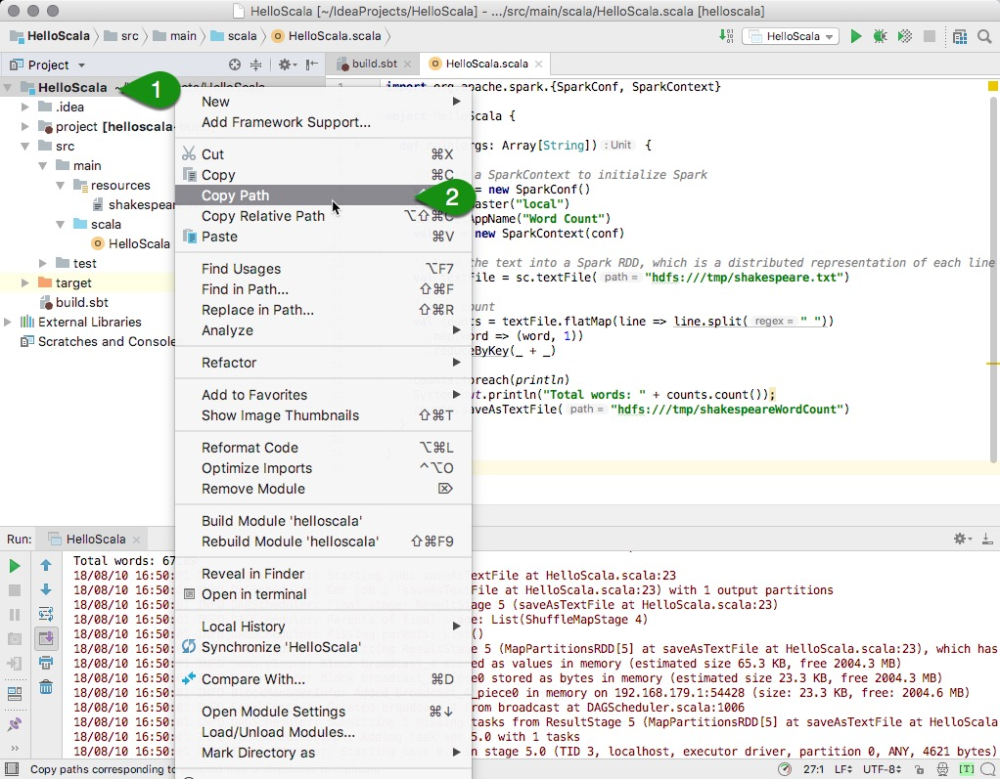

next, open a terminal (or _cmd_) window and change directories to the Path you just copied and run

~~~bash
sbt package
~~~

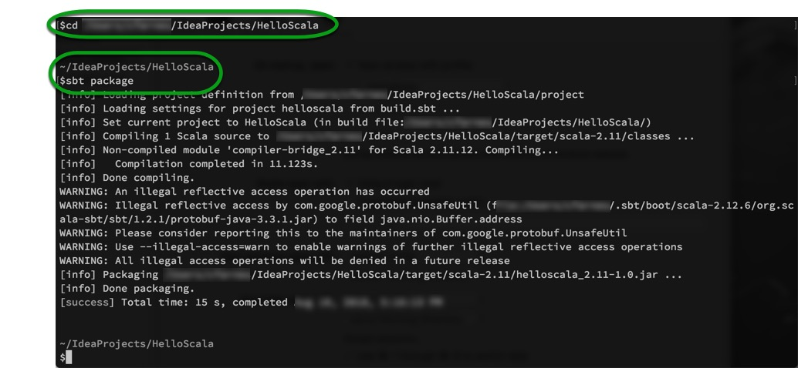

This will create a compiled jar called "helloscala_2.11-1.0.jar" in the folder ~/IdeaProjects/HelloScala/target/scala-2.11

You can also find where the jar is from the output of `sbt package`.

Next, copy the absolute path of your jar and use it to Secure Copy (SCP) it to the Sandbox:

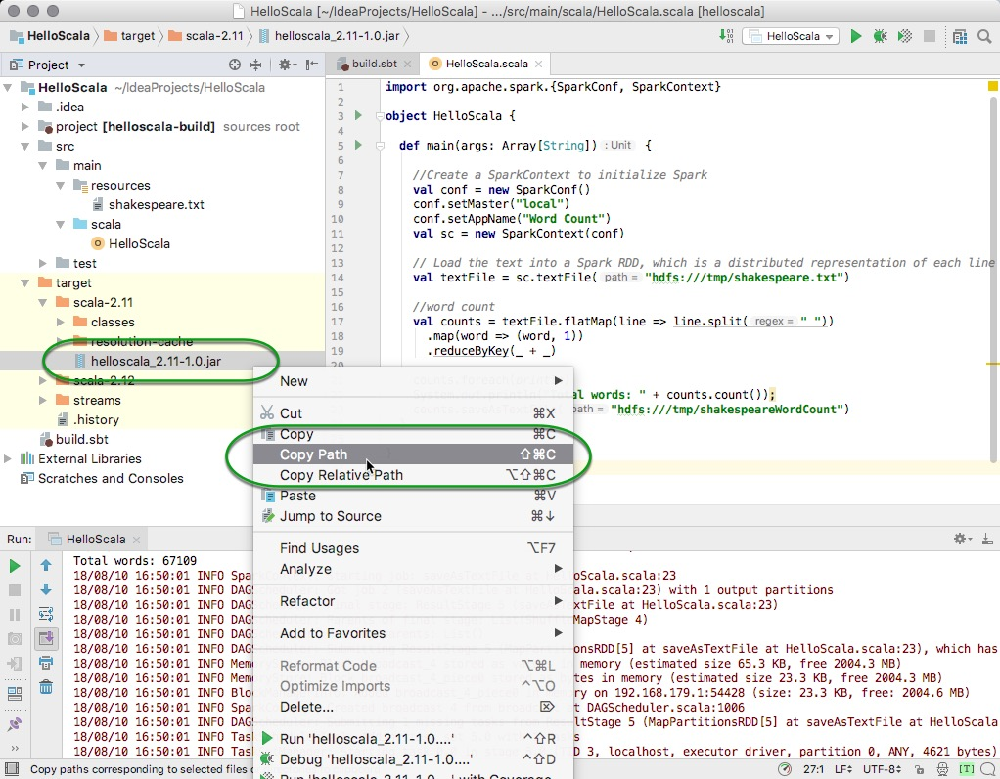

~~~bash
scp -P 2222 ~/IdeaProjects/HelloScala/target/scala-2.11/helloscala_2.11-1.0.jar root@sandbox-hdp.hortonworks.com:/root
~~~

Open your favorite browser and navigate to sandbox-hdp.hortonworks.com:4200 and log on as root.

Use spark-submit to run our code. We need to specify the main class, the jar to run, and the run mode (local or cluster):

~~~bash
spark-submit --class HelloScala  --master local ./helloscala_2.11-1.0.jar
~~~

Your console should print the frequency of each word that appears in Shakespeare, like this:

~~~text
...
(comutual,1)
(ban-dogs,1)
(rut-time,1)
(ORLANDO],4)
(Deceitful,1)
(commits,3)
(GENTLEWOMAN,4)
(honors,10)
(returnest,1)
(topp'd?,1)
(compass?,1)
(toothache?,1)
(miserably,1)
(hen?,1)
(luck?,2)
(call'd,162)
(lecherous,2)
...
~~~

Additionally, if you open the File View in Ambari you should see results under /tmp/shakespeareWordCount. This shows the results have also been stored in HDFS.

You can open the new directory and open _part-0000_ to view the output of the program.

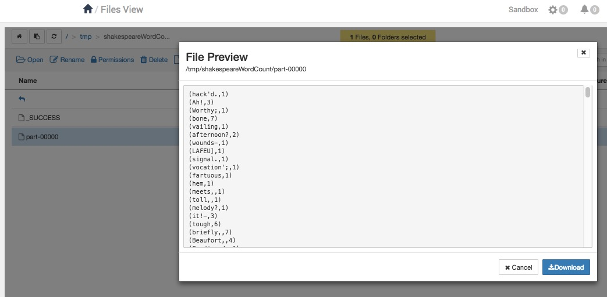

## Deploying to the cloud

In this section we'll learn how to deploy our code to a real cluster. If you don't have a cluster available you can quickly set one up on [AWS](https://hortonworks.com/products/cloud/aws/) using Hortonworks Data Cloud or on Azure using [HDInsight](https://azure.microsoft.com/en-us/services/hdinsight/) (which is powered by Hortonworks). These services are designed to let you quickly spin up a cluster for a few hours (perhaps on cheaper spot instances), run a series of jobs, then spin the cluster back down to save money. If you want a permanent installation of Hadoop that will run for months without being shutdown, you should download Hortonworks Data Platform from [here](https://hortonworks.com/downloads/) and install it on your servers.

After setting up a cluster the process of deploying our code is similar to deploying to the sandbox. We need to scp the jar to the cluster:

~~~bash
scp -P 2222 -i "key.pem" ~/IdeaProjects/HelloScala/target/scala-2.11/helloscala_2.11-1.0.jar root@[ip address of a master node]:root
~~~

Then open a second terminal window and ssh into the master node:

~~~bash
ssh -p 2222 -i "key.pem" root@[ip address of a master node]
~~~

Then use spark-submit to run our code:

~~~bash
spark-submit --class HelloScala  --master yarn --deploy-mode client  ./helloscala_2.11-1.0.jar
~~~

Notice that we specified the parameters **_--master yarn_** instead of **_--master local_**.

**_--master yarn_** means we want Spark to run in a distributed mode rather than on a single machine, and we want to rely on YARN (a cluster resource manager) to fetch available machines to run the job. If you aren't familiar with YARN, it is especially important if you want to run several jobs simultaneously on the same cluster. When configured properly, a YARN queue will provide different users or process a quota of cluster resources they're allowed to use. It also provides mechanisms for allowing a job to take full use of the cluster when resources are available and scaling existing jobs down when additional users or jobs begin to submit jobs.

The parameter **_--deploy-mode client_** indicates we want to use the current machine as the driver machine for Spark. The driver machine is a single machine that initiates a Spark job, and is also where summary results are collected when the job is finished. Alternatively, we could have specified **_--deploy-mode cluster_**, which would have allowed YARN to choose the driver machine.

It's important to note that a poorly written Spark program can accidentally try to bring back many Terabytes of data to the driver machine, causing it to crash. For this reason you shouldn't use the master node of your cluster as your driver machine. Many organizations submit Spark jobs from what's called an edge node, which is a separate machine that isn't used to store data or perform computation. Since the edge node is separate from the cluster, it can go down without affecting the rest of the cluster. Edge nodes are also used for data science work on aggregate data that has been retrieved from the cluster. For example, a data scientist might submit a Spark job from an edge node to transform a 10 TB dataset into a 1 GB aggregated dataset, and then do analytics on the edge node using tools like R and Python. If you plan on setting up an edge node, make sure that machine doesn't have the DataNode or HostManager components installed, since these are the data storage and compute components of the cluster. You can check this on the host tab in Ambari.

## Live Debugging

In this section we'll learn how to connect a running Spark program to a debugger, which will allow us to set breakpoints and step through the code line by line. Debugging Spark is done like any other program when running directly from an IDE, but debugging a remote cluster requires some configuration.

On the machine where you plan on submitting your Spark job, run this line from the terminal:

~~~bash
export SPARK_JAVA_OPTS=-agentlib:jdwp=transport=dt_socket,server=y,suspend=n,address=8086
~~~

This will let you attach a debugger at port 8086. You'll need to make sure port 8086 is able to receive inbound connections. Then in IntelliJ go to Run -> Edit Configurations:

Then click the + button at the upper-left and add a new remote configuration. Fill the host and port fields with your host ip address and 8086.

If you run this debug configuration from your IDE immediately after submitting your Spark job, the debugger will attach and Spark will stop at breakpoints. You can also inspect the values of live variables within your program. This is invaluable when trying to pin down bugs in your code.

## Summary

We have installed the needed dependencies and Integrated Developing Environment needed to develop and deploy your code to the sandbox, we also learned how easy it can be to deploy your code to the cloud or an external cluster. Additionally, we enabled live code debugging to fix bugs and improve your code in a realistic setting.

## Further Reading

- [Setting up a Spark Development Environment with Python](https://hortonworks.com/tutorial/setting-up-a-spark-development-environment-with-python/)
- [Setting up a Spark Development Environment with java](https://hortonworks.com/tutorial/setting-up-a-spark-development-environment-with-java/)
- [Hortonworks Community Connection (HCC)](https://community.hortonworks.com/spaces/85/data-science.html?type=question)
- [Spark Tutorials](https://hortonworks.com/tutorials/?tab=product-hdp&filters=apache-spark)