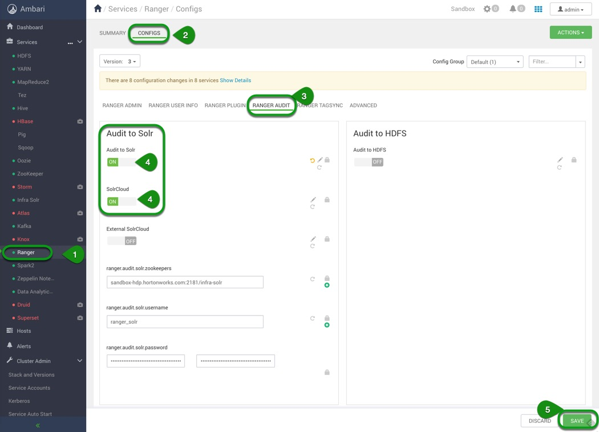
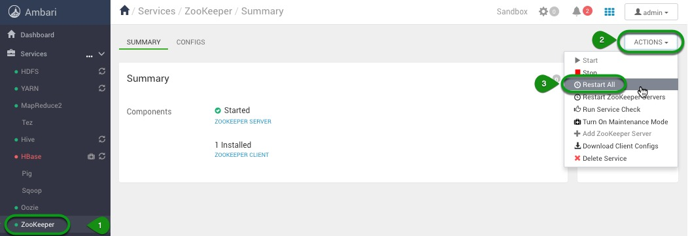
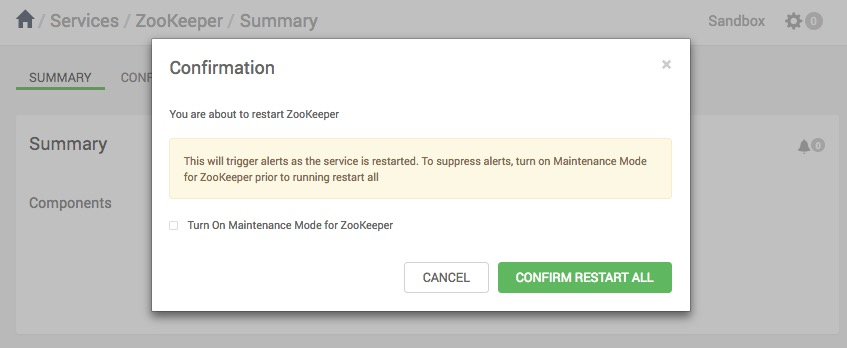

# Tag Based Policies with Apache Ranger and Apache Atlas

## Setting up the environment

## Introduction

In this section of the tutorial we will prepare the Sandbox environment by enabling relevant services and turning off services that are not used.

## Prerequisites

- Downloaded and Installed the latest [Hortonworks Data Platform (HDP) Sandbox](https://hortonworks.com/downloads/#sandbox)
- [Learning the Ropes of the HDP Sandbox](https://hortonworks.com/tutorial/learning-the-ropes-of-the-hortonworks-sandbox/)

## Outline

- [Concepts](#concepts)
- [Enable Ranger Audit to Solr](#enable-Ranger-Audit-to-Solr)
- [Stop Services not Used in Tag Based Policies](#stop-services-not-used-in-tag-based-policies)
- [Restart All Services Affected](#restart-all-services-affected)
- [Stop Services Not Used in Tag Based Policies](#stop-services-not-used-in-tag-based-policies)
- [Verify "ranger_audits" is created in Ambari Infra Solr](#verify-"ranger_audits"-is-created-in-ambari-infra-solr)
- [Summary](#summary)
- [Further Reading](#further-reading)

## Concepts

Before we begin creating, assigning, and editing tag policies we must enable Ranger audit to Solr and start the services needed to assign policies. Additionally, we will stop services not necessary for this tutorial.

Furthermore, we should become acquainted with the personas who reside within the HDP Sandbox.

Here is a brief description of them:

- raj_ops: Big Data Operations
- maria_dev: Big Data Developer

Raj is our administrator and thus has full access to most of Ambari's services.
Maria is our developer and thus has limited access to our cluster's services.

**Username** – raj_ops
**Password** – raj_ops

**Username** – maria_dev
**Password** – maria_dev

In order to set up our environment we will use our cluster administrator **admin**.

## Enable Ranger audit to Solr

Use your HDP **admin** credentials to sign in.

**Table 1**: Ambari Login credentials

| Username | Password |
|:---:|:---:|
| admin | **setup process |

> [Setup Ambari Admin Password Manually](https://hortonworks.com/tutorial/learning-the-ropes-of-the-hortonworks-sandbox/#admin-password-reset)

Once in Ambari click on the **Ranger** service on the service Stack on the left and follow these steps to enable audit to Solr:

1. Ensure you are in Ranger service

2. Select the **Configs** tab

3. **Ranger Audit** tab

4. Turn **ON** Ranger's Audit to Solr and SolrCloud features

5. **Save** this configuration

In the **Save Configuration** window that appears, write `Enable Audit to Solr and SolrCloud Feature`, then select **Save**, next click **OK** button on Dependent Configurations window.
Finally, click **Proceed Anyway** on the **Save Configuration Changes** window, and click **OK**.

## Restart All Services Affected

After Enabling Ranger Audit to Solr and SolrCloud, there are services that will need to be restarted for the changes to take effect on our sandbox:

### Restart the Zookeeper Service

1\. Select **Zookeeper**, then click on **Service Actions**. Click on **Restart All** to restart all components of Zookeeper. It will also restart all affected components of Zookeeper.

2\. On the **Confirmation** window, press **Confirm Restart All**.

**Background Operation Running** window will appear showing Zookeeper currently is being restarted. This window will appear for other services you perform a service action upon.

Click **OK** button in bottom right corner.

3\. Once Zookeeper finishes restarting, you will be able to see the components health.

<!---You may notice there is one component that still needs to be restarted. **SNameNode** says **Stopped**. Click on its name.

You are taken to the **Hosts Summary** page. It lists all components related to every service within the Ambari stack for the Sandbox host.

4\. Search for **SNameNode**, click on **Stopped** dropdown button, click **Start**.

Starting SNameNode is like restarting it since it was initially off, it will be refreshed from the recent changes from Ranger Audit config.--->

5\. Let's get back to Ambari Dashboard, click on the Ambari icon  in the top left corner.

<!--_ 6\. Head back to **HDFS** Service's **Summary** page. Click on **Service Actions** dropdown, click **Turn off Maintenance Mode**. 

7\. When the **Confirmation** window appears, confirm you want to **Turn off Maintenance Mode**, click **OK**.

Next, an **Information** window will appear conveying the result, click **OK**.--->

Now **HDFS** service has been successfully restarted. Initially, we did **Restart All**, which restarted all components.

## Stop Services Not Used in Tag Based Policies

Before we can restart the rest of the remaining services, we need to stop services that will not be used as part of the Tag Based Policies tutorial. We do this because we will be starting additional services, our sandbox is meant to have limited resources and might not respond well to having many services on at the same time.

Stopping a service is a similar process as we did before, but instead of using **Restart All**, click on the **Stop** button located in **Service Actions**.

1\. Stop the following services in this order:

- Oozie
- Spark2
- Zeppelin

### Restart the Other Affected Services from Ranger Config

1\. We will follow a similar approach as we did to turn off services to restart the remaining affected services.

Restart the remaining services in this order:

- Infra Solr
- Ranger
- HDFS
- YARN
- MapReduce2
- Tez
- Hive
- HBase (Turn Off Maintenance Mode then restart HBase)
- Sqoop
- Storm (Turn Off Maintenance Mode then restart Storm)
- Atlas (Turn Off Maintenance Mode then restart Atlas)
- Kafka (Turn off Maintenance Mode then restart Kakfa)
- Knox

If **Knox** doesn't re-start due to the **KNOX GATEWAY** failing, then:

1\. Click on **Knox Gateway**

2\. Find **Knox Gateway** under components and Start **Knox Gateway** 

3\. Go back to Knox's **Host Actions** and **Resstart All Components**

2\. In your **Background Operations Running** window, it should show that all the above services are being restarted.

> Note: **Atlas Metadata Server** might fail to restart, all you need to do is go to the component and individually start it

### Verify "ranger_audits" is created in Ambari Infra Solr

Once services have been restarted, you should verify that **ranger_audits** is started:

**Ambari** -> **Infra Solr** -> **Quick Links** -> **Solr Admin UI**

Make sure "ranger_audits" is displayed in Ambari Infra Solr as in the picture below:

**Dashboard** -> **Cloud** -> **Graph**

## Summary

Great now that we have set up the environment for us to work with let's get to work assigning Tag Based Policies with Atlas.

## Further Reading

- Downloaded and deployed the [Hortonworks Data Platform (HDP)](https://hortonworks.com/downloads/#sandbox) Sandbox
- [Learning the Ropes of the HDP Sandbox](https://hortonworks.com/tutorial/learning-the-ropes-of-the-hortonworks-sandbox/)