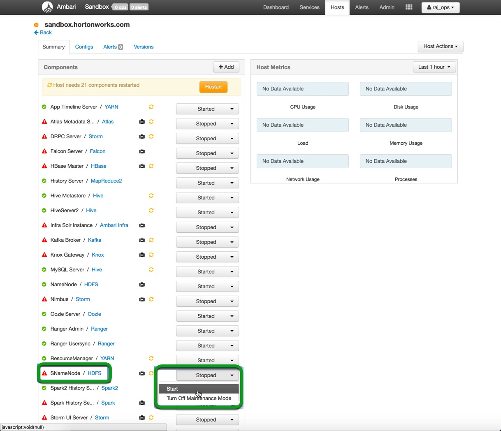
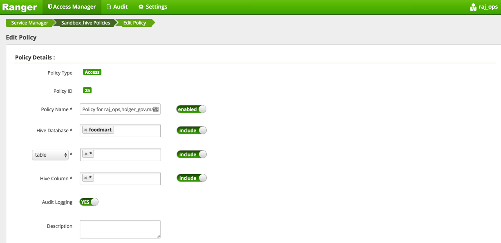
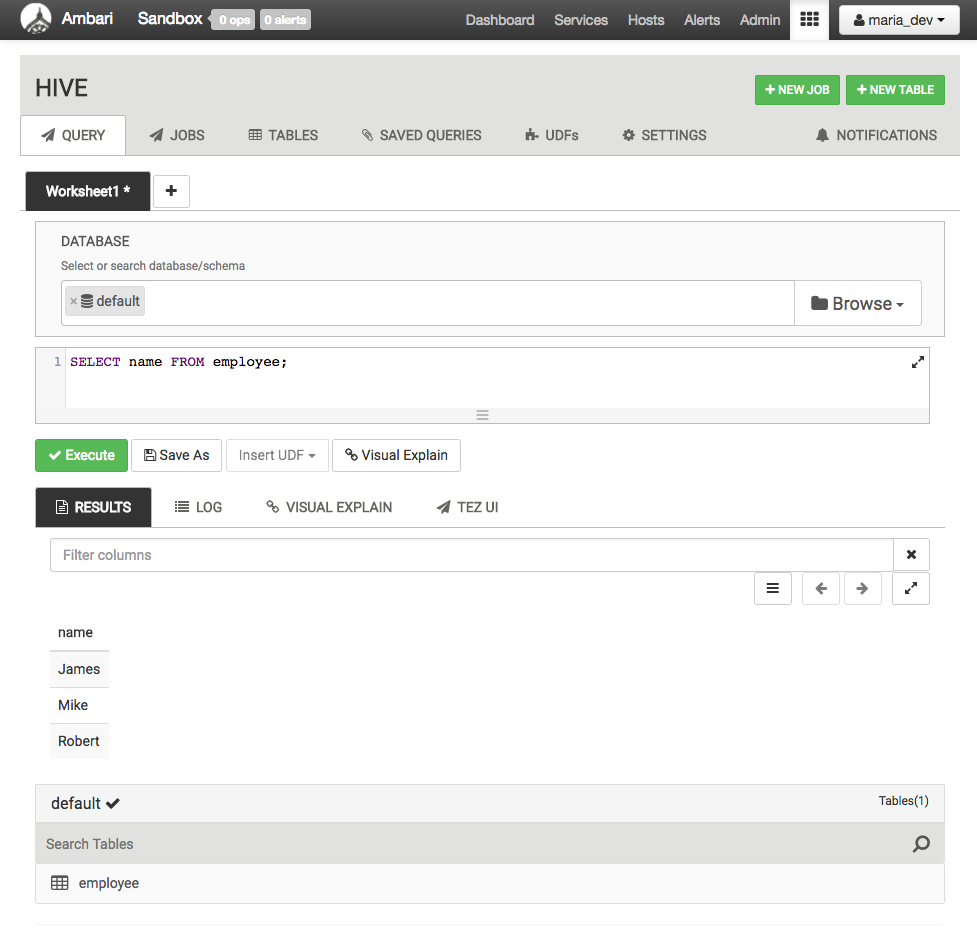
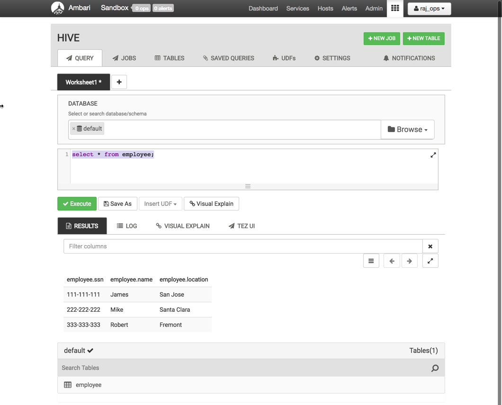

# Tag Based Policies with Apache Ranger and Apache Atlas

## Introduction

You will explore integration of Apache Atlas and Apache Ranger, and introduced the concept of tag or classification based policies. Enterprises can classify data in Apache Atlas and use the classification to build security policies in Apache Ranger.

This tutorial walks through an example of tagging data in Atlas and building a security policy in Ranger.

## Prerequisites

-   [Download Hortonworks 2.6 Sandbox](https://hortonworks.com/downloads/#sandbox)
-   [Install Hortonworks 2.6 Sandbox](https://hortonworks.com/tutorial/sandbox-deployment-and-install-guide/section/3/)
-   Add Sandbox Hostname to Your Hosts File, refer to [Learning the Ropes of Hortonworks Sandbox](https://github.com/hortonworks/data-tutorials/blob/master/tutorials/hdp/learning-the-ropes-of-the-hortonworks-sandbox/tutorial.md), section **1.3 Add Sandbox Hostname to Your Hosts File**

-   (Optional) Set the Ambari Password, refer to [Learning the Ropes of Hortonworks Sandbox](https://github.com/hortonworks/data-tutorials/blob/master/tutorials/hdp/learning-the-ropes-of-the-hortonworks-sandbox/tutorial.md), section **2.2 Setup Ambari admin Password Manually**

## Outline

-   [Step 1: Enable Ranger Audit to Solr](#step-1-enable-ranger-audit-to-solr)
-   [Step 2: Restart All Services Affected](#step-2-restart-all-services-affected)
-   [Step 3: Explore General Information](#step-3-explore-general-information)
-   [Step 4: Explore Sandbox User Personas Policy](#step-4-explore-sandbox-user-personas-policy)
-   [Step 5: Access Without Tag Based Policies](#step-5-access-without-tag-based-policies)
-   [Step 6: Create a Ranger Policy to Limit Access of Hive Data](#step-6-create-a-ranger-policy-to-limit-access-of-hive-data)
-   [Step 7: Create Atlas Tag to Classify Data](#step-7-create-atlas-tag-to-classify-data)
-   [Step 8: Create Ranger Tag Based Policy](#step-8-create-ranger-tag-based-policy)
-   [Summary](#summary)
-   [Further Reading](#further-reading)

### Step 1: Enable Ranger Audit to Solr

Log into Ambari as `raj_ops` user. User/Password is `raj_ops/raj_ops`

**Figure 1: Ambari Dashboard**

Click on the **Ranger** Service in the Ambari Stack of services on the left side column.

Select the **Configs** tab.

Select the **Ranger Audit** tab. Turn **ON** Ranger's Audit to Solr feature. Click on the **OFF button** under **Audit to Solr** to turn it **ON**.

**Save** the configuration. In the **Save Configuration** window that appears, write `Enable Audit to Solr Feature`, then click **Save** in that window. click **OK** button on Dependent Configurations window. click **Proceed Anyway.** On the **Save Configuration Changes** window, click **OK**.

**Figure 2: Ranger 'Audit to Solr' Config**

### Step 2: Restart All Services Affected

After Enabling Ranger Audit to Solr, there are services that will need to be restarted for the changes to take effect on our HDP sandbox.

**Figure 3: Affected Services After Ranger Audit Config Set**

Let's start by restarting services from the top of the Ambari Stack.

### 2.1: Restart HDFS Service

1\. Restart **HDFS**. Click on HDFS. Click on **Service Actions**, **Restart All** to restart all components of HDFS. It will also restart all affected components of HDFS.

**Figure 4: Restart All HDFS Components**

2\. On the **Confirmation** window, press **Confirm Restart All**.

**Figure 5: Confirm HDFS Restart**

**Background Operation Running** window will appear showing HDFS currently is being restarted. This window will appear for other services you perform a service action upon.

**Figure 6: Background Operation Running Window**

Click **X** button in top right corner.

3\. Once HDFS finishes restarting, you will be able to see the components health.

**Figure 7: Summary of HDFS Service's That Were Restarted**

You may notice there is one component still needs to be restarted. **SNameNode** says **Stopped**. Click on its name.

You are taken to the **Hosts Summary** page. It lists all components related to every service within the Ambari stack for the Sandbox host.

4\. Search for **SNameNode**, click on **Stopped** dropdown button, click **Start**.

**Figure 8: SNameNode Start**

Starting SNameNode is like restarting it since it was initially off, it will be refreshed from the recent changes from Ranger Audit config.

5\. Exit the Background Operations Window. Click on the Ambari icon  in the top right corner.

6\. Head back to **HDFS** Service's **Summary** page. Click on **Service Actions** dropdown, click **Turn off Maintenance Mode**.

7\. When the **Confirmation** window appears, confirm you want to **Turn off Maintenance Mode**, click **OK**.

An **Information** window will appear conveying the result, click **OK**.

**Figure 9: HDFS Summary of Final Restart Result**

Now **HDFS** service has been successfully restarted. Initially, we did **Restart All**, which restarted most components, but some components have to be manually restarted like **SNameNode**.

### 2.2: Stop Services Not Used in Tag Based Policies

Before we can restart the rest of the remaining services, we need to stop services that will not be used as part of the Tag Based Policies tutorial.

Stopping a service uses a similar approach as in section **2.1**, but instead of using **Restart All**, click on the **Stop** button located in **Service Actions**.

1\. Stop **(1) Oozie**, **(2) Flume**, **(3) Spark2** and **(4) Zeppelin**

### 2.3: Restart the Other Affected Services from Ranger Config

1\. Follow the similar approach used in section **2.1** to restart the remaining affected services by the list order: **(1) YARN**, **(2) Hive**, **(3) HBase**, **(4) Storm**, **(5) Ambari Infra** **(6) Atlas**, **(7) Kafka**, **(8) Knox**, **(9) Ranger**.

**Figure 10: Remaining Affected Services that Need to be Restarted**

> Note: Also turn off maintenance mode for **HBase**, **Atlas** and **Kafka**.

2\. In your **Background Operations Running** window, it should show that all the above services **(1-9)** are being restarted.

**Figure 11: Remaining Affected Services Restart Progress**

**Figure 12: Result of Affected Services Restarted**

> Note: sometimes **Atlas Metadata Server** will fail to restart, all you need to do is go to the component and individually start it

### 2.4 Verify "ranger_audits" is created in Ambari Infra Solr

Once we restart Ranger, you should verify that **ranger_audits** is started:

**Ambari** -> **Ambari Infra** -> **Quick Links** -> **Solr Admin UI**

Make sure "ranger_audits" is displayed in Ambari Infra Solr as in the picture below:

**Dashboard** -> **Cloud** -> **Graph**

### Step 3: Explore General Information

This section will introduce the personas we will be using in this tutorial for Ranger, Atlas and Ambari.

Earlier you were introduced to the raj_ops persona. Here is a brief description of each persona:

- raj_ops: Big Data Operations
- maria_dev: Big Data Developer
- holger_gov: Big Data Governance

Access Ranger with the following credentials:

User id – **raj_ops**
Password – **raj_ops**

And for Atlas:

User id – **holger_gov**
Password – **holger_gov**

And for Ambari:

User id – **raj_ops**
Password – **raj_ops**

User id – **maria_dev**
Password – **maria_dev**

### Step 4: Explore Sandbox User Personas Policy

In this section, you will explore the prebuilt Ranger Policy for the HDP Sandbox user personas that grant them permission to a particular database. This policy affects which **tables** and **columns** these user personas have access to in the **foodmart** database.

1\. Access the Ranger UI Login page at `sandbox.hortonworks.com:6080`.

Login Credentials: username = `raj_ops`, password = `raj_ops`

**Figure 13: Ranger Login is raj_ops/raj_ops**

Press `Sign In` button, the home page of Ranger will be displayed.

2\. Click on the `Sandbox_hive` Resource Board.

**Figure 14: Ranger Resource Based Policies Dashboard**

3\. You will see a list of all the policies under the Sandbox_hive repository. Edit policy called: **policy for raj_ops, holger_gov, maria_dev and amy_ds**

**Figure 15: Sandbox_hive Repository's Policies**

This policy is meant for these 4 users and is applied to all tables and all columns of a `foodmart` database.

**Figure 16: Ranger Policy Details**

4\. To check the type of access this policy grants to users, explore the table within the **Allow Conditions** section:

**Figure 17: Ranger Policy Allow Conditions Section**

You can give any access to the users as per their roles in the organization.

### Step 5: Access Without Tag Based Policies

In the previous section, you saw the data within the foodmart database that users within the HDP sandbox have access to, now you will create a brand new hive table called `employee` within a different database called `default`.

Keep in mind, for this new table, no policies have been created to authorize what our sandbox users can access within this table and its columns.

1\. Go to **Hive View 2.0**. Hover over the Ambari 9 square menu icon , select **Hive View 2.0**.

**Figure 18: Access Hive View 2.0 From Ambari Views**

2\. Create the `employee` table:

~~~sql
create table employee (ssn string, name string, location string)
row format delimited
fields terminated by ','
stored as textfile;
~~~

Then, click the green `Execute` button.

**Figure 19: Hive Employee Table Created**

3\. Verify the table was created successfully by going to the **TABLES** tab:

**Figure 20: Check TABLES for Employee Table**

4\. Now we will populate this table with data.

5\. Enter the HDP Sandbox's CentOS command line interface by using the Web Shell Client at `sandbox.hortonworks.com:4200`

Login credentials are:

username = `root`
password = `hadoop` (is the initial password, but you will asked to change it)

**Figure 21: HDP Sandbox Web Shell Client**

5\. Create the `employeedata.txt` file with the following data using the command:

~~~bash
printf "111-111-111,James,San Jose\\n222-222-222,Mike,Santa Clara\\n333-333-333,Robert,Fremont" > employeedata.txt
~~~

**Figure 22: Shell Command to Create Data**

5\. Copy the employeedata.txt file from your centOS file system to HDFS. The particular location the file will be stored in is Hive warehouse's employee table directory:

~~~
hdfs dfs -copyFromLocal employeedata.txt /apps/hive/warehouse/employee
~~~

**Figure 23: HDFS Command to Populate Employee Table with Data**

7\. Go back to `Hive View 2.0`. Verify the hive table `employee` has been populated with data:

~~~sql
select * from employee;
~~~

**Execute** the hive query to the load the data.

**Figure 24: Check That Table Is Populated with Data**

Notice you have an `employee` data table in Hive with `ssn, name and location`
as part of its columns. The ssn and location columns hold sensitive information
and most users should not have access to it.

### Step 6: Create a Ranger Policy to Limit Access of Hive Data

Your goal is to create a Ranger Policy which allows general users access to the `name`
column while excluding them access to the `ssn and location` columns.
This policy will be assigned to `maria_dev` and `raj_ops`.

1\. Go to Ranger UI on: `sandbox.hortonworks.com:6080`

**Figure 25: Ranger Resource Board Policies Dashboard**

### 6.1 Create Ranger Policy to Restrict Employee Table Access

2\. Go back to `Sandbox_hive` and then `Add New Policy`:

**Figure 26: Add New Ranger Policy**

3\. In the `Policy Details`, enter following values:

~~~
Policy Name - policy to restrict employee data
Hive Databases - default
table - employee
Hive_column - ssn, location (NOTE : Do NOT forget to EXCLUDE these columns)
Description - Any description
~~~

4\. In the `Allow Conditions`, it should have the following values:

~~~
Select Group – blank, no input
Select User – raj_ops, maria_dev
Permissions – Click on the + sign next to Add Permissions and click on select and then green tick mark.
~~~

**Figure 27: Add select Permission to Permissions Column**

You should have your policy configured like this:

**Figure 28: Ranger Policy Details and Allow Conditions**

5\. Click on `Add` and you can see the list of policies that are present in `Sandbox_hive`.

**Figure 29: New Policy Created**

6\. Disable the `Hive Global Tables Allow` Policy to take away `raj_ops` and `maria_dev`
access to the employee table's ssn and location column data. Go inside this Policy,
to the right of `Policy Name` there is an `enable button` that can be toggled to
`disabled`. Toggle it. Then click **save**.

**Figure 30: Disabled Hive Global Tables Allow Policy**

### 6.2 Verify Ranger Policy is in Effect

1\. To check the access if `maria_dev` has access to the Hive `employee` table,
re-login to Ambari as `maria_dev` user.

**Figure 31: maria_dev trying to access employee data**

2\. Go directly to `Hive View 2.0`, then **QUERY** tab, write the hive script to load the data from employee table.

~~~sql
select * from employee;
~~~

3\. You will notice a red message appears. Click on the **NOTIFICATIONS** tab:

**Figure 32: maria_dev encounters an authorization error**

Authorization error will appear. This is expected as the user `maria_dev` and
`raj_ops` do not have access to 2 columns in this table (ssn and location).

4\. For further verification, you can view the **Audit** tab in Ranger.
Go back to Ranger and click on `Audits=>Access` and select
`Service Name=>Sandbox_hive`. You will see the entry of Access Denied
for maria_dev. maria_dev tried to access data she didn't have authorization
to view.

**Figure 33: Ranger Audits Logged the Data Access Attempt**

5\. Return to `Hive View 2.0`, try running a query to access the `name` column
from the `employee` table. `maria_dev` should be able to access that data.

~~~sql
SELECT name FROM employee;
~~~

**Figure 34: maria_dev queries name column of employee table**

The query runs successfully.
Even, **raj_ops** user cannot not see all the columns for the location and SSN.
We will provide access to this user to all columns later via Atlas Ranger Tag
Based Policies.

### Step 7: Create Atlas Tag to Classify Data

The goal of this section is to classify all data in the ssn and location columns
with a `PII` tag. So later when we create a Ranger Tag Based Policy, users
who are associated with the `PII` tag can override permissions established in
the Ranger Resource Board policy.

1\. Login into Atlas web app using `http://sandbox.hortonworks.com:21000/`.

- username **holger_gov** and password **holger_gov**.

**Figure 35: Atlas Login**

2\. Go to `Tags` and press the `+ Create Tag` button to create a new tag.

- Name the tag: `PII`
- Add Description: `Personal Identifiable Information`

**Figure 36: Create Atlas Tag - PII**

Press the **Create** button. Then you should see your new tag displayed on the Tag
page:

**Figure 37: Atlas Tag Available to Tag Entities**

3\. Go to the `Search` tab. In `Search By Type`, write `hive_table`

**Figure 38: Atlas Search Tab**

**Figure 39: Search Hive Tables**

4\. `employee` table should appear. Select it.

**Figure 40: Selecting Employee Table via Atlas Basic Search**

- How does Atlas get Hive employee table?

Hive communicates information through Kafka, which then is transmitted to Atlas.
This information includes the Hive tables created and all kinds of data
associated with those tables.

5\. View the details of the `employee` table.

**Figure 41: Viewing Properties Atlas Collected on Employee Table**

6\. View the **Schema** associated with
the table. It'll list all columns of this table.

**Figure 42: Viewing Schema Atlas Collected on Employee Table**

7\. Press the **blue +** button to assign the `PII` tag to the `ssn` column.
Click **save**.

**Figure 43: Tag PII to ssn Column**

8\. Repeat the same process to add the `PII` tag to the `location` column.

**Figure 44: Tag PII to Location Column**

**Figure 45: Added PII tag to Employee's ssn and Location Columns**

We have classified all data in the `ssn and location` columns as `PII`.

### Step 8: Create Ranger Tag Based Policy

Head back to the Ranger UI. The tag and entity (ssn, location) relationship will be automatically inherited by Ranger. In Ranger, we can create a tag based policy
by accessing it from the top menu. Go to `Access Manager → Tag Based Policies`.

**Figure 46: Ranger Tag Based Policies Dashboard**

You will see a folder called TAG that does not have any repositories yet.

**Figure 47: Tag Repositories Folder**

Click `+` button to create a new tag repository.

**Figure 48: Add New Tag Repository**

Name it `Sandbox_tag` and click `Add`.

**Figure 49: Sandbox_tag Repository**

Click on `Sandbox_tag` to add a policy.

**Figure 50: Add New Policy to Sandbox_tag Repository**

Click on the `Add New Policy` button.
Give following details:

~~~
Policy Name – PII column access policy
Tag – PII
Description – Any description
Audit logging – Yes
~~~

**Figure 51: Policy Details and Allow Conditions**

In the Allow Conditions, it should have the following values:

~~~
Select Group - blank
Select User - raj_ops
Component Permissions - Select hive
~~~

You can select the component permission through the following popup. Check the
**checkbox** to the left of the word component to give `raj_ops` permission to
`select, update, create, drop, alter, index, lock and all` operations against
the hive table `employee` columns specified by `PII` tag.

**Figure 52: Add Hive Component Permissions to the Policy**

Please verify that Allow Conditions section is looking like this:

**Figure 53: Allow Conditions for PII column access policy**

This signifies that only `raj_ops` is allowed to do any operation on the columns that are specified by PII tag. Click `Add`.

**Figure 54: Policy Created for PII tag**

Now click on `Resource Based Policies` and edit `Sandbox_hive` repository by clicking on the button next to it.

**Figure 55: Edit Button of Sandbox_hive Repository**

Click on `Select Tag Service` and select `Sandbox_tag`. Click on `Save`.

**Figure 56: Added Tag Service to Sandbox_hive Repository**

The Ranger tag based policy is now enabled for **raj_ops** user. You can test it by running the query on all columns in employee table.

~~~sql
select * from employee;
~~~

**Figure 57: raj_ops has access to employee data**

The query executes successfully. The query can be checked in the Ranger audit log which will show the access granted and associated policy which granted access. Select Service Name as `Sandbox_hive` in the search bar.

> Note update picture below

**Figure 58: Ranger Audits Confirms raj_ops Access to employee table**

> **NOTE**: There are 2 policies which provided access to raj_ops user, one is a tag based policy and the other is hive resource based policy. The associated tags (PII) is also denoted in the tags column in the audit record).

## Summary

Ranger traditionally provided group or user based authorization for resources such as table, column in Hive or a file in HDFS.
With the new Atlas -Ranger integration, administrators can conceptualize security policies based on data classification, and not necessarily in terms of tables or columns. Data stewards can easily classify data in Atlas and use in the classification in Ranger to create security policies.
This represents a paradigm shift in security and governance in Hadoop, benefiting customers with mature Hadoop deployments as well as customers looking to adopt Hadoop and big data infrastructure for first time.

## Further Reading

- For more information on Ranger and Solr Audit integration, refer to [Install and Configure Solr For Ranger Audits](https://cwiki.apache.org/confluence/display/RANGER/Install+and+Configure+Solr+for+Ranger+Audits+-+Apache+Ranger+0.5)
- For more information on how Ranger provides Authorization for Services within Hadoop, refer to [Ranger FAQ](http://ranger.apache.org/faq.html)
- For more information on on HDP Security, refer to [HDP Security Doc](https://docs.hortonworks.com/HDPDocuments/HDP2/HDP-2.6.1/bk_security/content/ch_hdp-security-guide-overview.html)
- For more information on security and governance, refer to [Integration of Atlas and Ranger Classification-Based Security Policies](https://hortonworks.com/solutions/security-and-governance/)
